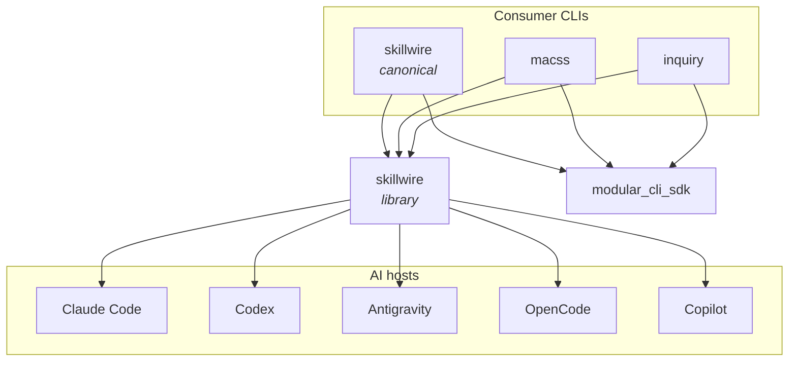
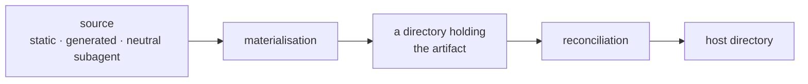
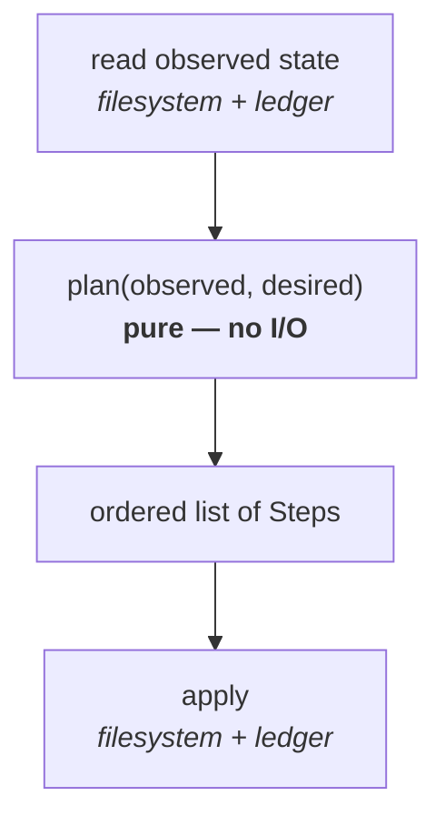
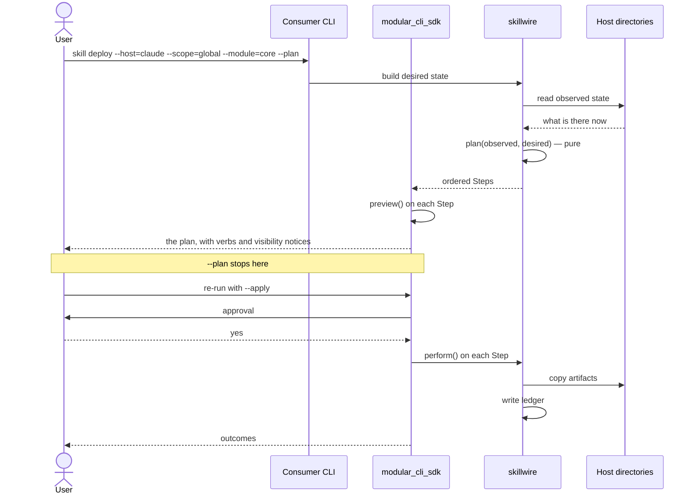

# Architecture

## Layers

| Layer | Responsibility |
|---|---|
| `code/skillwire` | The library. Domain model, reconciliation, host matrix, ledger. Knows nothing about any particular CLI |
| `code/cli` | The canonical consumer. Mounts the `skill` module over the library and ships its own skills as assets |

```
cli  →  skillwire
```

`cli` depends on `skillwire`. `skillwire` never depends on `cli`, and never on
any other consumer. That direction is what makes the library reusable.

There is no `db`, `api` or `app` layer: this project has no data layer, no
service and no interface beyond the terminal. The MACSS canon suggests those
three because they are the most common, and permits adding or removing layers.

## The library is shared, the CLI is one consumer among several

`skillwire` is written to be embedded. The canonical `skillwire` CLI is the
first consumer and the reference implementation, but `macss` and `inquiry`
consume the same library and gain the same `skill` module.



Each consumer carries its own skills, as assets of its own release:

```
skillwire/  code/cli/assets/skills/modules/<module>/<skill>/
macss/      code/cli/assets/skills/modules/<module>/<skill>/
inquiry/    code/cli/assets/skills/modules/<module>/<skill>/
```

The library never owns skills. It receives a materialised directory and resolves
where it must land. A skill belongs to the release of the CLI that transports it,
which is why it ships inside that CLI rather than in a shared location.

Because all three deploy into the *same* host directories, the ledger records the
owning consumer per deployment, and a deployment that would overwrite another
consumer's artifact is planned as `block`.

## The seam

The library is built around one separation, and everything else follows from it.



**Materialisation** produces a directory. A static skill already is one; a
generated skill is built by its generator; a subagent is transformed into the
host's format.

**Reconciliation** makes a host's directories match a desired set of
materialised directories. It does not know, and must not know, how any of them
came to exist.

That is what lets one engine serve static skills, skills generated at runtime by
a consumer, and subagents that need a different file format per host.

## Reconciliation is a pure function



I/O lives at the edges: one read before, one write after. The decision layer in
the middle is a pure function over two values, so every reconciliation state is
unit-testable without touching a disk.

This matters because that middle layer is where a bug destroys a user's work.

## How a route is built

`modular_cli_sdk` distinguishes a `Query`, which reads and answers, from a
`Command`, which changes something and must say what it would change first.
Skillwire supplies the `Step`s; the SDK renders the plan, takes approval, and
runs them.



`preview()` and `perform()` are separate methods rather than one method behind a
dry-run flag. A flag threaded through the work leaves nothing holding the
switched-off pass and the real one to the same behaviour.

## Deployment is by copy

Each host receives its own independent copy. Not a link to the consumer's asset
directory — that directory is replaced when the CLI is upgraded, and an upgrade
would then mutate a host's behaviour with no deployment having occurred. Not a
single canonical copy shared by links either — that forbids the per-host
variation that subagents require, since their file format differs per host.

The cost of copying is that a copy carries no proof of ownership, which is why
the ledger exists.

See [ADR 0002](adr/0002-copy-not-link.md).

## Cross-cutting concerns

- **Host matrix.** Paths for every host, kind and scope live in a data file, not
  in code. Adding a host is a data change.
- **Visibility graph.** Some hosts read other hosts' directories. The graph is
  part of the same data file, and every plan reports the consequences for hosts
  that are detected but were not named.
- **Ledger.** Machine-local, keyed by `(artifact, kind, host, scope, subagent?)`,
  recording the owning consumer. It is what makes a copy distinguishable from a
  file somebody else put there.
- **Manifest.** Repository-level and committed, declaring what a repo wants
  deployed. Manifest is to ledger as `package.json` is to `package-lock.json`.
- **Errors.** Typed hierarchy in `skillwire`, surfaced by the SDK's exit codes.
