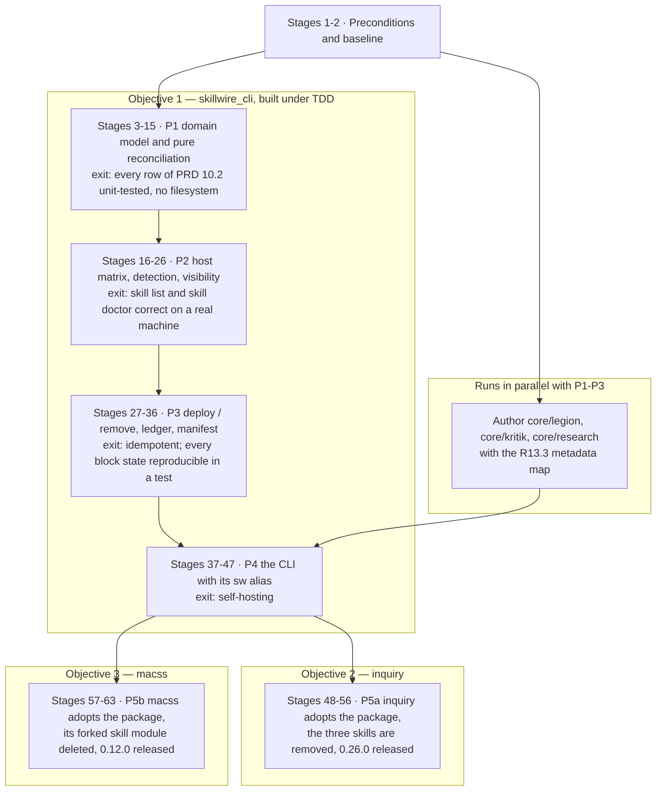

# Runbook

**Status:** Draft 1 — execution plan for P0 through P5, not started
**Date:** 2026-08-26
**Owner:** ccisnedev

---

This is an execution document. `docs/PRD.md` is the contract and
`docs/architecture.md` is the shape; this runbook is the ordered sequence of
stages that discharges them. It carries three objectives: **(1)** build the
`skillwire` package and `skillwire_cli` under TDD, with `legion`, `kritik` and
`research` as the first payload, covering PRD phases P1–P4; **(2)** take those
three skills out of `inquiry` and release an `inquiry` that deploys through the
package; **(3)** make `macss` deploy its own lifecycle skills through the same
package. Objectives 2 and 3 are the two halves of P5 and both are gated on P4.

Sixty-three stages, numbered continuously. A stage is open until its **exit
criterion** — a command that passes, a test that goes green, or a file that
exists — is satisfied on this machine. No stage closes on judgement.

---

## Table of contents

| § | Contents |
|---|---|
| [1](#1-purpose-and-how-to-use-this-runbook) | Purpose and how to use this runbook |
| [2](#2-the-order-of-the-work) | The order of the work |
| [3](#3-citation-convention) | Citation convention |
| [4](#4-working-conventions) | Working conventions |
| [5](#5-the-safety-envelope) | The safety envelope |
| [6](#6-rollback-and-blast-radius) | Rollback and blast radius |
| [7](#7-stage-group-0-preconditions-and-baseline) | **Stage group 0** — preconditions and baseline. Stages 1–2 |
| [8](#8-stage-group-a-p1-domain-model-and-pure-reconciliation) | **Stage group A** — P1, domain model and pure reconciliation. Stages 3–15 |
| [9](#9-stage-group-b-p2-host-matrix-detection-visibility-graph) | **Stage group B** — P2, host matrix, detection, visibility graph. Stages 16–26 |
| [10](#10-stage-group-c-p3-deploy-remove-ledger-manifest) | **Stage group C** — P3, deploy, remove, ledger, manifest. Stages 27–36 |
| [11](#11-stage-group-d-p4-the-cli-the-three-skills-and-self-hosting) | **Stage group D** — P4, the CLI, the three skills, self-hosting. Stages 37–47 |
| [12](#12-stage-group-e-p5a-inquiry) | **Stage group E** — P5a, inquiry. Stages 48–56 |
| [13](#13-stage-group-f-p5b-macss) | **Stage group F** — P5b, macss. Stages 57–63 |
| [14](#14-requirement-traceability) | Requirement traceability |
| [15](#15-deferred-work) | Deferred work — P6, subagents and hooks |
| [16](#16-definition-of-done) | Definition of done |

---

## 1. Purpose and how to use this runbook

It is executed by one engineer, working alone, in the order written. Read it top
to bottom once before starting. Each stage assumes every earlier stage has
closed.

### The three objectives, and why the order is forced

| # | Objective | Phase | Stages | Blocked by |
|---|---|---|---|---|
| 1 | Build the `skillwire` package and `skillwire_cli` under TDD, with `legion`, `kritik` and `research` as its first skills | P1–P4 | 3–47 | Nothing but stages 1–2 |
| 2 | Remove those three skills from `inquiry`; release an `inquiry` that manages its own skills through the package | P5a | 48–56 | Objective 1 complete through P4 |
| 3 | Make `macss` manage its own skills through the package | P5b | 57–63 | Objective 1 complete through P4 |

Two orderings are non-negotiable.

**P4 before P5.** P4's exit criterion is self-hosting: "this repo's own skills
deploy through it" (PRD §15, row P4). P5's is "both consume the `skillwire`
package; no forked deployment logic remains" (PRD §15, row P5). A consumer
cannot be migrated onto a library that has never deployed anything. Migrating
`macss` or `inquiry` first would mean debugging the library through a second
CLI's failures, with the consumer's tests deleted and nothing green to fall back
to. That the canonical CLI deploying its own payload is the cheapest available
proof that the library deploys at all is a judgement, not a fact the evidence
base establishes.

**The three skills land in `skillwire` before they leave `inquiry`.** `legion`,
`kritik` and `research` exist in exactly one source location today —
`inquiry/code/cli/assets/skills/{legion,kritik,research}/SKILL.md` — plus
deployed copies under `~/.claude/skills/` and `~/.config/opencode/skills/` that
inquiry's *deploy* path will never reclaim, because `_pruneRetiredSkills` is
scoped to the `iq-` prefix (`inquiry/code/cli/lib/hosts/deployer.dart:95-96`,
`:97-113`). `iq host clean` and `iq uninstall` would delete them, along with the
whole directory (`deployer.dart:61-66`; see Hazard A in section 5). The
`skillwire` destination is empty: `code/cli/assets/skills/modules/core/` holds
only `.gitkeep`. Deleting from `inquiry` before the `skillwire` copies exist and
are proven to deploy loses three files whose bodies are pinned verbatim by
inquiry's own tests (`inquiry/code/cli/test/assets_test.dart:124-153`). The
sequence is therefore: create in `skillwire` (pure addition, no consumer
affected) → prove deployment through `skillwire_cli` at P4 → only then remove
from `inquiry` and release.

---

## 2. The order of the work



Phases and exit criteria are quoted from the phase table in PRD §15. P5a and
P5b are the two halves of the single P5 row.

**Strictly serial, no exceptions.**

- P1 → P2 → P3 → P4. Each phase's exit criterion is the next phase's input.
  P2's host matrix is data consumed by P3's ledger: R6.2 requires the resolved
  directory to be recorded in the ledger, and the ledger is a P3 deliverable.
  P3's ledger is what makes P4's self-hosting deploy idempotent.
- P4 → P5a and P4 → P5b, for the reason in section 1.
- Authoring the three core skills → P4, because P4's exit criterion has no
  payload without them.

**Genuinely parallel.**

- Authoring the three core skills runs alongside P1–P3. It is content work with
  no dependency on any code, and its only blocker is fixing the `metadata` key
  vocabulary (stage 40).
- P5a and P5b are independent of each other in code: different repositories, no
  shared file. Either may go first. They are **not** independent at runtime —
  they share one machine's ledger, and therefore the multi-consumer `block`
  behaviour. See stage 57.
- Documentation debt in `inquiry` and `macss` that does not touch skill
  deployment — inquiry's stale `inquiry/docs/architecture.md:225-235` nine-skill
  roster,
  macss's superseded `docs/macss_skills.md` — may be cleared at any time.

**Not parallel, despite looking it.** Nothing in P5 may begin "just to prepare"
by deleting a consumer's tests or assets. Every deletion in `macss` and
`inquiry` is a P5 step, gated on P4.

---

## 3. Citation convention

`docs/PRD.md` and `docs/architecture.md` are under active edit. Line numbers in
them drift between one reading and the next, and a stale line number presented
as a fact breaches non-negotiable rule 5. Therefore:

- **The PRD and `docs/architecture.md` are cited by section number, requirement
  id or heading — never by line number.** Where a line number is genuinely
  wanted, derive it at the moment of use:
  `grep -n '\*\*R10.3\*\*' docs/PRD.md`.
- **Files in other repositories** — `macss`, `inquiry`, `modular_cli_sdk`,
  `preview_executor` — are cited by line, because they are not edited under this
  runbook. Each such citation was verified against the file as it stands.
- **Re-read PRD §10, §12 and §16 before starting stage 3.** Three things changed
  after this runbook was first drafted: R6.2 now reads "MUST **resolve** to
  exactly one of them" (previously "deploy"); non-negotiable rule 1 now reads
  "Never destroy what **the acting consumer** did not deploy"; and **R12.0** is
  new.
- **R12.0 binds this document.** One name identifies one thing. Prose here says
  *the `skillwire` package*, *`skillwire_cli`*, *the `skillwire` executable*,
  *the `sw` alias*, *the `skill` module*, or *the acting consumer*. A bare
  `skillwire` as the subject of a requirement is non-conforming.
- Absolute paths on this machine: `skillwire` is at
  `C:/Users/44358590/Code/macss/skillwire`, `macss` at
  `C:/Users/44358590/Code/macss/macss`, `inquiry` at
  `C:/Users/44358590/Code/silicon-brained-machines/inquiry`.
- **ADR numbers.** `docs/adr/0004-writing-the-name.md` already exists and is
  load-bearing (R12.0 cites it). ADR numbers are sequential and never reused
  (`docs/adr/0001-record-architecture-decisions.md:18`), so this runbook
  allocates 0005 onward. Re-run `ls docs/adr/` immediately before writing any
  new ADR: they are landing concurrently.

| ADR | Decision | Written at |
|---|---|---|
| `0005-where-the-sdk-sits.md` | The package depends on `preview_executor`; only `skillwire_cli` depends on `modular_cli_sdk` | Stage 1 |
| `0006-the-unit-tuple-order.md` | `(artifact, kind, host, scope, subagent?)` | Stage 3 |
| `0007-the-content-hash-contract.md` | SHA-256, sorted POSIX paths, text normalisation | Stage 3 |
| `0008-the-opencode-skills-directory.md` | Singular or plural, with evidence | Stage 16 |
| `0009-where-the-ledger-lives.md` | Ledger and manifest paths | Stage 28 |
| `0010-a-discrepancy-fails-the-run.md` | What a `Discrepancy` costs | Stage 35 |
| `0011-the-skill-metadata-vocabulary.md` | The `metadata` key set | Stage 40 |

---

## 4. Working conventions

### 4.1 The TDD protocol

Every code stage is written red → green → refactor, and the runbook names the
failing test before it names the implementation. The protocol is literal:

1. Write **one** failing test. Its file, its `group`, its name and what it must
   assert are specified by the stage. Run it; watch it fail for the reason you
   expect. A test that fails for the wrong reason is not red, it is broken.
2. Write the smallest implementation that makes it pass. Run the whole package
   suite, not just the new test.
3. Refactor with the suite green. No behaviour change, no new assertion.

A stage never introduces two failing tests at once. Where a stage lists several
tests, they are separate red-green cycles in the order listed.

### 4.2 Commands and package directories

Run from the package directory — `code/skillwire` or `code/cli`, never the
repository root, since there is no workspace pubspec.

| Concern | Value | Source |
|---|---|---|
| Library package directory | `code/skillwire` | `code/skillwire/pubspec.yaml:1` |
| CLI package directory | `code/cli` | `code/cli/pubspec.yaml:1` |
| Resolve dependencies | `dart pub get` | — |
| Static analysis | `dart analyze --fatal-infos` | `macss/.github/workflows/ci.yml:33-40`, `modular_cli_sdk/.github/workflows/ci.yml:32-43` |
| Tests | `dart test` | same |
| Lint baseline | `include: package:lints/recommended.yaml` | `modular_cli_sdk/analysis_options.yaml:1`, `macss/code/cli/analysis_options.yaml:1`, `inquiry/code/cli/analysis_options.yaml:1` |
| `lints` version | `^6.1.0` — the consumers' version, not the SDK's `^5.0.0` | `macss/code/cli/pubspec.yaml:19-20` vs `modular_cli_sdk/pubspec.yaml:21` |
| `test` version | `^1.31.0` | `macss/code/cli/pubspec.yaml:19-20` |

`inquiry/.github/workflows/ci.yml:28-30` runs the same three but omits
`--fatal-infos`. **This runbook uses `--fatal-infos` inside `skillwire`**,
matching the majority and the SDK itself; retro-fitting it after code lands is
worse than starting with it. Work inside `inquiry` keeps `inquiry`'s own
setting.

There is no test script to invoke. `macss/code/cli/scripts/` and
`inquiry/code/cli/scripts/` hold build and install helpers, plus, in `inquiry`,
`benchmark-fullflow-gemma4.ps1`; `modular_cli_sdk` and `skillwire` have no
`scripts/` directory at all.

`skillwire` is a two-package monorepo, unlike `macss` and `inquiry`, whose CI
sets a single `working-directory: code/cli`. Because `code/cli` depends on
`code/skillwire` by path (`code/cli/pubspec.yaml:17-19`), the library must be
green before the CLI's result means anything: always run the library's three
commands first.

### 4.3 Test layout

Flat `test/` directory, `<subject>_test.dart` filenames, shared helpers under
`test/support/`. No `unit`/`integration` split and no mirroring of `lib/`'s
structure — this is the convention in all three sibling repositories
(`macss/code/cli/test/` is 59 flat `*_test.dart` files plus
`test/support/{graphql_run,memory_sink}.dart`; the SDK's own `test/` is 21 flat
files with fakes in `test/doubles.dart`).

The SDK ships **no** test doubles to consumers: `MemorySink`, `FakeStep` and
`TouchCommand` live in `modular_cli_sdk/test/doubles.dart`, which is not
exported. `test/support/memory_sink.dart` must be written in each package here;
copy the shape of `macss/code/cli/test/support/memory_sink.dart:5-13`, which
wraps a `StreamConsumer` and exposes `Future<String> text()`. Command lifecycles
are driven through `package:modular_cli_sdk/testing.dart` (`previewCommand`,
`runCommand`, `applyCommand` — `modular_cli_sdk/lib/testing.dart:46-71`), never
hand-rolled.

**`applyCommand` is not an end-to-end harness.** Its signature is
`Future<O> applyCommand<I extends Input, O extends Output>(Command<I, O>
command)` (`modular_cli_sdk/lib/testing.dart:69-71`): it takes an
already-constructed `Command` object, never parses a command line, never calls
`applyDeclaredContract` or `ChangeFlags`, and produces no stdout — it returns
the typed `Output`. Any test that asserts on an argv string, an exit code and
rendered output must drive a real `ModularCli`, as
`macss/code/cli/test/skill_test.dart:305-329` already does.

### 4.4 R10.4 in test code: pure reconciliation never touches a filesystem

R10.4 makes reconciliation a pure function of `(observed state, desired state)`
with I/O at the edges, "one read before, one write after". P1's exit criterion
is exactly this: every row of the PRD §10.2 table unit-tested with no
filesystem (PRD §15, row P1).

- Reconciliation tests construct **observed** and **desired** as in-memory
  values — plain Dart objects built in the test body. No temp directory, no
  fixture files, no `Directory.systemTemp`.
- No file under the reconciliation test set, and no library file reachable from
  the reconciliation entry point, may `import 'dart:io'` — directly or
  transitively.
- This is checked by a meta-test, not by review. That meta-test is specified
  **once**, at stage 15, which owns it. It may itself use `dart:io` and is not
  part of the reconciliation suite.

### 4.5 Commits and branches

- **Branch per phase**, named `p1-domain-model`, `p2-hosts`, `p3-deployment`,
  `p4-cli`, `p5a-inquiry`, `p5b-macss`. A branch merges to `main` only when its
  phase exit criterion passes.
- **Commit subject: imperative, capitalised, no type prefix.** This is
  `skillwire`'s own convention, evidenced by its only two commits — "Add MIT
  license and package changelog", "Specify skillwire". Do not import the
  `feat:`/`refactor:` prefixes used in `macss` and `inquiry`; they are another
  repository's convention. Work inside `macss` or `inquiry` follows that
  repository's convention, not this one.
- **One commit per red-green cycle** where the cycle is meaningful on its own;
  never one commit spanning two phases.
- **`CHANGELOG.md` at the repository root gains an entry per phase**, under
  `[Unreleased]`, in the Keep a Changelog sections it already uses (`Added`,
  `Changed`, `Fixed`). ADR rationale stays in `docs/adr/`. `docs/roadmap.md` is
  the tick-list: a phase's checkboxes are ticked in the merge commit that closes
  it, never before.

---

## 5. The safety envelope

The five non-negotiables of PRD §16 are enforced by mechanism. Each row names
the mechanism and the test that proves it is in place. Where the mechanism
belongs to a later phase, that is stated — but the engineer must know all five
now, because two of them are already being violated on this machine by other
tools.

| Rule | Mechanism | Proof |
|---|---|---|
| 1. Never destroy what the acting consumer did not deploy (G3, R10.3) | Removal reads the ledger; states 5 and 6 are never removed, with or without `--force` | Stage 14: `remove` over a unit in state 6 yields `block`, and over state 5 yields `block`, in the pure planner. Stage 31: the same two states reproduced on disk. Externally, the stage 2 baseline is the tripwire |
| 2. Never act implicitly (G2, R12.2) | Every `CliParam` is declared with no default; `--host` and `--scope` are required; exactly one of `--skill`/`--module`/`--all` (PRD §12.3) | Stage 30: `skill deploy` with no `--host` exits `ExitCode.validationFailed` (7). Stage 30: `--scope=repo` outside a repository fails and does not fall back to `global` (R12.3) |
| 3. Never bypass plan/apply (R12.4) | The SDK appends `--plan`/`--apply`/`--autoapprove` to every Command's declared params (`modular_cli_sdk/lib/src/module_builder.dart:110`) and validates them **before** `steps()` is built (`module_builder.dart:120-124`, `change_flags.dart:66-89`) | Stage 30: a Command invoked with neither flag exits 7 and builds no steps — the shape is pinned in `modular_cli_sdk/test/plan_apply_test.dart:14-33`. **Hazard:** a Query registered with `params: null` silently accepts `--plan`, because `declared_arguments.dart:23` short-circuits with `if (params == null) return req;`. Every `m.query()` here passes `params:` — `const []` at minimum — and stage 38 asserts `skill list --plan` exits 7 |
| 4. Never let reconciliation touch the filesystem (R10.4) | Section 4.4 | Stage 15, `code/skillwire/test/purity_test.dart` |
| 5. Never present an unverified path as a fact (R14.1) | The host matrix is a data file (R6.3) in which every path entry carries its source; Q1 and Q2 gate P6, Q3 gates hooks, none of them gate P1–P5 | Stage 17: every path row in the host matrix data file has a non-empty source field. This rule binds this runbook too — every unverified statement here is marked ASSUMPTION |

**If a stage would violate one of the five, the stage is wrong, not the rule.**
Stop, record the conflict in the stage's notes, and resolve it in the PRD or an
ADR before continuing. There is no `--force` for the runbook.

### Two hazards that already exist on this machine

Both are addressed by later stages. The engineer must know them before touching
anything.

**Hazard A — inquiry's cleaner deletes entire host directories.**
`inquiry/code/cli/lib/hosts/deployer.dart:61-66` implements `clean()` as
`_deleteDirectory(adapter.skillsDirectory(homeDir))` plus
`_deleteDirectory(adapter.agentDirectory(homeDir))`, for **all five** adapters
in `allAdapters` (`all_adapters.dart:10-16`) — ten directories in total,
unconditionally and without namespace discrimination. Contrast
`_pruneRetiredSkills` (`deployer.dart:97-113`), which skips any directory whose
basename does not start with `iq-` (`:106`) and whose doc comment states that
`kritik`, `legion`, `research` and anything a user wrote are never touched
(`:95-96`). The narrow path is correct and the wide path is not. `clean()` is
reachable from two routes, each carrying its own copy of the step:
`iq host clean` (`lib/modules/host/commands/clean.dart:57-74`) and
`iq uninstall` (`lib/modules/global/commands/uninstall.dart:44-60`).

`deploy()` itself deletes only within inquiry's own namespace:
`HostDeployer.deploy` (`deployer.dart:36-48`) calls `_pruneRetiredSkills` at
`:45`, which removes `iq-`-prefixed directories the release no longer ships and
leaves everything else alone — pinned by
`inquiry/code/cli/test/deployer_test.dart:107-120`, where a non-`iq-`
`stale-skill` survives a redeploy. The *undiscriminating* destructive path is
`clean()` only.

*Until stage 51 fixes it: do not run `iq host clean` or `iq uninstall` on this
machine.*

**Hazard B — pre-existing deployments will reconcile as state 6, `block`.**
Five `macss-*` skills sit in `~/.claude/skills/` and five in
`~/.config/opencode/skill/`. ASSUMPTION: that
`macss/code/cli/lib/modules/skill/deployer.dart` wrote them is an inference from
the code path, not an observation; nothing on disk records the writer. None has
a ledger entry, because no ledger exists yet. PRD §10.2 row 6 — "Present but
absent from the ledger" — is `block`, "No consumer deployed it", and R10.1 makes
any `block` refuse `--apply` unless `--force` is passed. The same is true of
`kritik`, `legion` and `research` in `~/.claude/skills/`.

**Expect the first real `skill deploy` on this machine to be a wall of
`block`.** That is the design working, not a defect.

PRD Draft 2 gives it a route out. **R10.6: adoption.** Re-run with `--force` and
every state-6 unit whose destination hash equals what would be deployed is
adopted — a ledger row naming the acting consumer, and **not one byte written to
the destination**. Units whose hashes differ stay `block` even under `--force`,
which is what protects anything the user edited by hand.

So `--force` here is not the blunt instrument the name suggests, and the
instinct to avoid it is wrong in this one case: on a machine carrying
pre-package deployments, a forced deploy is how the existing directories become
managed without being touched. Read the plan first and confirm every line reads
`adopt` rather than `replace`. A `replace` under `--force` means a hash
mismatch, and that is the case to stop and investigate.

The adoption mechanics are stated once at stage 51 and cross-referenced from
stage 59.

A third, smaller trap sits beside Hazard B: `macss` writes to
`~/.config/opencode/skill` — **singular** —
(`macss/code/cli/lib/modules/skill/host.dart:45-48`), while the PRD host matrix
(§6.1) specifies `~/.config/opencode/skills/` — plural. Both directory names
exist on this machine and hold disjoint sets of skill names; no byte-level
comparison of the two trees was performed. Which one OpenCode
actually reads is not established by the evidence base; under R14.1 it must be
verified before either is written to as if settled. Stage 16 does that.

---

## 6. Rollback and blast radius

### Which stages touch what

| Stages | Repository writes | User home directory | Other repositories |
|---|---|---|---|
| 1 | `skillwire` only | None | None |
| 2 | None | Writes `~/.skillwire-baseline/` only | None |
| 3–15 (P1) | `skillwire` only | **None** — R10.4 forbids it | None |
| 16–26 (P2) | `skillwire` only | **Reads only.** `skill list` and `skill doctor` are Queries; `doctor` is specified as "Diagnose drift without mutating" (PRD §12.2) | None |
| 27–36 (P3) | `skillwire`; the ledger file | **First writes.** Host skills directories, plus wherever the ledger lives — settled at stage 28. R11.1 forbids `~/.agents/.skill-lock.json` | None |
| 37–47 (P4) | `skillwire` | Writes — the self-hosting deploy of `legion`, `kritik`, `research` | None |
| 48–56 (P5a) | None | Writes via `inquiry` | `inquiry` — source deletions and two released versions |
| 57–63 (P5b) | `skillwire/docs/snapshots/` | Writes via `macss` | `macss` — source deletions and a released version |

Stages 3–26 are safe to run and re-run freely. Stage 27 onward is where a
mistake first becomes visible outside the repository. Stages 48 and 57 onward
are where a mistake becomes visible to other people, because both repositories
release on a version bump: `macss/.github/workflows/release.yml:4-7` triggers on
any push to `main` touching `code/cli/pubspec.yaml`, and the release itself
fires only when the version in that file has no matching remote tag
(`release.yml:38-48`, `:55`). Adding a dependency alone runs the workflow
harmlessly — it is the version bump in the same file that publishes.

### The global undo

Run in this order. Each step is independent of the ones after it.

1. **Find what changed under the host directories.** Re-run the hash sweep from
   stage 2 into a fresh CSV and compare:

```powershell
$b = Get-Content (Join-Path $HOME ".skillwire-baseline\LATEST")
$old = Import-Csv (Join-Path $b "baseline-hashes.csv")
# ... re-run the $roots sweep from stage 2 into $new ...
Compare-Object $old $new -Property Path, Hash
```

   `=>` rows are files that exist now and did not before, or whose content
   changed. `<=` rows are files that existed before and are now missing or
   altered.

2. **Delete what this project added.** Any path in the `=>` set with no matching
   `Path` in the baseline was created here. Remove those directories. Nothing
   else — a path present in both sets belongs to another tool, and rule 1
   applies to the rollback as much as to the tool.

3. **Restore what was altered or lost.** For each affected root, expand the
   corresponding archive from `$b` over it:

```powershell
$name = ("$HOME\.claude\skills" -replace '[:\\]','_') + '.zip'
Expand-Archive -Path (Join-Path $b $name) -DestinationPath "$HOME\.claude" -Force
```

   The archives are per-root and complete, so this restores content and, being
   the original bytes, restores line endings too.

4. **Remove the ledger.** Once its location is settled at stage 28, deleting it
   is part of the undo — a ledger describing deployments that have been rolled
   back is worse than none.

5. **Reset the repositories.** `git -C <repo> reset --hard <sha>` against the
   SHAs captured in `$b\baseline-repos.txt`, then delete the phase branch. That
   file is written and verified at stage 2; without it this step has no floor.
   For `inquiry` and `macss`, whose SHAs the same file records, a reset is only
   safe before their releases went out — after that, see step 6.

6. **If a consumer release already went out**, the undo is a forward one: a new
   patch release restoring the previous behaviour. A `git reset` on `main` after
   a tag exists does not unpublish anything. This is why stages 55 and 63 land
   the dependency change and the version bump as one deliberate commit, and
   never as a side effect.

**What cannot be rolled back**, and must therefore be got right first time:
anything deleted from `inquiry` or `macss` before the `skillwire` copy is proven
to deploy. Section 1's ordering exists to make that case impossible.
---

## 7. Stage group 0. Preconditions and baseline

Nothing here is optional, and three of the items are decisions the runbook
forces now because deferring them is more expensive later.

### Stage 1 — Toolchain, dependencies and the three decisions

- [ ] **Git state.** `git status --short` MUST be empty before this stage
      begins, and the branch MUST be `main`. Commit or stash any in-flight
      documentation edits first, then record the resulting SHA as the pre-work
      floor for the whole of objective 1. `f8c654e Add MIT license and package
      changelog` is the correct floor only if nothing has been committed on top
      of it — check with `git rev-parse HEAD`.
- [ ] **Dart SDK.** Both `skillwire` pubspecs declare `environment: sdk: ^3.6.0`
      (`code/skillwire/pubspec.yaml:10`, `code/cli/pubspec.yaml:11`).
      `modular_cli_sdk` 0.5.0 declares `sdk: ^3.8.1`
      (`modular_cli_sdk/pubspec.yaml:13-14`, the constraint on `:14`), and
      `preview_executor` 0.1.0 the same. Raise **both** `skillwire` pubspecs to
      `sdk: ^3.8.1`, matching the two existing consumers.
- [ ] **Confirm the installed SDK satisfies it.** `dart --version` reports
      `Dart SDK version: 3.11.5 (stable) ... on "windows_x64"`, resolved from
      `C:\flutter\bin\cache\dart-sdk\bin\dart.exe` — a Flutter-bundled Dart,
      which is also what generated `code/skillwire/.dart_tool/package_config.json`
      (`"generator": "pub"`, `"generatorVersion": "3.11.5"`). 3.11.5 satisfies
      `^3.8.1`.
- [ ] **D1 — where `modular_cli_sdk` sits. DECISION, recorded before any P1
      code.** The evidence is contradictory. The mermaid graph under
      "The package is shared, the CLI is one consumer among several" in
      `docs/architecture.md` draws `SW --> SDK`, `MA --> SDK` and `IN --> SDK`
      and gives the library **no** edge to the SDK, and the layer table says the
      package "Knows nothing about any particular CLI". But R12.5 requires each
      unit of PRD §10.1 to be emitted as one `Step`, and R12.6 forbids the
      package defining a plan type of its own — so the package must reference
      the `Step` type.

      **Decision: the package depends on `preview_executor` directly; only
      `skillwire_cli` depends on `modular_cli_sdk`.** `Step`, `Preview`,
      `Outcome`, `StepContext`, `Execution`, `Discrepancy` and `StepFailure` are
      not defined in `modular_cli_sdk` at all — they come from
      `package:preview_executor` and are re-exported
      (`modular_cli_sdk/lib/modular_cli_sdk.dart:34-42`; the interface itself at
      `preview_executor-0.1.0/lib/src/step.dart:39-55`). `preview_executor`
      0.1.0 declares `environment: sdk: ^3.8.1` and **zero runtime
      dependencies**, and resolves from pub.dev as a hosted package
      (`macss/code/cli/pubspec.lock:348-354`). Under this split the package
      emits real `Step` objects (R12.5 satisfied), defines no plan type (R12.6
      satisfied), and acquires no dependency on the CLI framework — so the
      architecture graph stays literally true, because the edge the package
      gains is to the engine, not to the SDK. The package also stays embeddable
      by a consumer that is not a `modular_cli_sdk` CLI, which is the constraint
      that "the package must not depend on any consumer" protects.
- [ ] Record D1 as `docs/adr/0005-where-the-sdk-sits.md`, following the
      numbering and never-delete convention of
      `docs/adr/0001-record-architecture-decisions.md:18`. Amend
      `docs/architecture.md`'s graph to add `LIB --> PE["preview_executor"]` and
      `SDK --> PE` in the same commit, leaving the absence of a `LIB --> SDK`
      edge intact — it becomes true rather than aspirational.
- [ ] **D2 — the tuple order. DECISION.** PRD §10.1 and R11.2 fix the unit and
      ledger key as `(artifact, kind, host, scope, subagent?)`.
      `docs/adr/0003-the-name-skillwire.md:34-36` writes the resolver signature
      as `(host, subagent?, kind, scope)` — a different order, and missing
      `artifact`. R15.1 freezes this from P1. Take PRD §10.1 as authoritative —
      `README.md` names the PRD as the contract. **Recorded as
      `docs/adr/0006-the-unit-tuple-order.md` at stage 3, which carries its
      exit criterion.** Do not let two orders reach code.
- [ ] **D3 — the `metadata` key vocabulary. DECISION.** R13.3 requires version
      and provenance in the `metadata` map of the `SKILL.md` frontmatter and
      prohibits a separate `skill.yaml`. The PRD names no keys. `version` is
      load-bearing rather than decorative: it is a rendered column of
      `skill list` (PRD §12.2, the columns paragraph). The key set must be fixed
      before the first `SKILL.md` is written, and all three skills written
      consistently in one pass. **Recorded as
      `docs/adr/0011-the-skill-metadata-vocabulary.md` at stage 40, which
      carries its exit criterion.**
      ASSUMPTION: that the Agent Skills specification constrains `metadata` to a
      string→string map is asserted by PRD §13, R13.3 and has not been checked
      against the upstream specification in this evidence base; verify against
      the published Agent Skills specification before choosing a key whose value
      is not a string.
- [ ] **Dev dependencies.** Neither `skillwire` package declares any: there is
      no `dev_dependencies` key in `code/skillwire/pubspec.yaml` (12 lines) or
      `code/cli/pubspec.yaml` (21 lines). Add `test: ^1.31.0` and
      `lints: ^6.1.0` to both, matching the consumers
      (`macss/code/cli/pubspec.yaml:19-20`) rather than the SDK, which pins
      `lints: ^5.0.0` (`modular_cli_sdk/pubspec.yaml:21`).
- [ ] **Lint baseline.** No `analysis_options.yaml` exists anywhere in the
      repository. Create one per package containing exactly
      `include: package:lints/recommended.yaml` — the identical one-line file
      used by `modular_cli_sdk/analysis_options.yaml:1`,
      `macss/code/cli/analysis_options.yaml:1` and
      `inquiry/code/cli/analysis_options.yaml:1`.

**Exit criterion (stage 1)** — from `code/skillwire` and again from `code/cli`:

```
dart pub get
grep -qx 'include: package:lints/recommended.yaml' analysis_options.yaml
dart analyze --fatal-infos
dart test --version
```

all exit 0, and `ls docs/adr/0005-where-the-sdk-sits.md` exits 0.

`dart pub get` proves the SDK constraint and the new dependencies resolve
together. The `grep` proves the lint baseline is present: at this stage neither
package has any Dart source, so `dart analyze --fatal-infos` reports "No issues
found" and exits 0 whether or not `analysis_options.yaml` exists — it cannot
distinguish the two, and is kept only as the no-regression command for later
stages. `dart test --version` resolves `package:test` and prints its version
(1.31.2 on this machine), failing non-zero if the dev dependency is missing;
`dart test` has no `--no-run` option.

**Rollback (stage 1)** — `git -C C:/Users/44358590/Code/macss/skillwire reset
--hard <pre-work SHA>` and delete `code/skillwire/.dart_tool`,
`code/cli/.dart_tool`, `code/cli/pubspec.lock`. Nothing outside the repository
has been touched.

### Stage 2 — Baseline snapshot of this machine's host directories

Rule 1 — never destroy what the acting consumer did not deploy — is only
detectable against a known prior state. Capture it before anything is deployed.

Present on this machine (verified): `~/.claude/skills/` holding eight
directories — `kritik`, `legion`, `research` and five `macss-*`;
`~/.config/opencode/skill/` (singular) holding the five `macss-*`;
`~/.config/opencode/skills/` (plural) holding `kritik`, `legion`, `research`;
`~/.codex/skills/` holding only `.system`. Absent (verified): `~/.agents/`
entirely; a `skills` directory under `~/.copilot/`. Unverified:
`~/.gemini/antigravity/skills/` — the snapshot script tests for it rather than
assuming it.

- [ ] Run the global-scope snapshot from PowerShell:

```powershell
$stamp = Get-Date -Format yyyyMMdd-HHmmss
$b = Join-Path $HOME ".skillwire-baseline\$stamp"
New-Item -ItemType Directory -Force $b | Out-Null
$roots = @(
  "$HOME\.claude\skills", "$HOME\.claude\agents",
  "$HOME\.codex\skills", "$HOME\.codex\agents",
  "$HOME\.config\opencode\skill", "$HOME\.config\opencode\skills",
  "$HOME\.config\opencode\agent",
  "$HOME\.copilot\skills", "$HOME\.copilot\agents",
  "$HOME\.gemini\skills", "$HOME\.gemini\agents",
  "$HOME\.agents\skills",
  "$HOME\.gemini\antigravity\skills"
) | Where-Object { Test-Path $_ }
$roots | ForEach-Object { Get-ChildItem -LiteralPath $_ -Recurse -File } |
  Get-FileHash -Algorithm SHA256 |
  Select-Object Path, Hash |
  Export-Csv (Join-Path $b "baseline-hashes.csv") -NoTypeInformation
foreach ($r in $roots) {
  $zip = ($r -replace '[:\\]', '_') + '.zip'
  Compress-Archive -Path $r -DestinationPath (Join-Path $b $zip) -Force
}
$b | Set-Content (Join-Path $HOME ".skillwire-baseline\LATEST")
```

  The thirteen roots are the global-scope destinations of PRD §6.1 plus the
  agent directories inquiry's `clean()` destroys (Hazard A), so one artefact
  covers both rule 1 and stage 51's rollback.

- [ ] **Snapshot the repo-scope destinations too.** PRD §6.1 also specifies
      `.claude/skills/`, `.agents/skills/`, `.opencode/skills/`,
      `.github/skills/` and `.agent/skills/`, and stage 30 writes to them once
      `--scope=repo` works. Without this, rule 1's tripwire does not exist for
      repo scope and section 6's rollback has no baseline to compare against.

```powershell
foreach ($repo in @("C:\Users\44358590\Code\macss\skillwire",
                    "C:\Users\44358590\Code\macss\macss",
                    "C:\Users\44358590\Code\silicon-brained-machines\inquiry")) {
  foreach ($rel in @(".claude\skills",".agents\skills",".opencode\skills",
                     ".github\skills",".agent\skills")) {
    $p = Join-Path $repo $rel
    if (Test-Path $p) {
      Compress-Archive -Path $p -DestinationPath `
        (Join-Path $b (("$repo\$rel" -replace '[:\\]','_') + '.zip')) -Force
    }
  }
}
```

- [ ] Record, in the same directory, which repositories are at which SHA:
      `git -C <repo> rev-parse HEAD` for `skillwire`, `macss` and `inquiry`,
      written to `$b\baseline-repos.txt`, one `<repo> <sha>` line each.

**Exit criterion (stage 2)** — the following prints a count of 16 or greater,
then `True`, then `3`:

```powershell
$b = Get-Content (Join-Path $HOME ".skillwire-baseline\LATEST")
(Import-Csv (Join-Path $b "baseline-hashes.csv")).Count
Test-Path (Join-Path $b (("$HOME\.claude\skills" -replace '[:\\]','_') + '.zip'))
(Get-Content (Join-Path $b "baseline-repos.txt")).Count
```

Sixteen is a floor, not a target: eight `SKILL.md` under `~/.claude/skills/`,
five under `~/.config/opencode/skill/` and three under
`~/.config/opencode/skills/` are individually verified to exist, each deployed
directory containing exactly one file. The archive name is derived from the
same expression the snapshot used, so it cannot drift from it.

**Rollback (stage 2)** — none required; the snapshot writes only into
`~/.skillwire-baseline\`, which is outside every host directory and outside
every repository. Delete that tree to undo.

---

## 8. Stage group A. P1, domain model and pure reconciliation

Exit criterion for the whole group, from PRD §15 row P1: every row of the §10.2
table is unit-tested with no filesystem. The mechanical form of that is two
commands, given at stage 15.

### Stage 3 — Close P0 before writing a line of domain code

`docs/roadmap.md` P0 has eight ticked boxes and one unticked: `- [ ] Reviewed`.
PRD §15 row P0 gives the exit criterion as "Reviewed; no open contradictions".
Three contradictions are open, and all three are frozen by R15.1 the moment P1
writes a type, because R15.1 makes the resolver signature and ledger key
immutable from P1 onward.

**Contradiction 1 — where `modular_cli_sdk` sits.** Settled at stage 1 as D1.
Confirm `docs/adr/0005-where-the-sdk-sits.md` exists and that
`docs/architecture.md`'s graph carries the `LIB --> PE` edge.

**Contradiction 2 — tuple order.** PRD §10.1 and R11.2 fix the unit as
`(artifact, kind, host, scope, subagent?)`.
`docs/adr/0003-the-name-skillwire.md:34-36` writes the resolver signature as
`(host, subagent?, kind, scope)` — a different order, and without `artifact`.

**Contradiction 3 — the content-hash contract is undefined.** States 2, 3 and 4
of PRD §10.2 all turn on "content hash matches / differs", and R11.3 requires
the ledger to record a content hash, but the PRD names no algorithm, no
traversal order and no line-ending policy. This is not academic:
`.gitattributes` forces `* text=auto eol=lf` in this repository, while the three
already-deployed copies under `C:/Users/44358590/.claude/skills/` are CRLF and
content-identical to their LF sources — the byte delta equals the line count
exactly (legion 8292−8127 = 165, kritik 6247−6069 = 178, research
4334−4191 = 143). A raw-byte hash would classify three unchanged files as state
3 or state 4 on the very first run and defeat R10.5.

- [ ] Write `docs/adr/0006-the-unit-tuple-order.md`. Decision: PRD §10.1 is
      authoritative — `(artifact, kind, host, scope, subagent?)` — because
      `README.md` names the PRD as the contract. Mark
      `docs/adr/0003-the-name-skillwire.md:34-36` as superseded on that one
      point, per the never-delete rule in
      `docs/adr/0001-record-architecture-decisions.md`.
- [ ] Write `docs/adr/0007-the-content-hash-contract.md`. Decision to record, in
      full, so that stage 9 can test it:
      1. Algorithm: SHA-256, from `package:crypto`.
      2. Domain: the whole materialised directory, not `SKILL.md` alone — R8.1
         forbids reconciliation from knowing what is inside, so it cannot
         privilege one filename.
      3. Traversal: every regular file, relative POSIX path, sorted
         lexicographically by that path; per file the hash absorbs the path
         bytes, a NUL, the normalised content bytes, and a NUL.
      4. Normalisation: for files whose relative path ends `.md`, `.yaml`,
         `.yml`, `.json`, `.txt`, CRLF and lone CR are normalised to LF before
         hashing; all other files hash raw. This is what makes the three
         already-deployed CRLF copies hash equal to their LF sources.
      5. Empty directories are not represented. Symlinks are not followed and
         are an error, not a silent skip.
- [ ] **~~Settle what `--force` does to a state-6 unit on *deploy*.~~ Settled in
      PRD Draft 2 by R10.6: adoption.** A forced deploy over state 6 whose
      destination hash equals the materialised artifact's writes a ledger entry
      naming the acting consumer and **touches the destination not at all**; the
      plan verb is `adopt`. Where the hashes differ the unit stays `block` with
      or without `--force`. Nothing to decide here — read R10.6 and carry it into
      stage 13's test, which now asserts `adopt` rather than `block` for the
      hash-equal case.
- [ ] Amend PRD §10 with a single sentence pointing at ADR 0007 as the
      definition of "content hash", so the contract has one home.
- [ ] Tick `- [ ] Reviewed` in `docs/roadmap.md` P0.

**Exit criterion.** `ls docs/adr/0005-where-the-sdk-sits.md
docs/adr/0006-the-unit-tuple-order.md
docs/adr/0007-the-content-hash-contract.md` exits 0, and
`awk '/^## P0/,/^## P1/' docs/roadmap.md | grep -c '^- \[ \]'` reports 0.

### Stage 4 — Package skeleton

`code/skillwire/pubspec.yaml` is twelve lines with no `dependencies` key; its
`pubspec.lock` reads `packages: {}`. Stage 1 has already raised the SDK
constraint, added `test`/`lints` and created `analysis_options.yaml`; this stage
adds the runtime dependencies and the library itself.

- [ ] Failing test first: `code/skillwire/test/package_smoke_test.dart`, group
      `'package'`, one test `'exports a library that can be imported'` that does
      `import 'package:skillwire/skillwire.dart';` and asserts a single exported
      constant `skillwireLibraryVersion == '0.0.1'`. It fails because `lib/`
      does not exist.
- [ ] Add to `code/skillwire/pubspec.yaml`: `dependencies: preview_executor:
      ^0.1.0`, `crypto: ^3.0.0`, `path: ^1.9.0`, `yaml: ^3.1.3`. Keep the
      absence of `publish_to` — the package is meant to be publishable.
      - `preview_executor` — the `Step`/`Preview`/`Outcome` types, per ADR 0005.
      - `crypto` — SHA-256 for ADR 0007.
      - `path` — POSIX/native path separation, needed by R11.4.
      - `yaml` — `SKILL.md` frontmatter for `skill validate` (R13.3).
        `yaml ^3.1.x` is compatible with `sdk ^3.8.1`:
        `macss/code/cli/pubspec.yaml:16` pins `yaml: ^3.1.3` under
        `sdk: ^3.8.1` (`:8`) and resolves.
      - **Not** `modular_cli_sdk` — ADR 0005. Adding it here would give every
        future embedder the CLI framework as a transitive dependency.
- [ ] Create `code/skillwire/lib/skillwire.dart` as the public barrel, exporting
      nothing yet beyond `skillwireLibraryVersion`.
- [ ] Create `.github/workflows/ci.yml` with a package matrix
      (`code/skillwire`, `code/cli`) crossed with `ubuntu-latest` and
      `windows-latest`, steps `dart pub get` / `dart analyze --fatal-infos` /
      `dart test`, using `dart-lang/setup-dart@v1` with `sdk: stable` — the
      shape of `macss/.github/workflows/ci.yml:13-24` but two working
      directories, because this repository has two packages and the CLI resolves
      the package from disk by path (`code/cli/pubspec.yaml:17-19`). Order the
      matrix so `code/skillwire` is meaningful before `code/cli` runs.
- [ ] Update `code/skillwire/CHANGELOG.md`, replacing "Name reservation. No
      implementation yet." with an `## [Unreleased]` section.

**Exit criterion.** From `code/skillwire`: `dart pub get && dart analyze
--fatal-infos && dart test` all exit 0, and `dart pub deps --style=compact`
lists `preview_executor 0.1.0` and does **not** list `modular_cli_sdk`.

### Stage 5 — The unit tuple, with `kind` and `subagent` present from the start

R15.1 requires `kind` and `subagent` in the resolver signature and the ledger
key at P1, though only `skill` is implemented. The reason to obey it now rather
than later is concrete: the tuple is simultaneously (a) the reconciliation
signature, (b) the ledger key per R11.2, and (c) the manifest's row identity per
PRD §11. Deferring `kind` means that the day subagents arrive, a ledger written
by every prior release becomes unreadable, every manifest in every repository
needs a schema migration, and `plan()`'s signature changes — three breaking
changes landing in one commit, on a file the tool is forbidden to lose, since
R11.1 makes the ledger unrecoverable from any other source. Carrying an enum
with one live value and a nullable field costs one line each.

- [ ] Failing test first: `code/skillwire/test/unit_test.dart`.
      - group `'Kind'` — `'has skill and subagent, and skill is the only one
        implemented'`: asserts `Kind.values` contains exactly `Kind.skill` and
        `Kind.subagent`, and that `Kind.subagent.isImplemented` is `false`.
      - group `'Unit'` — `'is keyed by artifact, kind, host, scope and optional
        subagent'`: constructs two `Unit`s differing only in `kind` and asserts
        they are unequal and have different `hashCode`; repeats for each of the
        five fields; asserts two `Unit`s equal in all five are `==`.
      - group `'Unit'` — `'renders a stable string key'`: asserts `Unit(...).key`
        is a deterministic string that round-trips through `Unit.parseKey`,
        including the case where `subagent` is null. This is the ledger key of
        R11.2, so it must be serialisable.
      - group `'Unit'` — `'orders fields as the PRD does'`: asserts `key`
        renders artifact, kind, host, scope, subagent in that order, per ADR
        0006.
- [ ] Implement `lib/src/domain/kind.dart`, `host.dart`, `scope.dart`,
      `artifact.dart`, `unit.dart`.
      - `Kind` — enum `skill`, `subagent`, with `isImplemented`.
      - `Host` — enum `claude`, `codex`, `antigravity`, `opencode`, `copilot`,
        exactly the five values of PRD §12.3.
      - `Scope` — enum `global`, `repo`.
      - `Artifact` — name, version, module, and the materialised directory's
        content hash. It carries **no** knowledge of how it was materialised
        (R8.1): no source type, no generator handle, no file list. That fact
        belongs to the ledger row, not the artifact.
      - `Unit` — the five-field value type, `==`, `hashCode`, `key`, `parseKey`.
- [ ] Export all five from `lib/skillwire.dart`.

**Exit criterion.** `dart test test/unit_test.dart` exits 0 and
`grep -n 'subagent' lib/src/domain/unit.dart` returns at least one line — R15.1
is discharged in code, not in a comment.

### Stage 6 — The typed error hierarchy

`docs/architecture.md`'s "Cross-cutting concerns" section names "Errors. Typed
hierarchy in the `skillwire` package, surfaced by the SDK's exit codes". It
carries no requirement id and appears in no phase row of PRD §15, so it is an
unassigned deliverable. It is placed here because R12.2 and R12.3 first bind at
P2 and need the types to already exist, and because `plan()` in stage 7 must be
able to refuse malformed input without throwing bare `ArgumentError`.

The only structured error type the SDK ships is `CommandException`
(`modular_cli_sdk/lib/src/command_exception.dart:19-56`), whose constructor is
entirely named — `CommandException({required String code, required String
message, int exitCode = ExitCode.genericError, bool isRetryable = false,
Map<String, dynamic>? details})` (`command_exception.dart:35-41`) — and a grep
of the SDK's `lib/src` shows no subclasses. So the package defines its own
hierarchy and the CLI adapts it to `CommandException` at the boundary; the
package must not depend on the SDK (ADR 0005).

- [ ] Failing test first: `code/skillwire/test/errors_test.dart`, group
      `'SkillwireError'` — `'every error carries a stable code and an exit
      code'`: enumerates the concrete subclasses and asserts each has a
      non-empty `code`, a message that names the offending value, and an
      `exitCode` drawn from the SDK's set `{1, 2, 4, 5, 6, 7, 64}`
      (`modular_cli_sdk/lib/src/exit_codes.dart:17-39`; note there is no 3).
      Assert codes are unique across the hierarchy.
- [ ] Implement `lib/src/errors.dart`: sealed `SkillwireError` with at minimum
      `MissingRequiredParameter` (R12.2), `RepoScopeOutsideRepository` (R12.3),
      `UnknownHost`, `UnverifiedHostPath` (R14.1 — thrown when the matrix is
      asked for a path marked unverified), `OnePathViolation` (R7.5),
      `LedgerUnreadable`, `ArtifactNotConforming` (R13.3). Give each an
      `exitCode`: `validationFailed` (7) for the parameter errors, `notFound`
      (4) for the lookup errors, `conflict` (6) for `OnePathViolation`.

**Exit criterion.** `dart test test/errors_test.dart` exits 0.

### Stage 7 — `ObservedState`, `DesiredState`, and the shape `plan()` returns

R10.4 puts filesystem access at the edges: one read before, one write after.
That is only enforceable if the two inputs are values that can be constructed in
a test with no disk, and if the output is a value too. R12.6 forbids a plan type
of the package's own, and the SDK's plan is the ordered list of `Step`s
(`modular_cli_sdk/lib/src/module_builder.dart:145-155`). Those two pull in
opposite directions: a `Step` is an object with a `perform(StepContext)` that
does I/O (`preview_executor-0.1.0/lib/src/step.dart:39-55`), and a pure function
returning one is testable only by calling `preview()`.

Resolution, recorded as a comment on `plan()`: `plan()` returns `List<Step>`,
and each element is a `Step` whose verb, target and detail are settled entirely
in its constructor. `macss` follows the same rule:
`macss/code/cli/lib/src/steps.dart:21`'s `WriteFile` takes `contents` as a
constructor argument.

The reconciliation tests therefore assert against `step.preview()`, which "Must
change nothing, and must be safe to call more than once"
(`preview_executor-0.1.0/lib/src/step.dart:42-44`), and never call `perform()`.
Note that the same doc comment explicitly permits reading — "a step decides
between `create` and `keep` by looking. What it must not do is write"
(`step.dart:46-47`) — so the stricter "preview does not touch the filesystem"
assertion at stage 27 is this project's own choice, not the package's rule.

- [ ] Failing test first: `code/skillwire/test/reconcile_shape_test.dart`.
      - group `'plan'` — `'returns one Step per desired unit, in a stable
        order'`: three desired units in shuffled input order produce three Steps
        in a deterministic order (artifact, then host, then scope).
      - group `'plan'` — `'is pure: calling it twice on the same inputs gives
        the same previews'`: asserts the two `List<Preview>` are equal
        field-by-field.
      - group `'plan'` — `'previews are safe to call repeatedly'`: calls
        `preview()` three times on one Step and asserts identical results.
- [ ] Implement `lib/src/domain/observed_state.dart`: `ObservedState` is a value
      holding, per `Unit`, an `ObservedUnit` with — presence at the destination,
      the destination's content hash (nullable), the ledger row (nullable), and
      the owning consumer recorded in that row (nullable). Nothing else. It has
      no constructor that reads a disk.
- [ ] Implement `lib/src/domain/desired_state.dart`: `DesiredState` is a value
      holding, per `Unit`, the `Artifact` and its resolved destination path.
      Path resolution happened upstream, at the edge.
- [ ] Implement `lib/src/reconcile/verb.dart`: enum `create`, `keep`, `replace`,
      `block`, exactly the four verbs of PRD §10.2. The SDK's `Preview.verb` is
      a free `String` (`preview_executor-0.1.0/lib/src/preview.dart:29`), so the
      enum lives in the package and is stringified at the boundary; that keeps
      the table exhaustive-switchable.
- [ ] Implement `lib/src/reconcile/plan.dart` with the signature
      `List<Step> plan({required ObservedState observed, required DesiredState
      desired, required String consumer, bool force = false})`. Body for now:
      emit a `create` Step for every desired unit. The remaining five states are
      stages 9 to 13.
- [ ] Implement `lib/src/steps/deploy_unit.dart` as a `Step` that takes verb,
      unit, source directory, destination path and detail in its constructor and
      returns them from `preview()`; `perform()` throws `UnimplementedError`
      until stage 27. The reconciliation tests never call it.

**Exit criterion.** `dart test test/reconcile_shape_test.dart` exits 0, and
`grep -rl 'dart:io' lib/src/reconcile/ lib/src/domain/` returns nothing.

### Stage 8 — State 1: nothing at the destination → `create`

PRD §10.2 row 1: `| 1 | Nothing | create | Deploy |`.

- [ ] Failing test first: `code/skillwire/test/reconcile_create_test.dart`,
      group `'state 1 — nothing at the destination'`, test `'plans create'`: an
      `ObservedState` in which the unit is absent and has no ledger row produces
      exactly one Step whose `preview().verb == 'create'` and whose
      `preview().target` is the resolved destination path.
- [ ] Second test in the same group, `'creates for every kind in the
      signature'`: the same assertion with `Kind.subagent`, proving the planner
      does not special-case `skill` (R15.1, R8.1).
- [ ] Implement the state-1 branch in `plan()`.

**Exit criterion.** `dart test test/reconcile_create_test.dart` exits 0.

### Stage 9 — State 2: ours, hash matches → `keep`

PRD §10.2 row 2. "Ours" means: a ledger row exists for this exact unit and its
`owningConsumer` equals the consumer running the plan.

- [ ] Failing test first: `code/skillwire/test/reconcile_keep_test.dart`, group
      `'state 2 — ours, content hash matches'`, test `'plans keep and emits no
      work'`: ledger row present, `owningConsumer == consumer`, observed hash
      equals the desired artifact hash, ledger hash equals both → one Step with
      verb `keep`.
- [ ] Test `'keep is decided on the hash contract of ADR 0007, not raw bytes'`:
      construct the observed hash from a CRLF rendering and the desired hash
      from the LF original of the same content, and assert `keep`. This is the
      case that will occur on first contact with
      `C:/Users/44358590/.claude/skills/legion/SKILL.md` (CRLF, 8292 bytes)
      against `inquiry/code/cli/assets/skills/legion/SKILL.md` (LF, 8127 bytes;
      delta 165 equals its line count). Because hashing is at the edge, this
      test asserts the hashing function directly and then feeds its output into
      `plan()`; the planner itself only ever compares two opaque hashes.
- [ ] Implement `lib/src/hash/content_hash.dart` per ADR 0007 — SHA-256 over
      sorted relative POSIX paths with the text-extension normalisation. It
      takes a `Map<String, List<int>>` of relative path to bytes, so it is
      itself testable with no filesystem; the directory walker that builds that
      map lives at the edge, at stage 27.
- [ ] Implement the state-2 branch in `plan()`.

**Exit criterion.** `dart test test/reconcile_keep_test.dart` exits 0.

### Stage 10 — State 3: ours, hash differs → `replace`

PRD §10.2 row 3: `replace`, "Deploy; plan shows `old → new`". "Ours and differs"
is distinguished from state 4 by the ledger: in state 3 the destination still
hashes to what the ledger recorded, and the *source* moved. In state 4 the
destination no longer hashes to what the ledger recorded, and the *destination*
moved.

- [ ] Failing test first: `code/skillwire/test/reconcile_replace_test.dart`,
      group `'state 3 — ours, content hash differs'`.
      - `'plans replace when the source moved and the destination did not'`:
        ledger hash == observed hash, desired hash differs → verb `replace`.
      - `'the plan detail shows old → new'`: asserts `preview().detail` is
        non-null and contains both the ledger hash's short form and the desired
        hash's short form, in that order, joined by `→`. The PRD makes this
        rendering normative, so it is asserted, not left to taste.
- [ ] Implement the state-3 branch in `plan()`.

**Exit criterion.** `dart test test/reconcile_replace_test.dart` exits 0.

### Stage 11 — State 4: ours, but modified at the destination → `block`

PRD §10.2 row 4: `block`, "Local edits would be lost". This is non-negotiable
rule 1: never destroy what the acting consumer did not deploy.

- [ ] Failing test first:
      `code/skillwire/test/reconcile_block_modified_test.dart`, group
      `'state 4 — ours, modified at the destination'`.
      - `'plans block when the destination hash differs from the ledger hash'`:
        ledger row ours, `observedHash != ledgerHash` → verb `block`.
      - `'blocks even when the destination happens to match the new source'`:
        `observedHash == desiredHash` but `observedHash != ledgerHash` → still
        `block`. Someone edited the destination into the shape we were about to
        write; the plan must not silently claim ownership of that edit.
      - `'the detail says local edits would be lost'`: asserts `preview().detail`
        names the destination path and the words that distinguish state 4 from
        states 5 and 6, so the three block reasons are never conflated in output.
- [ ] Implement the state-4 branch in `plan()`.

**Exit criterion.** `dart test test/reconcile_block_modified_test.dart` exits 0.

### Stage 12 — State 5: deployed by a different consumer → `block`

PRD §10.2 row 5: `block`, "Plan names the owning consumer". This state exists
because deployment is by copy and a copy carries no ownership marker (R9.1); the
ledger's `owningConsumer` field (R11.3) is the only evidence. It is load-bearing
for objectives 2 and 3: `macss`, `inquiry` and `skillwire_cli` all deploy into
`~/.claude/skills/` — eight directories are there today, five `macss-*` and
three unprefixed.

- [ ] Failing test first:
      `code/skillwire/test/reconcile_block_foreign_test.dart`, group
      `'state 5 — deployed by a different consumer'`.
      - `'plans block when the ledger row names another consumer'`: ledger row
        present with `owningConsumer == 'macss'`, plan run as `'skillwire_cli'`
        → verb `block`.
      - `'the plan names the owning consumer'`: asserts `preview().detail`
        contains the literal string `macss`. R11.3 requires the field; this
        proves it reaches the user.
      - `'blocks even when the hashes match'`: identical content, foreign owner
        → still `block`, never `keep`. Otherwise two consumers would silently
        take turns owning the same directory.
- [ ] Implement the state-5 branch in `plan()`, ordered **before** the hash
      comparisons so that ownership is decided first.

**Exit criterion.** `dart test test/reconcile_block_foreign_test.dart` exits 0.

### Stage 13 — State 6: present but absent from the ledger → `block`

PRD §10.2 row 6: `block`, "No consumer deployed it". This is the state the three
unprefixed skills already on this machine will land in on first contact:
`kritik`, `legion` and `research` exist under
`C:/Users/44358590/.claude/skills/`, and no ledger row exists for them.
ASSUMPTION: that `iq host get` wrote those particular directories is an
inference — the route exists (`inquiry/code/cli/lib/modules/host/host_builder.dart:16`)
and the contents match inquiry's assets after CRLF normalisation, but nothing on
disk records the writer. The state-6 conclusion does not depend on the
attribution.

- [ ] Failing test first:
      `code/skillwire/test/reconcile_block_unledgered_test.dart`, group
      `'state 6 — present but absent from the ledger'`.
      - `'plans block when something is there and no ledger row exists'`:
        observed present, ledger row null → verb `block`.
      - `'blocks without --force even when the content hash equals the desired
        hash'`: hash-equal, no `--force` → `block`. The unforced plan never
        claims a directory it did not write.
      - `'adopts under --force when the content hash equals the desired hash'`:
        hash-equal, `--force` → verb `adopt` (R10.6). Assert the planner emits
        **no destination write** for this unit — adoption is a ledger-only
        operation, and a test that only checks the verb would not catch an
        implementation that rewrote identical bytes and reported `adopt`.
      - `'stays blocked under --force when the hashes differ'`: R10.6's other
        half. This is the case that protects a skill the user wrote by hand into
        a directory name the package also ships.
      - `'the detail distinguishes state 6 from state 5'`: asserts the detail
        does **not** name a consumer, because there is none to name.
- [ ] Implement the state-6 branch in `plan()`.

**Exit criterion.** `dart test test/reconcile_block_unledgered_test.dart` exits 0.

### Stage 14 — Idempotence, `remove`, and the `--force` rule, as pure properties

R10.5: applying the same plan twice produces `keep` for every unit on the second
run. R10.3: `remove` acts only on states 2, 3 and 4; states 5 and 6 are never
removed, with or without `--force`. R10.1 and R10.2: any `block` makes `--apply`
refuse unless `--force` is passed, and `--force` is never implied.

- [ ] Failing test first:
      `code/skillwire/test/reconcile_idempotence_test.dart`, group
      `'R10.5 idempotence'`, test `'the observed state implied by a create plan
      yields keep on the second pass'`: run `plan()` over a
      nothing-at-destination observed state, derive the observed state applying
      it would produce (ledger row written with the desired hash, destination
      hash equal to it), run `plan()` again, assert every verb is `keep`. Repeat
      for a `replace` plan. This is the pure half of R10.5; stage 34 proves the
      on-disk half.
- [ ] Failing test first: `code/skillwire/test/reconcile_remove_test.dart`,
      group `'R10.3 remove'`.
      - `'removes in states 2, 3 and 4'`: one test per state, asserting a
        `remove` verb.
      - `'never removes in state 5'` and `'never removes in state 6'`: assert
        the verb is `block`.
      - `'force does not unlock states 5 and 6'`: same two inputs with
        `force: true`, still `block`. R10.3's "with or without `--force`" is a
        property of the pure function, not of the flag layer, so it is proven
        here and cannot be bypassed by a caller.
      - `'removes nothing in state 1'`: absent at destination → no Step, or a
        Step with verb `keep`; assert whichever the implementation chooses and
        state it in the doc comment.
- [ ] Failing test first: `code/skillwire/test/reconcile_force_test.dart`, group
      `'R10.1 blocks and force'`.
      - `'a plan containing any block is not applicable'`: assert
        `planIsApplicable(steps, force: false)` is `false` when one of five
        steps is `block`.
      - `'force adopts a hash-equal state 6 unit in a deploy plan'`: assert
        R10.6's verb is `adopt`, that a hash-different state 6 unit stays
        `block` under `force: true`, and that `force: true` lifts neither state 5
        nor state 6 in a `remove` plan. R10.1, R10.3 and R10.6 pull in three
        directions and the reader will ask; cite all three in a comment.
      - `'force is a parameter, never inferred'`: assert the default is `false`
        and that no other argument to `plan()` sets it (R10.2).
- [ ] Implement `planRemoval(...)` alongside `plan(...)` in
      `lib/src/reconcile/plan.dart`, and `planIsApplicable(List<Step>, {bool
      force})` in the same file.

**Exit criterion.** `dart test test/reconcile_idempotence_test.dart
test/reconcile_remove_test.dart test/reconcile_force_test.dart` exits 0.

### Stage 15 — P1 exit: the table is covered and the suite is disk-free

- [ ] Add `code/skillwire/test/reconcile_table_coverage_test.dart`, group
      `'PRD 10.2'`, test `'every row of the table is reachable'`: a table-driven
      test constructing one observed/desired pair per row 1 to 6 and asserting
      the six verbs `create`, `keep`, `replace`, `block`, `block`, `block`. This
      is the single test that makes the phase's exit criterion mechanical rather
      than a matter of counting files.
- [ ] Add the disk-free guard as a test rather than a convention:
      `code/skillwire/test/purity_test.dart`, group `'R10.4'`, test `'no
      reconciliation test imports dart:io'`, reading the source of every file
      matching `test/reconcile_*_test.dart` and asserting none contains
      `dart:io`. It must do the same over every file reachable by relative
      `import` from the reconciler's library file, asserting the union contains
      no `dart:io` and no `package:file` import. **This test may itself use
      `dart:io`; it is not part of the reconciliation suite**, and it is
      deliberately named outside the `reconcile_*` glob so it does not match
      itself. It is the single owner of the rule stated in section 4.4.
- [ ] Tick the three P1 boxes in `docs/roadmap.md`.
- [ ] Append a P1 entry to the root `CHANGELOG.md` under `[Unreleased] / Added`.

**Exit criterion.** Both commands pass, from `code/skillwire`:

1. `dart test` exits 0 with `reconcile_table_coverage_test.dart` reporting six
   passing cases.
2. `grep -rl "dart:io" test/reconcile_*_test.dart lib/src/reconcile lib/src/domain`
   exits 1 (no match).
---

## 9. Stage group B. P2, host matrix, detection, visibility graph

Exit criterion for the whole group, from PRD §15 row P2: `skill list` and
`skill doctor` are correct on a real machine.

### Stage 16 — Resolve the OpenCode skills directory before any path is written down

This stage exists because the evidence base surfaced a direct contradiction, and
non-negotiable rule 5, with R14.1 behind it, forbids encoding either side of it
as a fact until it is resolved.

PRD Draft 2 stopped presenting the plural form as fact. The OpenCode row of §6.1
now reads **unverified — see Q4**, R6.4 states the contradiction, and Q4 is the
only open question on the critical path: it blocks OpenCode at `global` scope
and nothing else. P2's exit criterion now includes closing it. This stage is
what closes it — until it does, no deployment may target either directory.

| Source | Global OpenCode skills path |
|---|---|
| PRD §6.1, the OpenCode row | `~/.config/opencode/skills/` — **plural** |
| `macss/code/cli/lib/modules/skill/host.dart:45-48` | `~/.config/opencode/skill` — **singular** |
| `inquiry/code/cli/lib/hosts/opencode_adapter.dart:14-15` | `p.join(homeDir, '.config', 'opencode', 'skills')` — **plural** |
| This machine | **both** exist: `~/.config/opencode/skill/` holds the five `macss-*`; `~/.config/opencode/skills/` holds `kritik`, `legion`, `research` |

`macss/code/cli/lib/modules/skill/host.dart` has been touched exactly twice
(`git log --follow`: commits `6a1029c` and `02db9c9`) and reads singular today.
`inquiry` is the direct source of the plural form, and by inference wrote the
plural directory on this machine. That is another tool's belief, not evidence
about what OpenCode reads. Note also that `inquiry` uses the **singular**
`agent/` for OpenCode's *subagent* directory and pins it as a deliberate
regression guard (`inquiry/code/cli/lib/hosts/opencode_adapter.dart:20-21`,
`inquiry/code/cli/test/hosts_test.dart:70-78`), so OpenCode demonstrably does
use singular directory names somewhere. Neither form can be assumed from the
other.

- [ ] Step 1. `opencode` is on this machine's PATH at
      `C:/Users/44358590/AppData/Roaming/fnm/node-versions/v20.19.4/installation/opencode`
      (verified with `which opencode`). Record its version:
      `opencode --version`.
- [ ] Step 2. Apply the same technique PRD §14.1 used for Codex — string
      extraction from the binary. The PATH entry is a POSIX shell shim, not a
      symlink, and the OpenCode payload is a native binary, not JavaScript:

```
grep -ao "opencode/skills\?" \
  "$(dirname "$(which opencode)")/node_modules/opencode-ai/bin/opencode.exe" \
  | sort | uniq -c
```

      Run on this machine today this yields `2 opencode/skill` and
      `2 opencode/skills` — **both** forms are present in the binary, which is
      the answer step 4's "if both directory names are read" branch anticipates.
      Record the extract verbatim in the ADR.
- [ ] Step 3. Cross-check against OpenCode's official documentation, which PRD
      §7.1 already cites as the source for three visibility edges. Record the
      URL and the retrieval date.
- [ ] Step 4. If steps 2 and 3 agree on one form, record the winner in
      `docs/adr/0008-the-opencode-skills-directory.md` with both pieces of
      evidence quoted, and amend PRD §6.1 if the PRD is the side that was wrong.
      If they disagree, or if both directory names are read — which the binary
      extract above already suggests — record **both** paths in the matrix and
      let R6.2 resolve exactly one as the deploy destination.
- [ ] Step 5. Record explicitly, in the same ADR, that the five `macss-*`
      directories currently in `~/.config/opencode/skill/` are orphaned if the
      plural form wins. They are not this project's to remove (non-negotiable
      rule 1). `macss` ships `skill clean` today
      (`macss/code/cli/lib/modules/skill/skill_builder.dart:33-41`), and stage
      60 retires it; carry the orphan sweep as a named item into stage 59's
      pre-upgrade sequence rather than fixing it here.

- [ ] Step 6. Close Q4 in the PRD: replace the `**unverified — see Q4**` cell in
      the §6.1 OpenCode row with the resolved path or paths, move Q4's substance
      into §14.1 with its source, delete the Q4 row from §14.2, and delete R6.4.
      A question that has been answered but left open in the contract is worse
      than one never asked — the next reader cannot tell which state it is in.

**Exit criterion.** `docs/adr/0008-the-opencode-skills-directory.md` exists and
contains a quoted extract from the binary or the documentation, a retrieval
date, and a one-line decision; and `grep -c "Q4" docs/PRD.md` reports 0. No path
is written into the matrix at stage 18 until both hold.

**Rollback.** None — this stage reads only.

### Stage 17 — Mark every unverified path in the matrix, and refuse to serve it

PRD §14.1 lists what was verified during the design cycle: Codex's paths (binary
0.120.0), Copilot's paths (GitHub documentation), and that OpenCode reads
Claude's directories (OpenCode documentation). **Antigravity appears nowhere in
that list.** Its two paths — `~/.gemini/antigravity/skills/` and `.agent/skills/`
— therefore have no recorded provenance, and R14.1 forbids implementing against
them. Claude Code's two paths are likewise absent from §14.1, though
`C:/Users/44358590/.claude/skills/` is observable on this machine and contains
eight directories.

- [ ] Failing test first:
      `code/skillwire/test/host_matrix_verification_test.dart`, group `'R14.1'`.
      - `'every path in the matrix carries a provenance record'`: asserts each
        entry has a non-empty `source` and `verifiedOn` field.
      - `'asking for an unverified path throws rather than returning it'`:
        asserts `UnverifiedHostPath` (stage 6) is thrown for any entry whose
        provenance is the literal `unverified`.
- [ ] Verify Antigravity's two paths against the Antigravity CLI or its official
      documentation, and record the result in PRD §14.1 as a new row naming the
      method used. If it cannot be verified, mark both entries `unverified` in
      the data file and let the test above make the host unusable — a host that
      throws is conforming; a host that guesses is not.
- [ ] Verify Claude Code's two paths the same way and add the row.

**Exit criterion.** `dart test test/host_matrix_verification_test.dart` exits 0,
and the §14.1 table has gained at least two rows:

```
awk '/^### 14.1/,/^### 14.2/' docs/PRD.md | grep -Ec 'Antigravity|Claude Code'
```

reports 2.

### Stage 18 — The host matrix as a data file (R6.3)

R6.3: the matrix MUST live in a data file, not in code; adding a host is a data
change. A pure Dart package cannot read a file from inside its own package at
runtime — there is no `package:` file resolution in an AOT binary, which is why
`macss` resolves assets from beside the executable
(`macss/code/cli/lib/macss_cli.dart:49`). That mechanism is a consumer concern
and cannot own a package-level fact.

Design, recorded in the file's own header comment: the single source of truth is
`code/skillwire/lib/src/hosts/host_matrix.yaml`. A generator,
`code/skillwire/tool/generate_host_matrix.dart`, emits
`lib/src/hosts/host_matrix.g.dart` containing Dart literals. A test asserts the
generated file is in sync with the YAML, so hand-editing the Dart is caught. The
YAML is the data file R6.3 requires; the generated Dart is a build product, not
a second source of truth. No `build_runner` dependency: the generator is a
`dart run tool/generate_host_matrix.dart` invocation.

- [ ] Failing test first: `code/skillwire/test/host_matrix_test.dart`.
      - group `'R6.3 the matrix is data'` — `'adding a host is a data change'`:
        the test writes a temporary YAML containing a sixth, fictional host,
        runs the *loader* over that YAML (not the generated file), and asserts
        the loader returns six hosts with the fictional one's paths intact,
        without any Dart source having changed. This is the test that proves the
        requirement; it is the only test in the group that matters.
      - group `'R6.3 the matrix is data'` — `'the generated Dart matches the
        YAML'`: parses `lib/src/hosts/host_matrix.yaml`, runs the same loader,
        and asserts the result equals the constant in `host_matrix.g.dart`
        field-by-field. Fails if anyone hand-edits the generated file.
      - group `'skill paths'` — `'reproduces PRD 6.1 for every host and scope'`:
        one assertion per cell of the PRD §6.1 table, with the OpenCode row
        taking whatever stage 16 decided.
      - group `'OpenCode global skills directory'` — `'resolves to the value in
        the data file, whose entry carries evidence'`: asserts the resolved path
        equals the data-file value and that the entry's evidence field is
        non-empty. The test reads the data file; it never restates a literal
        path. That is the mechanical form of rule 5.
- [ ] Write `lib/src/hosts/host_matrix.yaml`. Per host: `id`, `displayName`,
      `detection` (stage 20), and per `kind` and `scope` an ordered list of
      directories, each with `path`, `source` and `verifiedOn` (stage 17).
      Subagent entries for Antigravity and OpenCode are present with
      `path: null` and `source: unverified`, mirroring PRD §6.2 — R15.1 wants
      the shape to exist even where the value does not.
- [ ] Write `tool/generate_host_matrix.dart` and
      `lib/src/hosts/host_matrix.g.dart`.
- [ ] Write `lib/src/hosts/host_matrix.dart` — the loader and the public
      accessor `HostMatrix.directoriesFor({required Host host, required Kind
      kind, required Scope scope})`, returning the **ordered** directory list.
      That ordering is R6.2's preference list and it is the value stage 28's
      ledger writer consumes to fill `resolvedDestinationPath`; assert in the
      group above that the accessor's return type is the type the ledger writer
      takes, so a P2 that closes with a matrix P3 cannot key off is caught here
      rather than at stage 28.
- [ ] Add `dart run tool/generate_host_matrix.dart` to the CI job before
      `dart analyze`, followed by `git diff --exit-code
      lib/src/hosts/host_matrix.g.dart` so a stale generated file fails the
      build.

**Exit criterion.** `dart test test/host_matrix_test.dart` exits 0, and
`dart run tool/generate_host_matrix.dart && git diff --exit-code
lib/src/hosts/host_matrix.g.dart` exits 0.

### Stage 19 — Codex's global path from `CODEX_HOME` (R6.1)

R6.1: resolved from `CODEX_HOME`, falling back to `~/.codex` only when unset;
hardcoding `~/.codex` is non-conforming. The path family itself is one of the
verified facts of PRD §14.1 (string extraction from `codex.exe` 0.120.0), so
only the resolution rule is at issue here.

- [ ] Failing test first: `code/skillwire/test/codex_home_test.dart`, group
      `'R6.1'`.
      - `'uses CODEX_HOME when set'`: environment `{'CODEX_HOME': '/x/y'}`
        resolves the global skills directory to `/x/y/skills`.
      - `'falls back to ~/.codex only when CODEX_HOME is unset'`: environment
        without the key resolves to `<home>/.codex/skills`.
      - `'an empty CODEX_HOME is treated as unset'`: `{'CODEX_HOME': ''}`
        resolves to the fallback. State this in the doc comment; the PRD says
        "unset" and an empty string is the ambiguous case.
      - `'the repo-scope path is unaffected by CODEX_HOME'`: resolves to
        `.agents/skills` regardless.
- [ ] Implement resolution in `lib/src/hosts/path_resolver.dart`, taking
      `Map<String, String> environment` and a home directory as arguments so the
      whole resolver is testable with no `Platform.environment` access.
      `Platform.environment` is read once, at the edge, by the CLI. HOME
      resolution follows the sibling convention `HOME` then `USERPROFILE`
      (`macss/code/cli/lib/modules/skill/host.dart:37-38`), failing explicitly
      when neither resolves rather than defaulting.

**Exit criterion.** `dart test test/codex_home_test.dart` exits 0, and
`grep -rn "'\.codex'" lib/ | grep -v path_resolver.dart` returns nothing — the
fallback exists in exactly one place.

### Stage 20 — Host detection on a real machine (R7.4)

R7.4: only hosts actually detected on the machine may be named in visibility
messages. The PRD does not define "detected".

Decision, recorded in the matrix data file and in a doc comment: a host is
detected when **either** its marker directory exists **or** its executable is on
PATH. Rationale: marker-directory-only is what `macss` does
(`macss/code/cli/lib/modules/skill/host.dart:57-64`) and it misses a freshly
installed host that has not yet written a config directory; executable-only
misses a host installed by an IDE extension with no PATH entry. Both signals are
recorded separately, because `skill doctor` should be able to say which one
fired. On this machine the union is observable: `which opencode codex claude`
resolves all three, and `~/.claude/skills/`, `~/.config/opencode/` and
`~/.codex/` all exist, while `~/.copilot/` exists **without** a `skills`
subdirectory and `~/.agents/` does not exist at all.

- [ ] Failing test first: `code/skillwire/test/host_detection_test.dart`, group
      `'R7.4 detection'`.
      - `'detects a host whose marker directory exists'`.
      - `'detects a host whose executable is on PATH but has no marker
        directory'`.
      - `'does not detect a host with neither signal'`.
      - `'reports which signal fired'`: asserts the `DetectedHost` value carries
        `byMarkerDirectory` and `byExecutable` booleans.
      - `'takes the filesystem and PATH as injected functions'`: the detector is
        constructed with a `bool Function(String) directoryExists` and a
        `String? Function(String) whichExecutable`, so the group imports no
        `dart:io`.
- [ ] Implement `lib/src/hosts/detection.dart`. Add
      `detection: {marker: ..., executable: ...}` per host to
      `host_matrix.yaml`.
- [ ] Add `code/skillwire/test/host_detection_real_machine_test.dart`, tagged so
      it can be excluded in CI (`@Tags(['real-machine'])`), group
      `'this machine'`, test `'reports at least one detected host'`. This one
      does use `dart:io` and is not part of the reconciliation suite. It is the
      honest form of "correct on a real machine": it asserts the detector agrees
      with what `ls` shows, and it is allowed to be skipped on a CI runner where
      no host is installed.

**Exit criterion.** `dart test test/host_detection_test.dart` exits 0, and
`dart test --tags real-machine` on the development machine reports `claude`,
`codex` and `opencode` detected and `copilot` detected-without-skills-directory.

### Stage 21 — The visibility graph, and the Copilot edge that must not exist globally

PRD §7.1 gives exactly six table rows. R7.1 is the one that must be tested
negatively: Copilot's edge to Claude's directory exists at **repo scope only**,
because GitHub's documentation lists `~/.copilot/skills` and `~/.agents/skills`
as the personal locations and `~/.claude/skills` is not among them. Encoding a
global Copilot←Claude edge would produce false warnings and is non-conforming.

Two of the six rows name two directories at `both` scopes — the OpenCode and the
Copilot `~/.agents/skills/` · `.agents/skills/` rows — so expanding the table
into `(host, directory, scope)` triples, which is the unit
`alsoVisibleFrom` consumes, yields **twelve** triples, not six: 1 + 1 + 4 + 1 +
1 + 4.

- [ ] Failing test first: `code/skillwire/test/visibility_graph_test.dart`.
      - group `'PRD 7.1'` — `'has exactly the six documented rows'`: asserts the
        loader reports 6 source rows.
      - group `'PRD 7.1'` — `'which expand to twelve (host, directory, scope)
        edges'`: asserts the expanded edge set has 12 members and each matches a
        row of the PRD §7.1 table, with the two `both`-scope rows expanding to
        four edges each.
      - group `'R7.1'` — `'Copilot reads .claude/skills at repo scope'`: asserts
        the edge is present for `Scope.repo`.
      - group `'R7.1'` — `'Copilot does NOT read ~/.claude/skills at global
        scope'`: asserts `visibleFrom(directory: '~/.claude/skills', scope:
        Scope.global)` does not contain `Host.copilot`. This is the false-edge
        guard; without it the tool warns users about a host that cannot see the
        file.
      - group `'R7.1'` — `'OpenCode DOES read ~/.claude/skills at global
        scope'`: the positive control, so the previous test cannot pass by the
        graph being empty.
      - group `'R7.4'` — `'names only detected hosts'`: with only `claude`
        detected, deploying to `~/.claude/skills` produces an empty "also
        visible from" set even though the graph has an OpenCode edge.
- [ ] Put the graph in the same `host_matrix.yaml` as a top-level `visibility:`
      list — `docs/architecture.md`'s "Cross-cutting concerns" bullet requires
      it to be part of the same data file.
- [ ] Implement `lib/src/hosts/visibility.dart` with
      `Set<Host> alsoVisibleFrom({required String directory, required Scope
      scope, required Set<Host> detected, required Set<Host> targeted})`, which
      subtracts the targeted hosts and intersects with the detected set (R7.2,
      R7.4).

**Exit criterion.** `dart test test/visibility_graph_test.dart` exits 0.

### Stage 22 — The one-path invariant (R7.5) and the rejected suffix workaround

R7.5: for each pair (artifact, host), exactly one of the directories that host
reads may contain that artifact; a deployment that would violate it MUST be
planned as `block`. The PRD explicitly rejects renaming to disambiguate — a
`_opencode` suffix — and the reason must survive into the code comment, because
it is the kind of thing a later contributor will re-invent: the Agent Skills
specification requires `name` to equal the directory name, so a suffixed
directory is a **second artifact** with a different invocation command, and both
remain visible to the host. The collision the invariant exists to prevent is not
a filesystem collision; it is two things the user can invoke that claim to be
the same skill.

R7.6 is the irreducible companion: at global scope Claude Code and OpenCode
cannot hold different variants of a same-named skill, because OpenCode reads
`~/.claude/skills/` and cannot be prevented. That is not a `block` — the
deployment is legitimate — and §10.2 has no room for it, because a unit can be
`create` **and** ambiguous at once.

PRD Draft 2 gives it a home: **§7.5, plan annotations**. An annotation attaches
to a unit, states a consequence, and changes nothing (R7.7). The set covers
R7.2, R7.3 and R7.6 alike (R7.8), and rides in `preview().detail` and the
`skill list` eighth column (R7.9). Build the annotation type here, once, rather
than three ad-hoc strings: the visibility notices of stage 21 and the asymmetry
below are the same shape, and R7.8 says more will follow.

- [ ] Failing test first: `code/skillwire/test/one_path_invariant_test.dart`.
      - group `'R7.5'` — `'blocks a second copy in another directory the same
        host reads'`: OpenCode with the artifact already observed in
        `~/.claude/skills/x` and a desired deployment to
        `~/.config/opencode/skills/x` → verb `block`, detail naming both paths.
      - group `'R7.5'` — `'does not block when the two directories belong to
        different hosts'`: the same two paths with only `claude` targeted and
        `opencode` not detected → not a block.
      - group `'R7.5'` — `'a suffixed name is a different artifact, not a
        disambiguation'`: asserts that an artifact named `x_opencode` produces a
        `Unit` unequal to the one for `x` and is not treated as satisfying `x`'s
        desired state. This encodes the rejection so nobody implements the
        workaround later.
      - group `'R7.6'` — `'annotates the global Claude/OpenCode asymmetry'`:
        deploying `x` to `claude` at `global` with `opencode` detected but not
        targeted → verb unchanged (`create` or `keep`), and the unit carries an
        asymmetry annotation naming OpenCode.
      - group `'R7.6'` — `'does not annotate at repo scope'`: the same inputs at
        `Scope.repo` carry no asymmetry annotation, because `.opencode/skills/`
        makes it avoidable.
      - group `'R7.7'` — `'an annotated unit still applies'`: a plan whose every
        unit is `create` with annotations attached does **not** refuse `--apply`.
        This is the requirement's whole point and the easiest to regress.
      - group `'R7.9'` — `'every annotation reaches preview().detail'`: an
        annotated unit's `Preview.detail` is non-null and names each annotation's
        host. Pair it with R7.4: a host not detected on the machine is never
        named.
- [ ] Implement the annotation type in `lib/src/reconcile/annotation.dart` —
      a value carrying its kind, the hosts it names, and its rendered text —
      and have `plan()` attach annotations to units without touching their verb.
- [ ] Implement the invariant check in `lib/src/reconcile/one_path.dart`, called
      from `plan()`. It is pure: it consumes the observed directory set that the
      edge already read.
- [ ] Retrofit stage 21's visibility notices onto the annotation type, so R7.2
      and R7.3 use the same carrier R7.8 names. Its tests must stay green
      unchanged apart from how they reach the text.

**Exit criterion.** `dart test test/one_path_invariant_test.dart` and
`dart test test/visibility_test.dart` both exit 0, and
`grep -rn "detail:" lib/src/reconcile/ | grep -v annotation.dart` returns
nothing — one carrier, not three.

### Stage 23 — `skill validate` (Query)

PRD §12.2: `skill validate` is a Query, "Conformance of sources to the
specification". It is the gate the three skills in stage group D pass through,
so it is built before they land.

- [ ] Failing test first: `code/skillwire/test/skill_validate_test.dart`, group
      `'R13.3 conformance'`.
      - `'accepts a SKILL.md whose name equals the directory name'`.
      - `'rejects a SKILL.md whose name differs from the directory name'`.
      - `'rejects a directory with no SKILL.md'`.
      - `'rejects a directory containing skill.yaml'` — R13.3 prohibits it
        outright; no `skill.yaml` exists in any of the three repositories today,
        so this test guards against one appearing.
      - `'requires a metadata map carrying version'` — PRD §12.2 makes `version`
        a rendered `skill list` column, so it is load-bearing.
      - `'accepts a CHANGELOG.md beside SKILL.md'` — permitted by R13.3.
      - `'reports every failure, not the first'`: a directory with two faults
        yields two findings.
- [ ] Implement `lib/src/validate/skill_validator.dart` over an injected map of
      relative path to bytes, so the validator itself is disk-free and the
      walker sits at the edge.

**Exit criterion.** `dart test test/skill_validate_test.dart` exits 0.

### Stage 24 — `skill list` (Query), including the eighth column

PRD §12.2, the columns paragraph: the columns are **name · version · module ·
kind · host · scope · status · also visible from**, and "the last column is
section 7 made visible: it names detected hosts that read the destination
without having been targeted."

Two SDK facts govern the wiring. First, a `Query` is
`abstract class Query<I extends Input, O extends Output>` with `input`,
`validate()` and `execute()` (`modular_cli_sdk/lib/src/query.dart:36-49`) — it
shares no method with `Command`, so the two cannot be confused. Second, and this
is a trap: a Query rejects `--plan`/`--apply` only through the undeclared-flag
check, and that check is **skipped** when the route registers `params: null`
(`modular_cli_sdk/lib/src/declared_arguments.dart:23`, `if (params == null)
return req;`). Every query in this project therefore passes `params:`
explicitly, `const []` at minimum — the SDK's own query tests do exactly that
(`modular_cli_sdk/test/query_test.dart:33,48`).

- [ ] Failing test first: `code/skillwire/test/skill_list_test.dart`, group
      `'12.2 columns'`, test `'renders exactly the eight documented columns in
      order'`: asserts the header row equals
      `['name','version','module','kind','host','scope','status','also visible from']`.
- [ ] Test `'the eighth column names detected but untargeted hosts'`: with
      `claude` targeted, `opencode` detected and the destination
      `~/.claude/skills`, the cell contains `opencode`.
- [ ] Test `'the eighth column is empty when the only reader was targeted'`.
- [ ] Test `'the eighth column never names an undetected host'` (R7.4).
- [ ] Test `'a destination with no source row still renders'`: a directory
      present at the destination for which no shipped artifact exists renders
      with `status` = the state-6 block reason and with `version` and `module`
      empty. Stage 26 depends on this: it enumerates eight foreign directories
      under `~/.claude/skills` at a phase where
      `code/cli/assets/skills/modules/core/` still holds only `.gitkeep`, and
      no foreign directory can supply a `version` or a `module`.
- [ ] Failing test first: `code/cli/test/skill_list_contract_test.dart`, group
      `'R12.2 nothing implicit'`.
      - `'requires --host'`: omitting it exits `ExitCode.validationFailed` (7,
        `modular_cli_sdk/lib/src/exit_codes.dart:17-39`) with a message naming
        the parameter, never a default.
      - `'requires --scope'`: same.
      - `'accepts --host repeatably'`: two `--host` values are both honoured.
      - `'rejects --plan'` and `'rejects --apply'`: exit 7. This is the test
        that catches a `params: null` registration.
      - `'--scope=repo outside a repository fails explicitly'` (R12.3): asserts
        the error names the scope and does not mention `global`, and that no
        output row is produced.
- [ ] Implement the package side in `lib/src/query/catalogue.dart` and the route
      in the CLI at stage 38. The `code/cli` package does not yet exist, so keep
      those two CLI tests written and failing and land them at stage 38; the
      package-side assertions above stand on their own.

**Exit criterion.** `dart test test/skill_list_test.dart` exits 0 from
`code/skillwire`; the `code/cli` contract test is carried into stage 38.

### Stage 25 — `skill doctor` (Query)

PRD §12.2: `skill doctor` is a Query, "Diagnose drift without mutating".

- [ ] Failing test first: `code/skillwire/test/skill_doctor_test.dart`, group
      `'diagnosis'`.
      - `'reports each of the six states without mutating'`: constructs an
        observed state exercising all six rows and asserts one finding per unit
        with the matching verb, and that the injected filesystem double recorded
        zero writes.
      - `'reports a host detected without a skills directory'`: the Copilot case
        observed on this machine — `~/.copilot/` exists, `~/.copilot/skills`
        does not.
      - `'reports a unit whose recorded destination is no longer in the
        matrix'`: the drift that R6.2's recorded choice exists to make visible.
      - `'rejects --plan and --apply'`: as stage 24, with `params: const []`.

**Exit criterion.** `dart test test/skill_doctor_test.dart` exits 0.

### Stage 26 — P2 exit: correct on a real machine

**This stage is blocked until stages 37 and 38 land.** There is no `sw` on this
machine's PATH and no stage in this runbook runs `dart pub global activate`;
declaring `executables: sw: main` creates the shim only on activation. The
invocations below therefore use the same form stage 46 uses,
`dart run bin/main.dart`, run from `code/cli`, and this stage closes after stage
38 rather than before it.

- [ ] Run, from `code/cli`:
      `dart run bin/main.dart skill list --host=claude --host=opencode
      --scope=global --all`.
- [ ] Compare its output against `ls ~/.claude/skills` (today: eight
      directories — `kritik`, `legion`, `macss-analyze`, `macss-execute`,
      `macss-plan`, `macss-specification`, `macss-verification`, `research`) and
      against `ls ~/.config/opencode/skill ~/.config/opencode/skills`. Every one
      of the eight must appear, and all eight must report a `block` status,
      state 6 — none is in a ledger. The `version` and `module` cells are empty
      for all eight, per stage 24's `'a destination with no source row still
      renders'` test.
- [ ] Run `dart run bin/main.dart skill doctor --host=copilot --scope=global
      --all` and confirm it reports Copilot detected with no skills directory
      rather than crashing.
- [ ] Tick the four P2 boxes in `docs/roadmap.md`.

**Exit criterion.** The `skill list` invocation exits 0 and its row count equals
the directory count of `ls -d ~/.claude/skills/*/ | wc -l`; the `skill doctor`
invocation exits 0.

**Rollback.** None — both routes are Queries and mutate nothing. That is the
property being relied on, and stage 25's zero-writes assertion is what makes
relying on it legitimate.

---

## 10. Stage group C. P3, deploy, remove, ledger, manifest

Exit criterion for the whole group, from PRD §15 row P3: idempotent; every
`block` state reproducible in a test.

### Stage 27 — Steps, with `preview()` and `perform()` as separate methods (R12.5)

R12.5 requires each unit of PRD §10.1 to be emitted as one `Step`, with
`preview()` returning the verb and carrying the section-7 visibility notice in
its detail, and `perform()` doing the work — "never one method behind a dry-run
flag". The PRD gives the reason and it is worth restating in the code: a flag
threaded through the work leaves nothing holding the switched-off pass and the
real one to the same behaviour.

`Step` is `abstract class Step { Preview preview(); Future<Outcome>
perform(StepContext context); }` (`preview_executor-0.1.0/lib/src/step.dart:39-55`).
`PreviewExecutor.perform` re-previews each step immediately before performing it
(`preview_executor-0.1.0/lib/src/executor.dart:48`, `:72-80`) and compares that
fresh preview against **the `Outcome` the same `perform()` call returned** —
`Discrepancy.actedDifferently => actual.verb != claimed.verb || actual.target !=
claimed.target` (`discrepancy.dart:45-46`) — and also collects a `Discrepancy`
when a value the preview named as `pending` is absent from the `Outcome`
(`executor.dart:68-80`). The executor's own doc says so at `executor.dart:29-32`:
"The preview taken here is the one used for the comparison — not one the caller
took earlier — so the check is about whether the step kept its word, not about
how long the caller spent deciding."

The consequence, stated plainly because it is easy to get backwards: **the
executor catches a step that does not keep its own word. It does not detect that
the world moved between plan and apply.** A step whose verb is settled in the
constructor returns the same verb from both previews, so a changed world
produces no discrepancy at all. Detecting that is this project's own
responsibility; stage 35's ADR decides whether `perform()` must re-verify the
destination hash before writing.

- [ ] Failing test first: `code/cli/test/deploy_step_test.dart`, group
      `'R12.5 preview and perform'`.
      - `'preview does not touch the filesystem'`: build a `DeployUnit` step
        against a temporary directory, call `preview()` three times, assert the
        destination still does not exist. This is stricter than
        `preview_executor`'s own rule, which permits reading
        (`step.dart:46-47`); it is a deliberate local choice.
      - `'perform copies the whole materialised directory'` (R9.1): a source
        with `SKILL.md` and a nested `references/note.md` arrives complete — not
        `SKILL.md` alone. This is the case `macss` cannot represent
        (`macss/code/cli/lib/modules/skill/deployer.dart:46` loads exactly
        `skills/$name/SKILL.md`), and it must work before objective 3.
      - `'preview and perform agree on verb and target'`: run through
        `runCommand` from `package:modular_cli_sdk/testing.dart`
        (`modular_cli_sdk/lib/testing.dart:57-59`) and assert
        `execution.isFaithful`
        (`preview_executor-0.1.0/lib/src/execution.dart:35`).
      - `'the verb is settled in the constructor'`: construct the step, mutate
        the destination on disk, call `preview()`, assert the verb is unchanged.
      - `'the detail carries the section 7 visibility notice'`: a step built
        with a non-empty also-visible set renders those hosts in
        `preview().detail` (R7.2).
      - `'a blocked step refuses to perform'`: `perform()` on a `block` step
        throws rather than writing. Belt and braces behind R10.1.
- [ ] Failing test first: same file, group `'RemoveUnit'`: `'perform deletes
      only the recorded destination'` and `'perform on a path not in the ledger
      throws'` (non-negotiable rule 1).
- [ ] Implement the two steps in the package at `code/skillwire/lib/src/steps/`
      — `deploy_unit.dart` and `remove_unit.dart`. The package may implement
      `Step` because `Step` comes from `preview_executor`, which the package
      depends on (ADR 0005), and putting them there is what lets `macss` and
      `inquiry` inherit them (G6).
- [ ] Implement the directory walker at the edge:
      `readMaterialisedDirectory(Directory)` returning the
      `Map<String, List<int>>` that stage 9's hash function consumes.
- [ ] Add `code/skillwire/test/support/memory_sink.dart`. The SDK ships **no**
      fakes to consumers — `MemorySink`, `FakeStep` and `TouchCommand` live in
      `modular_cli_sdk/test/doubles.dart` and are not exported. Copy the shape
      of `macss/code/cli/test/support/memory_sink.dart:5-13`, which wraps a
      `StreamConsumer` and exposes `Future<String> text()`.

**Exit criterion.** `dart test test/deploy_step_test.dart` exits 0, and the
nested-file assertion passes — proving R9.1 copies a directory, not a file.

**Rollback.** Every test in this stage writes only under
`Directory.systemTemp.createTempSync()`; the teardown deletes it recursively. No
host directory is touched.

### Stage 28 — The ledger

R11.1: the `skillwire` package MUST NOT read or write
`~/.agents/.skill-lock.json`, because that file belongs to `npx skills`, whose
implementation deletes it outright when it meets a version lower than its
current one — sharing it would mean losing the ledger on an unrelated tool's
upgrade. R11.2: the key is the full tuple of PRD §10.1. R11.3: seven field
groups — source type, source reference, resolved destination path, content hash,
owning consumer, artifact version, and timestamps.

PRD Draft 2 settles where it lives, and it is **not** an assumption any more.
R11.5: exactly **one ledger per machine, shared by all three consumers**, at
`$SKILLWIRE_HOME/ledger.json`, falling back to `~/.skillwire/ledger.json` only
when `SKILLWIRE_HOME` is unset — the same resolution rule R6.1 applies to
`CODEX_HOME`, so implement it with the same helper. The reason it is shared
rather than per-consumer is state 5: a consumer that can read only its own
ledger cannot answer *which other consumer owns this*, and cannot answer it at
all for a consumer it has never heard of. R11.6 adds a schema version and makes
every write atomic — temp file in the same directory, then rename.

Note that `~/.agents/` **does not exist on this machine** (verified), so
R11.1 is currently vacuously satisfied and will not be tested by accident — it
needs the explicit test below.

- [ ] Failing test first: `code/skillwire/test/ledger_test.dart`.
      - group `'R11.2 the key'` — `'is the full tuple'`: two rows differing only
        in `kind` coexist; two differing only in `scope` coexist; two differing
        only in `subagent` coexist. Round-trips through JSON.
      - group `'R11.3 the fields'` — `'records all seven field groups'`: one
        assertion per group, named after the PRD's words — `sourceType`,
        `sourceReference`, `resolvedDestinationPath`, `contentHash`,
        `owningConsumer`, `artifactVersion`, and the two timestamps R11.3 now
        names outright: `created`, set when the consumer first deployed or
        adopted the unit, and `updated`, set when it last wrote to the
        destination.
      - group `'R11.3 timestamps'` — `'keep advances neither'` and `'adopt sets
        both to the same instant'`: R10.6's adoption performs no destination
        write, so `created == updated` is the signature that distinguishes an
        adopted row from a deployed one on inspection.
      - group `'R11.5 one shared ledger'` — `'resolves SKILLWIRE_HOME before the
        default'` and `'a row written as macss is read back as owned by macss
        when the acting consumer is inquiry'`. The second is the state-5
        detection path and the whole reason the file is shared; test it across
        two different `owningConsumer` values in one file.
      - group `'R11.6 durability'` — `'a write is atomic'`: assert the codec
        writes to a temporary path in the ledger's own directory and renames,
        never truncating the target in place. Three CLIs share this file.
      - group `'R11.3 paths'` — `'stores the destination path resolved and
        native'`: on Windows the stored path contains `\`. R11.4's
        relative-and-forward-slash rule is scoped to the **manifest**, not the
        ledger, and the ledger's field is a *resolved* destination. Assert the
        two path types are distinct Dart types so no function can accept both.
      - group `'R11.1'` — `'never reads or writes ~/.agents/.skill-lock.json'`:
        run a full deploy and remove through an injected filesystem double and
        assert no path containing `.skill-lock.json` was opened for read or
        write. A grep-based source test is a weaker second guard; the
        behavioural test is the one that counts.
      - group `'R6.2'` — `'records which of a multi-directory host's directories
        was resolved'`: an OpenCode row's `resolvedDestinationPath` is one of
        its global candidates, taken from the ordered accessor of stage 18, and
        the row records it.
      - group `'durability'` — `'a corrupt ledger is an error, not an empty
        ledger'`: malformed JSON raises `LedgerUnreadable` (stage 6). Silently
        treating a corrupt ledger as empty would reclassify every managed unit
        into state 6 and then, under `--force`, overwrite them.
- [ ] ~~Write `docs/adr/0009-where-the-ledger-lives.md`.~~ Superseded by PRD
      R11.5 and R11.6; the ledger path and durability rules are now in the
      contract, not an ADR. The manifest filename of stage 29 still needs one.
- [ ] Implement `lib/src/ledger/ledger.dart` (the value type and its JSON codec,
      disk-free) and `lib/src/ledger/ledger_file.dart` (the edge).
- [ ] Implement R6.2's choice as the ordered preference list already in
      `host_matrix.yaml`, so the "which directory" answer is data (R6.3) rather
      than a hidden default, and surface the resolved directory in `skill list`'s
      `status` cell so it is visible without reading the ledger.

**Exit criterion.** `dart test test/ledger_test.dart` exits 0, and
`grep -rn "skill-lock" lib/ ../cli/lib/` returns nothing.

**Rollback.** If a ledger is written during manual testing, delete
`$SKILLWIRE_HOME/ledger.json` (default `~/.skillwire/ledger.json`, R11.5). It is machine-local, uncommitted, and rebuilt by the next
`--apply`; deleting it reclassifies managed units into state 6, which is a
`block`, not a deletion.

### Stage 29 — The manifest

PRD §11: repository root, committed, written by a human or a consumer CLI; the
`package.json` to the ledger's `package-lock.json`. R11.4: paths stored in the
manifest MUST be relative and use `/` separators, so a manifest is portable
across machines and operating systems. The PRD names no filename. ASSUMPTION,
to record in `docs/adr/0009-the-manifest-filename.md`: `skillwire.yaml` at the
repository root. Verify no sibling repository already uses that name before relying on it.

- [ ] Failing test first: `code/skillwire/test/manifest_test.dart`.
      - group `'R11.4 portable paths'` — `'stores relative paths'`: an absolute
        path is rejected with a typed error, not silently relativised.
      - group `'R11.4 portable paths'` — `'stores / separators on every
        platform'`: a path built with `p.join` on Windows is serialised with
        `/`. Assert on the serialised **string**, not on a re-parsed value.
      - group `'R11.4 portable paths'` — `'round-trips through a Windows and a
        POSIX reading'`: the same manifest text resolves to the correct native
        path under both context implementations of `package:path`.
      - group `'schema'` — `'rows are keyed by the tuple of 10.1'`: including
        `kind` and `subagent`, so R15.1 covers the manifest as well as the
        ledger.
      - group `'G4 reproducible'` — `'two readings of the same manifest produce
        the same desired state'`.
- [ ] Implement `lib/src/manifest/manifest.dart` with two distinct path types:
      `ManifestPath` (relative, POSIX) and `ResolvedPath` (absolute, native). No
      function accepts both — this is the guard against the normalisation bug
      that the ledger/manifest asymmetry invites.

**Exit criterion.** `dart test test/manifest_test.dart` exits 0, and the
separator assertion passes when the suite is run on `windows-latest` in CI.

### Stage 30 — `skill deploy` as a Command, and `--force`

R12.4: every Command MUST require `--plan` or `--apply`; `modular_cli_sdk`
enforces this and neither the package nor any consumer may bypass it. The
enforcement is real and needs nothing from us: the SDK appends the three flags
to every Command's declared params — `params: [...?params,
...ChangeFlags.params]` (`modular_cli_sdk/lib/src/module_builder.dart:110`) —
and validates them **before** `steps()` is built (`module_builder.dart:120-124`),
so a Command invoked with neither flag exits `ExitCode.validationFailed` (7)
having read nothing (`modular_cli_sdk/test/plan_apply_test.dart:14-33`). Do not
redeclare the three flags; `macss` documents why at
`macss/code/cli/lib/modules/skill/commands/deploy.dart:37-40`.

R12.6: no plan type of the package's own. `Command` is
`abstract class Command<I extends Input, O extends Output>` with `input`,
`validate()`, `steps()` and `describe(Execution)`
(`modular_cli_sdk/lib/src/command.dart:44-75`) — there is no preview or apply
method to override, so the shape enforces the requirement.

R10.1 and R10.2: any `block` makes `--apply` refuse unless `--force`; `--force`
is never implied by another flag.

**A constraint on how required parameters are reported.** The SDK's
`applyDeclaredContract` throws on the **first** absent required parameter, with
a fixed message — `missing required option --${param.name}`,
`ExitCode.validationFailed` (`modular_cli_sdk/lib/src/declared_arguments.dart:84-92`)
— and it fires at `module_builder.dart:114`, three lines **before**
`unit.validate()` runs at `:117`. A command declaring three required parameters
can therefore never name all three in one SDK-generated error. Where a stage
below asserts that an error names more than one missing parameter, declare those
parameters non-required and reject them in the Command's own `validate()`, which
runs at `module_builder.dart:117` and can emit the full message. `CliParam` does
support `required:` (`modular_cli_sdk/lib/src/cli_param.dart:42`, `:64`, `:78`,
`:97`, `:114`; positionals forced true at `:153`; a guard at `:47-49` forbids a
parameter that is both required and defaulted) — the point is that the two
mechanisms cannot both be used for the same parameter.

- [ ] Failing test first: `code/cli/test/skill_deploy_contract_test.dart`, group
      `'R12.4'`.
      - `'neither --plan nor --apply exits 7 and builds no steps'`: assert the
        message contains `Choose --plan or --apply`
        (`modular_cli_sdk/lib/src/change_flags.dart:66-89`) and that the
        command's step builder was never called.
      - `'both flags exits 7'`.
      - `'--autoapprove without --apply exits 7'`.
- [ ] Failing test first: same file, group `'R12.2 and R12.3 parameters'`:
      missing `--host`, missing `--scope`, `--scope=repo` outside a repository,
      and the selector triad — exactly one of `--skill`, `--module`, `--all`:
      zero of the three is an error, two of the three is an error.
- [ ] Failing test first: same file, group `'R10.1 and R10.2 force'`.
      - `'--apply refuses a plan containing a block'`: non-zero exit, nothing
        written.
      - `'--force behaves as ADR 0007 recorded'`.
      - `'--force is not implied by --autoapprove'`: `--apply --autoapprove`
        over a blocked plan still refuses. `--autoapprove` authorises the
        prompt, not the block.
      - `'--force is not implied by --all'`.
      - `'--plan renders blocks without refusing'`: `--plan` is a report; it
        exits 0 (`modular_cli_sdk/lib/src/change_outputs.dart:42`) and shows the
        block verbs.
- [ ] Implement `code/cli/lib/modules/skill/commands/deploy.dart` — `Input`,
      `Output`, `Command` in one file with `static final List<CliParam> params`,
      following `macss/code/cli/lib/modules/requisition/commands/new.dart:45-53`.
- [ ] `steps()` performs exactly one filesystem read (observed state) and then
      calls the pure `plan()`; `describe()` renders the outcome. No I/O between.

**Exit criterion.** `dart test test/skill_deploy_contract_test.dart` exits 0.

**Rollback.** All tests in this stage drive the CLI through a real `ModularCli`
against temporary directories (section 4.3). If a manual run against a real host
directory is needed, take the directory listing first
(`ls -la ~/.claude/skills > <scratch>/before.txt`) and restore by deleting
whatever the ledger records as created.

### Stage 31 — `skill remove` as a Command (R10.3 on disk)

R10.3: `remove` MUST act only on states 2, 3 and 4; states 5 and 6 are never
removed, with or without `--force`. Stage 14 proved this as a pure property;
this stage proves it against a real filesystem, which is where the failure would
actually cost a user their work.

- [ ] Failing test first: `code/cli/test/skill_remove_test.dart`, group
      `'R10.3 on disk'`.
      - `'removes a state 2 unit'`: ledger row ours, hashes agree → directory
        gone after `--apply`.
      - `'removes a state 3 unit'` and `'removes a state 4 unit'`.
      - `'leaves a state 5 unit on disk'`: ledger row owned by `macss` → the
        directory still exists after `--apply`, and the ledger row is unchanged.
      - `'leaves a state 6 unit on disk'`: no ledger row → directory survives.
      - `'--force does not remove state 5 or state 6'`: re-run both with
        `--force`, assert both directories still exist. This is non-negotiable
        rule 1 made mechanical.
      - `'removing clears the ledger row'`: after a successful state 2 removal,
        `Unit.key` is absent from the ledger.
      - `'R7.3 the plan says when another detected host also read the
        directory'`: removing from `~/.claude/skills` with `opencode` detected
        renders OpenCode in the preview detail.
- [ ] Implement `code/cli/lib/modules/skill/commands/remove.dart`.

**Exit criterion.** `dart test test/skill_remove_test.dart` exits 0, with the
two `--force` assertions passing.

**Rollback.** Temporary directories only, as stage 30.

### Stage 32 — Every `block` state reproducible on disk

This is half the phase's exit criterion, stated as its own stage so it cannot be
assumed to be covered by stages 30 and 31.

- [ ] Failing test first: `code/cli/test/block_states_on_disk_test.dart`, one
      group per state, each building a real temporary host directory and a real
      ledger file.
      - group `'state 4 — modified at the destination'`: write the artifact,
        record the ledger, then edit `SKILL.md` at the destination; assert
        `--plan` shows `block` and `--apply` without `--force` exits non-zero
        with the file unchanged.
      - group `'state 5 — deployed by another consumer'`: write a ledger row
        with `owningConsumer: 'macss'`; assert `block`, and assert the rendered
        plan text contains `macss`.
      - group `'state 6 — present but absent from the ledger'`: create the
        destination directory by hand with no ledger row; assert `block`, and
        assert the directory is byte-identical afterwards.
      - one test per group asserting `--apply --force` behaves as stage 30
        specified, and that state 5 and 6 removals remain refused.

**Exit criterion.** `dart test test/block_states_on_disk_test.dart` exits 0 with
three groups reporting.

### Stage 33 — The one-path invariant against a real filesystem

- [ ] Failing test first: `code/cli/test/one_path_on_disk_test.dart`, group
      `'R7.5'`, test `'a second copy in another directory the same host reads is
      blocked'`: place the artifact in a fake `~/.claude/skills`, target
      OpenCode's `~/.config/opencode/skills`, assert `block` and that neither
      directory is modified.
- [ ] Test `'the message does not offer a suffixed name as a remedy'`: assert
      the rendered detail does not contain `_opencode`. The workaround is
      rejected by R7.5 and must not reappear as a suggestion.

**Exit criterion.** `dart test test/one_path_on_disk_test.dart` exits 0.

### Stage 34 — Idempotence proved by applying twice

R10.5, on disk. PRD §15 row P3 makes it the other half of the phase exit
criterion.

- [ ] Failing test first: `code/cli/test/idempotence_test.dart`, group
      `'R10.5'`.
      - `'applying the same plan twice yields keep for every unit'`: run
        `--apply --autoapprove`, then run `--plan` and assert every preview verb
        is `keep`; then run `--apply` again and assert the SDK's
        `NothingToDoOutput` path is taken with exit 0
        (`modular_cli_sdk/lib/src/change_outputs.dart:71`,
        `modular_cli_sdk/lib/src/module_builder.dart:168-172`).
      - `'the second apply writes nothing'`: capture destination file mtimes
        after the first apply and assert they are unchanged after the second. A
        `keep` that rewrites identical bytes still fails this, and should.
      - `'the ledger updatedAt is unchanged by a keep'`: otherwise every no-op
        run rewrites the ledger and G4's reproducibility becomes noise.
      - `'idempotent across line-ending platforms'`: apply, rewrite the
        destination's `SKILL.md` with CRLF and identical text, re-plan, assert
        `keep`. This is ADR 0007's normalisation exercised end to end, and it is
        the exact condition of the three already-deployed skills under
        `C:/Users/44358590/.claude/skills/`.
- [ ] Implement `ExplainsNothingToDo` on both Commands
      (`modular_cli_sdk/lib/src/explains_nothing_to_do.dart:39-45`) so an empty
      plan explains itself rather than printing nothing; the SDK reads it once,
      immediately after `steps()` (`modular_cli_sdk/lib/src/module_builder.dart:152-154`).

**Exit criterion.** `dart test test/idempotence_test.dart` exits 0, including
the mtime assertion.

### Stage 35 — What a discrepancy means here

The SDK collects a `Discrepancy` when a step acted differently from its
re-preview, writes it to stderr, and **returns the command's own exit code**
(`modular_cli_sdk/lib/src/module_builder.dart:190-192`). A deploy that claimed
`create` and did `keep` would therefore exit 0 with a warning nobody reads in
CI. Non-negotiable rule 5 — never present an unverified path as a fact — argues
that a plan the tool did not honour is exactly such a misstatement.
`describe(Execution)` is the only place that can act on it, which is why the SDK
passes `Execution` to it (`modular_cli_sdk/lib/src/command.dart:75`).

- [ ] Failing test first: `code/cli/test/discrepancy_policy_test.dart`, group
      `'faithfulness'`.
      - `'a faithful execution exits 0'`.
      - `'an unfaithful execution exits non-zero'`: construct a step that acts
        differently, assert `execution.isFaithful` is false
        (`preview_executor-0.1.0/lib/src/execution.dart:35`) and that the
        `Output.exitCode` reflects it.
      - `'a step failure still calls describe'`: a throwing step sets
        `Execution.failure`; `describe()` is called at
        `modular_cli_sdk/lib/src/module_builder.dart:183`, and the framework
        returns `ExitCode.genericError` only when the command's own
        `Output.exitCode` is `ExitCode.ok` —
        `return result.exitCode == ExitCode.ok ? ExitCode.genericError :
        result.exitCode;` (`module_builder.dart:197-199`). Assert the exit is
        non-zero, never the specific value 1: once `exitCode` consults
        `execution.isFaithful` the command's own code wins.
- [ ] Record the decision in `docs/adr/0010-a-discrepancy-fails-the-run.md`.
      State in it whether this project's steps declare `pending` values at all,
      since a missing `pending` value is the second thing that produces a
      `Discrepancy` (`preview_executor-0.1.0/lib/src/executor.dart:68-80`), and
      whether `perform()` must re-verify the destination hash before writing —
      the executor's re-preview does not do that (stage 27).
- [ ] Implement `exitCode` on both Commands' `Output` types to consult
      `execution.isFaithful`.

**Exit criterion.** `dart test test/discrepancy_policy_test.dart` exits 0.

### Stage 36 — P3 exit

- [ ] Tick the four P3 boxes in `docs/roadmap.md`.
- [ ] Append a P3 entry to the root `CHANGELOG.md`.

**Exit criterion.** From `code/skillwire` and from `code/cli`:
`dart analyze --fatal-infos && dart test` both exit 0; and, from `code/cli`,
`dart test -n "R10.5|state 4|state 5|state 6"` reports all four groups passing.
`-n` takes a regular expression and repeated `-n` flags are ANDed, not ORed, so
the alternation is the only form that matches more than one group.
---

## 11. Stage group D. P4, the CLI, the three skills and self-hosting

Exit criterion for the whole group, from PRD §15 row P4: self-hosting — this
repository's own skills deploy through its own executable. The runbook adds the
second half R10.5 implies: re-running produces `keep` for every unit.

The three skills that land in `code/cli/assets/skills/modules/core/` here are
**copied** from `inquiry`, not moved. They are removed from `inquiry` at stage
49, and only after they are proven to deploy from here. Until then both
repositories hold byte-equivalent bodies, which is deliberate.

### Stage 37 — `skillwire_cli`: the package, the executable and the `sw` alias

`code/cli/pubspec.yaml` already declares `executables: skillwire: main` and
`sw: main` (lines 13-15) and a single path dependency on the package (lines
17-19). It has no `bin/` directory and no `modular_cli_sdk` dependency;
`modular_cli_sdk` appears nowhere under `code/`, only as prose in
`docs/architecture.md` and `docs/PRD.md`. A `pubspec.lock` and `.dart_tool/` are
present from stage 1; if that stage has not run, both are absent.

- [ ] Failing test first: `code/cli/test/entrypoint_test.dart`, group
      `'entry point'`, test `'runSkillwire returns an exit code and writes to
      the injected sinks'`: calls
      `runSkillwire(['--help'], stdout: sink, stderr: sink)` and asserts exit 0
      with non-empty output. It fails because `lib/skillwire_cli.dart` does not
      exist.
- [ ] Amend `code/cli/pubspec.yaml`: add `modular_cli_sdk: ^0.5.0` and
      `path: ^1.9.0`. Stage 1 has already raised `sdk: ^3.8.1` and added
      `test: ^1.31.0` / `lints: ^6.1.0`; if it has not, do both here.
      `modular_cli_sdk` 0.5.0 resolves from pub.dev — both sibling consumers
      lock it with sha256
      `9928cf38e6f478d6f4f085e371f37d580dae686cb16a23ebe0695b0b0bd05a1c`
      (`macss/code/cli/pubspec.lock:300-307`,
      `inquiry/code/cli/pubspec.lock:180-187`). Note that
      `modular_cli_sdk/CHANGELOG.md:9-14` claims the last published version is
      0.4.1; that note is stale and the lockfiles disprove it. There is no
      `dart pub info` subcommand — confirm the pin by letting `dart pub get`
      resolve it and recording the resulting `pubspec.lock` sha256, or with
      `dart pub unpack modular_cli_sdk:0.5.0 --output <temp>`, which fails if
      the version is not published.
- [ ] Create `code/cli/bin/main.dart` as a thin shim: call `runSkillwire(args)`
      and `exit(code)`, nothing else, following
      `macss/code/cli/bin/main.dart:10-13`. Tests drive the library entry point,
      not the process.
- [ ] Create `code/cli/lib/skillwire_cli.dart` exposing
      `Future<int> runSkillwire(List<String> args, {IOSink? stdout,
      IOSink? stderr})`.
- [ ] Add `code/cli/test/support/memory_sink.dart` (the SDK exports no fakes;
      see section 4.3).
- [ ] Failing test first: `code/cli/test/alias_test.dart`, group `'the sw
      alias'`, test `'both executables resolve to the same entry point'`:
      asserts `pubspec.yaml`'s `executables` map has `skillwire` and `sw` both
      pointing at `main`, and that `bin/main.dart` exists. A declared executable
      with no file is the defect this guards.

**Exit criterion.** From `code/cli`: `dart pub get && dart analyze
--fatal-infos && dart test` all exit 0, and `dart run bin/main.dart --help`
exits 0.

### Stage 38 — Mount the `skill` module

R12.1: the module is named `skill`, **singular**, in every consumer; two modules
differing by a single `s` are prohibited. The SDK makes the module name the
route prefix (`modular_cli_sdk/lib/src/module_builder.dart:226`), so the name is
literally what the user types. `macss` already mounts a module by that exact
name (`macss/code/cli/lib/macss_cli.dart:72`), which is the collision R12.1
exists to prevent at P5.

- [ ] Failing test first: `code/cli/test/routes_test.dart`, group
      `'12.2 routes'`.
      - `'registers exactly the five documented routes'`: `skill list`,
        `skill deploy`, `skill remove`, `skill doctor`, `skill validate` appear
        in `--help`, and no sixth `skill` route does.
      - `'the module is singular'`: asserts `skills ` appears in no route
        string.
      - `'list, doctor and validate are Queries'`: each rejects `--plan` with
        exit 7. This is stage 24's trap, asserted per route.
      - `'deploy and remove are Commands'`: each rejects the absence of
        `--plan`/`--apply` with exit 7.
      - `'every route declares its params'`: reads the machine-readable
        catalogue from `help --json` and asserts no route reports a null param
        contract (`modular_cli_sdk/lib/src/command_catalog.dart:45-55`,
        `isDeclared => params != null`).
- [ ] Implement `code/cli/lib/modules/skill/skill_builder.dart` as a top-level
      `void buildSkillModule(ModuleBuilder m, {required Assets assets})`,
      following `macss/code/cli/lib/modules/skill/skill_builder.dart:15-41`.
      Every `m.query(...)` call passes `params:` explicitly.
- [ ] Wire it in `runSkillwire`: `final cli = ModularCli(); cli.module('skill',
      (m) => buildSkillModule(m, assets: assets)); return cli.run(args,
      stdout: ..., stderr: ...)`
      (`modular_cli_sdk/lib/src/modular_cli.dart:70-75, 132-135`).
- [ ] Land the two `code/cli` contract tests deferred from stage 24.
- [ ] Decide whether to register a `PlanSink`. It is a typedef, not a class —
      `typedef PlanSink = String? Function(PlanDocument plan)`
      (`modular_cli_sdk/lib/src/plan.dart:69`) — and the SDK never chooses where
      a plan lives. `macss` defines one and never wires it:
      `macss/code/cli/lib/macss_cli.dart:44` constructs `ModularCli()` with no
      arguments while `macss/code/cli/lib/src/plan_file.dart:43` documents
      itself as registered. If plans are filed here, pass
      `ModularCli(planSink: ...)` **and** add a test that drives the full CLI
      with `--plan` and asserts the file exists — a unit test of the sink
      function alone is what let the `macss` gap survive.

**Exit criterion.** `dart test test/routes_test.dart` exits 0, and
`dart run bin/main.dart help --json | grep -c '"skill '` reports 5. Stage 26,
which is blocked on this stage, may now close.

### Stage 39 — Asset resolution beside the executable

`macss` resolves its asset root as
`p.dirname(p.dirname(io.Platform.resolvedExecutable))`
(`macss/code/cli/lib/macss_cli.dart:49`), which under `dart run` points into the
Dart SDK rather than the project — the CLI then reports a broken install that is
not broken. The SDK ships a whole test about this
(`modular_cli_sdk/test/running_from_source_test.dart`,
`Timeout(Duration(minutes: 5))`) and an example
(`modular_cli_sdk/example/beside_executable.dart:46`). This repository is a
two-package monorepo, so the assumption needs re-checking: `macss`'s assets sit
at `<root>/assets` with the binary at `<root>/bin`, whereas `skillwire_cli`'s
assets are at `code/cli/assets/skills/modules/`.

- [ ] Failing test first: `code/cli/test/assets_resolution_test.dart`, group
      `'asset root'`.
      - `'finds assets/skills/modules when running from source'`.
      - `'finds assets/skills/modules beside a compiled executable'`: compiles
        with `dart compile exe bin/main.dart -o <temp>/bin/skillwire.exe`,
        stages `assets/` beside it as `macss/code/cli/scripts/build.ps1:12-18`
        does, and runs it. Tag it and give it a five-minute timeout, as the SDK
        does.
- [ ] Implement `code/cli/lib/assets.dart` in the shape of
      `macss/code/cli/lib/assets.dart` — `path`, `loadString`, `listDirectory`,
      `directoryExists` — with `listDirectory` throwing on a missing directory
      and `directoryExists` as the guard. **`listDirectory` must be able to
      answer about a nested module tree**, either recursively or with a
      module-aware lookup: `macss`'s version returns immediate children only,
      which is what stage 62 has to work around when the five lifecycle skills
      move under `modules/lifecycle/`.

**Exit criterion.** `dart test test/assets_resolution_test.dart` exits 0,
including the compiled-binary case.

### Stage 40 — Fix the `metadata` vocabulary before any skill lands

R13.3 requires version and provenance in the `metadata` map of the `SKILL.md`
frontmatter, which the specification defines as a string→string map, and
prohibits a separate `skill.yaml`. It names no keys. PRD §12.2 makes `version` a
rendered `skill list` column, so at least that key is load-bearing. No precedent
exists: `code/cli/assets/skills/modules/core/` contains only `.gitkeep`, and
none of the three inquiry skills nor any of `macss`'s five carries a `metadata`
map today.

- [ ] Failing test first: `code/skillwire/test/skill_metadata_test.dart`, group
      `'R13.3 metadata'`.
      - `'reads version from the metadata map'`.
      - `'rejects a version outside semver'`.
      - `'reads the provenance keys'`: one assertion per key in the vocabulary
        below.
      - `'metadata values are strings'`: a YAML integer version (`version: 1`)
        is rejected with a message saying the specification defines a
        string→string map. This is a real trap — `1.0` would parse as a double.
- [ ] Record the vocabulary in
      `docs/adr/0011-the-skill-metadata-vocabulary.md` and mirror it into
      `code/cli/assets/skills/README.md`. Proposed, and to be confirmed against
      the Agent Skills specification's `metadata` guidance before it is written
      into three files:

      | Key | Meaning |
      |---|---|
      | `version` | Semver of this artifact. Rendered by `skill list` |
      | `origin` | The repository the skill came from |
      | `originRef` | The commit or issue in that repository |
      | `owner` | The consumer that ships it — `skillwire_cli` for these three |
      | `license` | SPDX identifier |

      ASSUMPTION: these five key names. The specification is not in this
      repository and was not read during evidence gathering; verify the
      `metadata` map's documented conventions at agentskills.io before writing
      them, per R14.1 and rule 5. If the specification reserves any of these
      names for another meaning, rename ours rather than overloading them.
- [ ] Decide the starting version. These three carry none today. Recommended:
      `1.0.0` for each, on the grounds that they are entering a new package with
      a new owner and no prior version was ever published; record the inquiry
      provenance in `originRef` rather than reconstructing a number from
      history. Their inquiry provenance commits are `e15d362` ("feat: draft
      Kritik skill protocol"), `15a5c4d` ("feat(research): add standalone
      skill", issues #193/#194) and `3b6b9cc` ("rename skill
      Invoke-ExpertCouncil to legion", issue #191).
- [ ] Define the body-comparison helper the next three stages use. The
      frontmatter of all three files is exactly four lines today, but adding the
      `metadata:` map inserts six lines before the closing fence, so `tail -n +5`
      no longer isolates the body. Anchor on the closing fence instead:

```
body() { awk 'f{print} /^---$/{n++; if(n==2) f=1}' "$1"; }
```

**Exit criterion.** `dart test test/skill_metadata_test.dart` exits 0 and
`docs/adr/0011-the-skill-metadata-vocabulary.md` exists.

### Stage 41 — `legion` lands in `core/`

Source: `inquiry/code/cli/assets/skills/legion/SKILL.md` — 165 lines, 8127
bytes, LF, ending with a newline. Its frontmatter is exactly two keys between
`---` fences: `name: legion` (line 2) and a single-quoted `description:` (line
3). There is **no** `metadata` map, no `version`, no `license`, no
`allowed-tools`. The directory holds exactly one file. The body references no
`references/`, `scripts/` or `assets/` path, and its only internal link is to a
heading in the same file ("See **Reference Personas** below", line 42, target at
line 144). Line 165 — the last line — already declares the skill
runtime-agnostic: "This protocol does not depend on any specific tooling,
framework, or runtime."

Three strings in this body are pinned verbatim by inquiry's own suite and must
survive the copy, or inquiry's tests break while the asset is still there:
`inquiry/code/cli/test/assets_test.dart:148` pins the degraded-mode warning from
`legion/SKILL.md:72`; `:131-145` pins two parallel-first routing sentences; and
`:153` pins "Do not begin synthesis until every expert has finished."
(`legion/SKILL.md:78`). `legion/SKILL.md:48-72` encodes a hardened
parallel-first contract; hand-editing near the frontmatter risks touching it.

- [ ] Copy `inquiry/code/cli/assets/skills/legion/SKILL.md` to
      `code/cli/assets/skills/modules/core/legion/SKILL.md` byte-for-byte.
      Do **not** delete the source — that happens at stage 49.
- [ ] Extend the frontmatter with a `metadata:` map per stage 40. Only the
      frontmatter changes; nothing below the closing `---` is touched.
- [ ] Verify the body is unchanged with the `body()` helper from stage 40:
      `body <new> | md5sum` equals `body <source> | md5sum`. `.gitattributes`
      forces `* text=auto eol=lf`, so the LF source lands as LF and the CRLF
      drift seen in `C:/Users/44358590/.claude/skills/` is not reintroduced from
      the repository side.
- [ ] Verify `name` equals the directory name: `legion` in both.
- [ ] Neutralise inquiry-specific references. Re-run the leakage grep
      (`socrates|descartes|ada|cleanroom|inquiry|iq|fsm|phase|route|scheduler|state`)
      against the copy and record the result. Across the three bodies it
      produces seventeen hits: fourteen are ordinary English ("Restate the
      problem", "State confidence"; the two `ada` hits sit inside "adapt" and
      "metadata"), and the other three are the de-coupling clauses treated at
      stages 42 and 43. None is an inquiry proper noun and none is an `iq`
      command. So this checkbox is a verification, not an edit.
- [ ] Failing test first: `code/cli/test/core_skills_test.dart`, group
      `'legion'`.
      - `'name equals the directory name'`.
      - `'carries the metadata map required by R13.3'`.
      - `'preserves the degraded-mode warning verbatim'`: the string
        `inquiry/code/cli/test/assets_test.dart:148` pins.
      - `'preserves the parallel-first routing sentences'`: the two sentences
        `assets_test.dart:131-145` pins.
      - `'preserves the synthesis-gate sentence'`: "Do not begin synthesis until
        every expert has finished." (`assets_test.dart:153`).
      - `'has a line-count floor of 160'`: a tripwire against reading or writing
        the wrong file.

      Those four content assertions are the regression cover moving with the
      file rather than being lost in transit at stage 54.

**Exit criterion.** `dart test test/core_skills_test.dart -n legion` exits 0,
and, with `body()` defined as at stage 40:

```
diff <(body code/cli/assets/skills/modules/core/legion/SKILL.md) \
     <(body /c/Users/44358590/Code/silicon-brained-machines/inquiry/code/cli/assets/skills/legion/SKILL.md)
```

reports no difference.

**Rollback.** `git rm -r code/cli/assets/skills/modules/core/legion` and restore
`.gitkeep`. Nothing outside this repository was touched: the source in `inquiry`
is untouched by design, so there is nothing to restore there.

### Stage 42 — `kritik` lands in `core/`

Source: `inquiry/code/cli/assets/skills/kritik/SKILL.md` — 178 lines, 6069
bytes, LF, and **no trailing newline**: its last byte is `.`, not `\n` (verified
by `tail -c 1 | od -c`). Frontmatter is `name: kritik` (line 2) and a
single-quoted `description:` (line 3). No `metadata` map. One file in the
directory. No external file references.
`inquiry/code/cli/test/assets_test.dart:124-129` pins the phrase "bounded
corpus" in this body.

Two lines are de-coupling clauses naming generic orchestration concepts rather
than inquiry itself: `kritik/SKILL.md:20` — "Do not couple this protocol to
automatic routing, phase-specific flows, or hidden certification steps." — and
`kritik/SKILL.md:167` — "No automatic scheduler integration". They read as
host-neutral already. Leave them as written; a skill that declines to be wired
into an orchestrator states a property of itself, not a reference to inquiry.

- [ ] Copy to `code/cli/assets/skills/modules/core/kritik/SKILL.md`
      byte-for-byte. Do **not** delete the source.
- [ ] Add the trailing newline. It is outside the frontmatter and outside every
      string inquiry's tests assert on, so it breaks nothing there, and it stops
      markdown linters and POSIX tools reporting an incomplete last line.
- [ ] Extend the frontmatter with the `metadata:` map per stage 40.
- [ ] Verify body integrity with the `body()` helper, allowing for the one added
      newline: compare `body <new> | md5sum` against
      `body <source> | sed -e '$a\' | md5sum`.
- [ ] Verify `name` equals the directory name: `kritik` in both.
- [ ] Re-run the inquiry-leakage grep against the copy and record it clean apart
      from the two de-coupling clauses named above.
- [ ] Failing test first: `code/cli/test/core_skills_test.dart`, group
      `'kritik'`.
      - `'name equals the directory name'`.
      - `'carries the metadata map required by R13.3'`.
      - `'preserves the bounded-corpus phrase'`.
      - `'ends with a newline'`.
      - `'has a line-count floor of 170'`.

**Exit criterion.** `dart test test/core_skills_test.dart -n kritik` exits 0,
and `tail -c 1 code/cli/assets/skills/modules/core/kritik/SKILL.md | od -c`
shows `\n`.

**Rollback.** `git rm -r code/cli/assets/skills/modules/core/kritik`.

### Stage 43 — `research` lands in `core/`

Source: `inquiry/code/cli/assets/skills/research/SKILL.md` — 143 lines, 4191
bytes, LF, trailing newline present. Frontmatter is `name: research` (line 2)
and a single-quoted `description:` (line 3). No `metadata` map. One file in the
directory. No external file references. No inquiry test pins any string in this
body, so it is the lowest-risk of the three.

Its de-coupling clauses are `research/SKILL.md:19` — "Do not couple this
protocol to other routes, phases, or automatic invocation flows." — and
`research/SKILL.md:140-141` — "No automatic routing or scheduler integration" /
"No coupling to phase-specific workflows". Same disposition as `kritik`: leave
them.

- [ ] Copy to `code/cli/assets/skills/modules/core/research/SKILL.md`
      byte-for-byte. Do **not** delete the source.
- [ ] Extend the frontmatter with the `metadata:` map per stage 40.
- [ ] Verify body integrity with the `body()` helper, as at stage 41.
- [ ] Verify `name` equals the directory name: `research` in both.
- [ ] Re-run the inquiry-leakage grep against the copy and record it clean apart
      from the de-coupling clauses named above.
- [ ] Failing test first: `code/cli/test/core_skills_test.dart`, group
      `'research'`.
      - `'name equals the directory name'`.
      - `'carries the metadata map required by R13.3'`.
      - `'has a line-count floor of 135'`.
- [ ] Failing test first: same file, group `'the core module'`.
      - `'contains exactly legion, kritik and research'`, matching the source
        layout tree of PRD §13.
      - `'R13.1 core holds only cross-domain skills'`: asserts every directory
        under `assets/skills/modules/core/` names a skill whose `SKILL.md`
        declares no domain-specific precondition — no required project
        artefact, no required CLI beyond the host. Where the judgement cannot be
        mechanised for a given skill, record it in
        `docs/adr/0011-...` rather than weakening the test. This is the only
        stage that covers R13.1.
      - `'R13.2 names are globally unique'`: asserts no two directories under
        `assets/skills/modules/` share a name across modules. This test can only
        see **this** repository; the cross-consumer half of R13.2 is discharged
        at stage 62.
      - `'R13.5 conformance is judged against SKILL.md alone'`: assert no test
        in the suite requires discoverability by any third-party installer.
        Stated as a documented convention on the group rather than an assertion,
        since it is a negative about future tests.
- [ ] `git rm code/cli/assets/skills/modules/core/.gitkeep` — the directory is
      now held in git by its contents.

**Exit criterion.** `dart test test/core_skills_test.dart` exits 0 with four
groups, and `ls code/cli/assets/skills/modules/core/` lists exactly `kritik`,
`legion`, `research`.

**Rollback.** `git rm -r code/cli/assets/skills/modules/core/research` and
restore `.gitkeep`.

### Stage 44 — `skill validate` green over the real payload

- [ ] Run `dart run bin/main.dart skill validate --all` from `code/cli`.
- [ ] Fix whatever it reports, in the skill files, not in the validator.
- [ ] Failing test first: `code/cli/test/validate_self_test.dart`, group
      `'self-validation'`, test `'every shipped skill validates'`: runs the
      validator over `assets/skills/modules/` and asserts zero findings. This is
      the guard that a future skill cannot be added without conforming.

**Exit criterion.** `dart run bin/main.dart skill validate --all` exits 0 and
reports three conforming skills; `dart test test/validate_self_test.dart` exits
0.

### Stage 45 — Self-hosting, dry: the plan

The first three tests in this stage run against a temporary `HOME`, not the real
one, so that the plan can be inspected before anything is written to a live host
directory.

- [ ] Failing test first: `code/cli/test/self_hosting_test.dart`, group
      `'self-hosting into a temporary home'`.
      - `'plans create for all three skills on a clean machine'`: temporary
        `HOME`, `--host=claude --scope=global --module=core --plan`; assert
        three previews, all `create`, targets under
        `<temp>/.claude/skills/{legion,kritik,research}`.
      - `'plan writes nothing'`: assert `<temp>/.claude/skills` does not exist
        afterwards.
      - `'--module=core selects exactly the core module'`: assert a fourth skill
        placed in a `<domain>/` module is not in the plan.
- [ ] Run the plan against the **real** home, read-only:
      `dart run bin/main.dart skill deploy --host=claude --scope=global
      --module=core --plan`. Expect three `block` verbs, state 6 — `kritik`,
      `legion` and `research` are already present under
      `C:/Users/44358590/.claude/skills/` (verified by `ls`) and no ledger row
      exists for them. This is the correct answer, not a defect: non-negotiable
      rule 1 forbids overwriting what the acting consumer did not deploy. Under
      R10.6 a hash-equal unit becomes `adopt` **only when `--force` is passed**,
      and this plan does not pass it, so `block` is what to expect here.
- [ ] Record that expectation in the test suite:
      `code/cli/test/self_hosting_test.dart`, group `'an unledgered
      destination'`, test `'blocks rather than adopting'` — seeded with a
      pre-existing identical directory in a temporary home.

**Exit criterion.** `dart test test/self_hosting_test.dart` exits 0, and the
real-home `--plan` run exits 0 while writing nothing (`ls -la ~/.claude/skills`
unchanged before and after).

**Rollback.** None — `--plan` mutates nothing, and this stage's on-disk
assertion proves it.

### Stage 46 — Self-hosting, wet: apply, then apply again

This is the only stage in objective 1 that writes into a real host directory.

- [ ] Take the before-state:
      `ls -la ~/.claude/skills > <scratch>/before-claude.txt` and
      `ls -la ~/.config/opencode/skill ~/.config/opencode/skills >
      <scratch>/before-opencode.txt`.
- [ ] Decide how the three pre-existing state 6 directories are handled. Three
      admissible routes now that R10.6 exists; record the choice in the CHANGELOG
      either way. (a) Move them aside by hand — `mv ~/.claude/skills/legion
      <scratch>/legion.pre-skillwire` and likewise for the other two — then
      deploy into the vacancy. (b) Deploy to a different host (`--host=codex
      --scope=global`, whose `~/.codex/skills/` holds only `.system`) and leave
      Claude's directory alone until stage 49 removes inquiry's claim on it.
      (c) Adopt them with `--force` under R10.6.
      **Route (b) is preferred for the first wet run**; it touches nothing a
      user relies on, and stage 48's gate depends on it.
      Route (c) is *conforming* — adoption writes no bytes to the destination —
      but hold it back until stage 51, where it is exercised deliberately as the
      migration path with its plan read line by line. The first wet run should
      prove the ordinary `create` path works before it proves the exceptional one
      does.
- [ ] Run `dart run bin/main.dart skill deploy --host=<chosen> --scope=global
      --module=core --apply`. Approve at the prompt; do not pass
      `--autoapprove` on the first live run.
- [ ] Verify the three directories exist at the destination and each contains
      `SKILL.md` with the `metadata` map.
- [ ] Verify the ledger has three rows, each carrying all seven field groups of
      R11.3 and `owningConsumer: skillwire_cli`.
- [ ] Re-run `skill deploy ... --plan` and confirm **three `keep` verbs**. This
      is the phase's real exit criterion and R10.5 observed against a live host.
- [ ] Re-run `skill deploy ... --apply` and confirm the SDK's nothing-to-do path
      with exit 0 and no file mtime changed.
- [ ] Run `skill list --host=<chosen> --host=claude --scope=global --all` and
      confirm the eighth column ("also visible from") is populated correctly for
      the detected-but-untargeted hosts on this machine (`opencode` is detected:
      `which opencode` resolves).
- [ ] Run `skill remove --host=<chosen> --scope=global --module=core --apply`
      and confirm the three directories are gone and the three ledger rows are
      cleared. Then re-deploy, so the phase ends deployed.
- [ ] Tick the two P4 boxes in `docs/roadmap.md`.
- [ ] Append a P4 entry to the root `CHANGELOG.md` and to
      `code/skillwire/CHANGELOG.md`.

**Exit criterion.** The second `--plan` reports `keep` for all three units and
exits 0; `diff <(ls -la ~/.claude/skills) <scratch>/before-claude.txt` reports
no difference if route (b) was taken.

**Rollback.**
1. `dart run bin/main.dart skill remove --host=<chosen> --scope=global
   --module=core --apply` — removes exactly what the ledger records, and only
   states 2, 3 and 4 (R10.3).
2. If the CLI itself is broken, delete the three directories named in the
   ledger's `resolvedDestinationPath` fields by hand, then delete
   `$SKILLWIRE_HOME/ledger.json` (default `~/.skillwire/ledger.json`, R11.5).
3. If route (a) was taken, restore the three moved directories:
   `mv <scratch>/legion.pre-skillwire ~/.claude/skills/legion` and likewise.
4. Nothing in `inquiry` or `macss` was touched at any point in objective 1;
   there is no rollback needed in either repository.

### Stage 47 — Objective 1 exit

- [ ] From `code/skillwire`: `dart pub get && dart analyze --fatal-infos &&
      dart test`.
- [ ] From `code/cli`: `dart pub get && dart analyze --fatal-infos &&
      dart test`.
- [ ] Confirm CI is green on both `ubuntu-latest` and `windows-latest` — the
      manifest separator test (stage 29) and the content-hash normalisation
      tests (stages 9 and 34) are the ones that can pass on one platform and
      fail on the other.
- [ ] Confirm the requirement ledger for this objective: R6.1, R6.2, R6.3,
      R7.1–R7.6, R8.1, R9.1, R10.1–R10.5, R11.1–R11.4, R12.0–R12.6, R13.1–R13.3,
      R13.5, R14.1 and R15.1 each have at least one citing stage above. R13.4 is
      asserted here for this repository and discharged fully at stages 53 and
      62. Q1 and Q2 remain open and gate P6 only, which is out of this
      objective's scope; Q3 gates hooks, which are in the roadmap Backlog and in
      no phase.

**Exit criterion.** Six commands (`pub get`, `analyze`, `test` in each package)
exit 0 locally, and the CI run for the head commit is green on both operating
systems.
---

## 12. Stage group E. P5a, inquiry

Take the three skills out of `inquiry` and ship an `inquiry` that deploys
through the `skillwire` package.

Paths in this group are relative to
`C:/Users/44358590/Code/silicon-brained-machines/inquiry` unless written in
full. Analysis runs as `dart analyze` without `--fatal-infos`, matching
inquiry's own CI (`.github/workflows/ci.yml`).

Two facts govern everything that follows, and both correct assumptions a reader
of inquiry's older documentation would otherwise carry in.

1. **`deploy()` deletes only within inquiry's own namespace.** The exclusive-wipe
   model was reversed; the reversal is attributed to issue #280 in code comments
   (`all_adapters.dart:18`, `deployer.dart:31`), and this runbook cites no other
   record of it. `HostDeployer.deploy` (`deployer.dart:36-48`) calls
   `_deploySkills`, `_pruneRetiredSkills` and conditionally `_deployAgent`;
   `_pruneRetiredSkills` (`:97-113`) removes only `iq-`-prefixed directories the
   release no longer ships (`:106`), pinned by `deployer_test.dart:107-120`,
   where a non-`iq-` `stale-skill` survives a redeploy. The undiscriminating
   destructive path is `clean()` (`:61-66`), not `deploy()`.
2. **`iq host get` keeps its name.** The route string is baked into
   `const postInstallArguments = ['host', 'get', '--apply', '--autoapprove']`
   (`lib/hosts/platform_ops.dart:86`), invoked from `linux_platform_ops.dart:79`,
   `windows_platform_ops.dart:88` and `upgrade.dart:187`, and typed literally
   into three installer scripts (`code/site/install.ps1:91`,
   `code/site/install.sh:118`, `code/cli/scripts/install.ps1:95`). Renaming or
   removing it breaks every install and upgrade path; `upgrade.dart`'s redeploy
   step is best-effort, so the breakage would be reported but non-fatal — the
   upgrade still succeeds, returning a failed-deploy Outcome rather than
   throwing (`upgrade.dart:193-201`, child stderr echoed at `:190-192`). This
   group therefore **narrows** `host get` — it stops deploying skills and keeps
   deploying the agent and running the Ollama configurator — rather than
   deleting it.

### Stage 48 — Gate

Nothing below may start until every box here is ticked. This stage mutates no
repository; it establishes that the preconditions hold and captures the state a
rollback would restore.

- [ ] `skillwire`'s roadmap P4 box is ticked and stage 46's exit criterion is
      demonstrated. Verify against the host stage 46 actually deployed to —
      route (b), `codex`:
      `cd C:/Users/44358590/Code/macss/skillwire/code/cli && dart run
      bin/main.dart skill deploy --module=core --host=codex --scope=global
      --plan`, then the same with `--apply`. The plan must name `legion`,
      `kritik` and `research` and no other artefact (PRD §13, the source layout
      tree). **Do not gate on `--host=claude`:**
      `~/.claude/skills/{kritik,legion,research}` exist on this machine with no
      ledger row, so that invocation resolves to state 6 `block` and R10.1 makes
      `--apply` refuse by design. If `--host=claude` is wanted, run stage 51's
      manual clean first.
- [ ] `skill list` reports the three as deployed, with a version in the
      `version` column:
      `dart run bin/main.dart skill list --host=codex --scope=global`. The eight
      columns are fixed by PRD §12.2; a blank `version` means R13.3's `metadata`
      map was not populated during objective 1 and this group cannot start.
- [ ] The ledger file exists on this machine and contains an entry for each of
      the three, each recording the owning consumer (R11.3). Record its absolute
      path — `$SKILLWIRE_HOME/ledger.json`, default `~/.skillwire/ledger.json`
      (R11.5) — in the release notes draft.
- [ ] Reconciliation is idempotent against those entries: re-running the same
      `--apply` produces `keep` for every unit (R10.5, PRD §10.2 row 2).
- [ ] The `skillwire` package version is pinned. Record the exact version string
      and the resolution mechanism.
      **Decision required — the evidence base does not settle it.**
      `code/skillwire/pubspec.yaml` has no `publish_to`, so the package is
      publishable, but it stands at `version: 0.0.1`. ASSUMPTION: that it is not
      on pub.dev; this is a network fact and was not checked. `inquiry` lives
      under a different repository root, so a relative path dependency is
      fragile and would break the release build. Choose one of: publish the
      package to pub.dev and pin `skillwire: ^0.1.0`; or a git dependency pinned
      to a tag. Verify the choice with `dart pub get` succeeding inside
      `code/cli` **and** with a clean single-repository run of the release
      workflow — `.github/workflows/release.yml:117` (`dart pub get`) and `:152`
      (`dart compile exe`) — producing a runnable binary.
      `code/cli/scripts/build.ps1` runs on the dev machine, where a sibling
      checkout is present, and cannot detect a dependency that only resolves
      there.
- [ ] SDK constraints are compatible. `code/cli/pubspec.yaml` declares
      `sdk: ^3.8.1` and `modular_cli_sdk: ^0.5.0`, matching the SDK's own
      `^3.8.1`. The `skillwire` skeleton pinned `sdk: ^3.6.0`, which is *wider*
      than `^3.8.1` and therefore resolves without change; stage 1 raises it as
      a conformance choice, not a resolution requirement. `dart pub get` would
      fail only if the package declared a lower bound above the installed SDK.
- [ ] **Snapshot the machine's currently deployed inquiry artefacts.** This is
      the artefact every rollback line in this group restores from.

```powershell
$stamp = Get-Date -Format 'yyyyMMdd-HHmmss'
$snap  = "$env:USERPROFILE\inquiry-migration-snapshot-$stamp"
New-Item -ItemType Directory -Force $snap | Out-Null
foreach ($d in @("$env:USERPROFILE\.claude\skills",
                 "$env:USERPROFILE\.claude\agents",
                 "$env:USERPROFILE\.config\opencode\skills",
                 "$env:USERPROFILE\.config\opencode\agent",
                 "$env:USERPROFILE\.codex\skills",
                 "$env:USERPROFILE\.codex\agents",
                 "$env:USERPROFILE\.copilot\skills",
                 "$env:USERPROFILE\.copilot\agents",
                 "$env:USERPROFILE\.gemini\skills",
                 "$env:USERPROFILE\.gemini\agents")) {
  if (Test-Path $d) { Copy-Item -Recurse -Force $d (Join-Path $snap ($d -replace '[:\\]','_')) }
}
Get-ChildItem -Recurse $snap | Select-Object FullName, Length | Out-File "$snap\manifest.txt"
```

      The ten directories are exactly the ones `clean()` touches: `allAdapters`
      holds five adapters (`lib/hosts/all_adapters.dart:10-16`) and `clean()`
      deletes both `skillsDirectory` and `agentDirectory` for each
      (`deployer.dart:63-64`). Three of them —
      `~/.codex/agents` (`codex_adapter.dart:16`), `~/.copilot/agents`
      (`copilot_adapter.dart:20-21`) and `~/.gemini/agents`
      (`gemini_adapter.dart:17`) — are destroyed by `clean()` and appear in no
      other list in this document.
- [ ] Record which inquiry version is installed on this machine (`iq --version`;
      the current release is `0.25.2`, `code/cli/pubspec.yaml:4` and
      `code/cli/lib/src/version.dart:5`) and keep the installer for it. Rollback
      depends on being able to reinstall it.
- [ ] `dart test` is green in `code/cli` on the unmodified tree. A migration
      started on a red suite cannot distinguish its own breakage from
      pre-existing breakage.

**Exit criterion.**
`dart run bin/main.dart skill list --host=codex --scope=global` (run in
`skillwire/code/cli`) prints `legion`, `kritik` and `research` with non-empty
`version` values; the snapshot directory exists and its `manifest.txt` is
non-empty; `dart test` in `inquiry/code/cli` exits 0.

**Rollback.** None — this stage writes only to a snapshot directory outside any
repository. Delete it if abandoning.

### Stage 49 — The removal

What leaves `inquiry`, with its verified size and disposition. Everything in
this stage is authored on a branch and reaches no user until stage 55.

**Assets — the three skills.** These move; they are not copied. Stages 41–43
have already created the `skillwire` copies, so this is the delete half of the
move.

| Path | Lines | Disposition |
|---|---|---|
| `code/cli/assets/skills/legion/SKILL.md` | 165 | delete — now at `skillwire/code/cli/assets/skills/modules/core/legion/` |
| `code/cli/assets/skills/kritik/SKILL.md` | 178 | delete — now at `.../modules/core/kritik/` |
| `code/cli/assets/skills/research/SKILL.md` | 143 | delete — now at `.../modules/core/research/` |
| `code/cli/assets/skills/` | — | delete the directory; `ls code/cli/assets/skills` returns exactly those three names and nothing else |

Deleting the directory has one non-obvious consequence: `_checkInternalAssets`
wraps `_assets.listDirectory('skills')` in a `try`/`catch` and, on failure,
reports a **missing asset**, producing a failing `assets` check and a remediation
telling the user to run `iq doctor --fix` — which re-downloads a release tarball
that will not contain skills either
(`lib/modules/global/commands/doctor.dart:507`, skills block at `:536-547`). That
block is removed in the same commit. Note the asymmetry with
`_getExpectedSkills`, which swallows the identical failure into an empty list
(`doctor.dart:453-461`); the two behave differently on the same missing
directory.

**`lib/hosts/` — what the `skillwire` package subsumes.**

| Path | Lines | Disposition |
|---|---|---|
| `lib/hosts/deployer.dart:14` `const inquirySkillNamespace = 'iq-'` | 1 | **keep, clean-only.** Stage 51's narrowed `clean()` needs it. Its use in `deploy()` goes |
| `lib/hosts/deployer.dart:73-82` `_deploySkills` | 10 | delete — replaced by R9.1 copy-into-host-directory |
| `lib/hosts/deployer.dart:97-113` `_pruneRetiredSkills` | 17 | delete from `deploy()`; stage 51 relocates the `iq-` sweep into `clean()` rather than dropping it |
| `lib/hosts/deployer.dart:44-45` calls to both | 2 | delete |
| `lib/hosts/host_adapter.dart:13-14` `String skillsDirectory(String homeDir)` | 2 | **keep, clean-only.** Stage 51's `clean()` iterates it to delete `iq-` children. Nothing else may call it |
| `lib/hosts/host_adapter.dart:40-44` `subsumedBy` | 5 | delete — declared and never read; the only occurrence in `lib/` and `test/` is the declaration itself. This **reverses D22** (`docs/spec/host-specific-agents.md:78-80`, which deliberately retained it as zero-cost); stage 55 records the reversal in that document |
| `lib/hosts/claude_adapter.dart:13-14` `skillsDirectory` | 2 | keep, clean-only; file survives (30 lines total) |
| `lib/hosts/opencode_adapter.dart:14-15` `skillsDirectory` | 2 | keep, clean-only; file survives (33 lines total) |
| `lib/hosts/codex_adapter.dart` | 17 | **keep** — see below |
| `lib/hosts/copilot_adapter.dart` | 22 | **keep** — see below |
| `lib/hosts/gemini_adapter.dart` | 18 | **keep** — see below |

The three clean-only adapters (`codex`, `copilot`, `gemini`) appear in
`allAdapters` but not in `deployAdapters` (`all_adapters.dart:10-16` vs
`:21-24`). They exist so that `iq host clean` sweeps files left by earlier
releases. Deleting them is tempting and wrong on two counts: `allAdapters`
cardinality is asserted at `test/hosts_test.dart:46-53`, and `CopilotAdapter` is
imported as an agent-assembly fixture by `test/agent_builder_test.dart` and
`test/firmware_agent_test.dart:6-14`, which have nothing to do with skills.

**The `skillsDirectory` decision, stated once so it is not reversed by a grep.**
`skillsDirectory` and `inquirySkillNamespace` survive as **clean-only** members.
The exit criteria below and at stage 53 therefore grep for the *deployment*
symbols, not for those two. A future change that gives either of them a second
caller is a regression.

**`lib/modules/host/` — what the package subsumes.**

| Path | Lines | Disposition |
|---|---|---|
| `lib/modules/host/commands/get.dart` | 259 | rewrite — remove the retired-skills reporting (`:80`, `:104-111`, `:138-142`, `:246-251`) and the "deploy skills" framing; keep host detection, the `--configure-ollama` flag, and the nothing-to-do wording |
| `lib/modules/host/commands/clean.dart` | 130 | rewrite — stage 51 |
| `lib/modules/host/host_builder.dart` | 40 | rewrite — descriptions only; `'Install Inquiry (agent + skills) globally for a host'` (`:26-27`) stops being true. Both route registrations survive (`:15-29`, `:31-39`) |
| `lib/inquiry_cli.dart:42-58` | 17 | rewrite — the `deployer`/`cleaner` pair is rebuilt around what survives; stage 53 adds the `skill` module here |

**TDD order for this stage.** Each removal is driven by a test that fails first.

- [ ] Write the failing test `test/deployer_test.dart` → group `'deploy no
      longer writes skills'` → assert that after `deployer.deploy('claude')` the
      host skills directory does not exist, and that `deploy` returns no
      retired-skill list. It fails against the current `deployer.dart:44-45`.
- [ ] Make it pass: delete `_deploySkills` and the `_pruneRetiredSkills` call
      from `deploy()`, and change `deploy`'s return type from `List<String>` to
      `void`. **The return-type change is itself a breaking edit:**
      `test/host_commands_test.dart`, `test/uninstall_test.dart` and
      `test/deployer_test.dart` all call `deployer.deploy('fake')` and several
      bind its result. That is a second reason those three files are touched at
      stage 54, independent of their skills assertions.
- [ ] Write the failing test `test/hosts_test.dart` → group `'adapters expose no
      deployment skill path'` → assert that no adapter member other than
      `skillsDirectory` names a skills path, and that `skillsDirectory` has
      exactly one caller, the narrowed `clean()`. In Dart the compile-time half
      is an analysis failure, not a runtime one, so the mechanical form is:
      delete the deployment assertions at `test/hosts_test.dart:9-12` and
      `:28-31`, and require `dart analyze` to report zero errors afterwards.
- [ ] Write the failing test `test/doctor_test.dart` → group
      `'internal assets'` → assert `iq doctor` exits 0 on a tree with no
      `assets/skills` directory. It fails against `doctor.dart:536-547`, which
      turns the missing directory into a reported missing asset.
- [ ] Make it pass: delete `code/cli/assets/skills/` and the skills block at
      `doctor.dart:536-547`.

**Exit criterion.**

```
cd code/cli
grep -rn "assets/skills\|listDirectory('skills')\|_deploySkills\|_pruneRetiredSkills" lib/   # returns nothing
grep -c "skillsDirectory" lib/hosts/deployer.dart                                            # exactly 1, in clean()
test ! -d assets/skills                                                                      # true
dart analyze                                                                                 # exits 0
```

**Rollback.** `git checkout -- code/cli` on the branch, or `git revert` the
commit. Nothing has left the repository; no host directory is touched by this
stage.

### Stage 50 — The separation, verified

The `skillwire` package subsumes **skill deployment and nothing else**. Three
subsystems in the same directories look adjacent and must survive intact. This
stage exists so that the survival is proven mechanically rather than asserted.

| Subsystem | Files | Why the package does not subsume it |
|---|---|---|
| Agent deployment | `lib/hosts/agent_builder.dart` (26), `deployer.dart:117-122` `_deployAgent`, `host_adapter.dart:17` `agentDirectory`, `:27-38` `agentFrontmatterAsset`/`agentSubstitutions`, `assets/agents/` | The package deploys `kind: skill`. Subagents are P6 and gated on Q1/Q2 (PRD §15, row P6), and inquiry's `inquiry.md` agent file is neither — it is a host-specific prompt assembled from a shared body plus per-host frontmatter |
| FSM / APE assets | `assets/fsm/`, `assets/apes/`, `assets/instructions/`, `assets/artifacts/`, `assets/inspection/`, `assets/archive/`; modules registered at `lib/inquiry_cli.dart:64-66` | These are read **in process** by the `fsm`, `ape` and `implementation` modules. They are never written into a host directory, so no reconciliation unit exists for them (PRD §10.1) |
| Ollama configurator | `lib/hosts/opencode_ollama_configurator.dart` (134), `lib/hosts/ollama_context.dart` (104), constructed at `host_builder.dart:20-24` | Rewrites `opencode.jsonc` and bakes `num_ctx` model variants. Not an artefact deployment at all. It is reachable **only** through `iq host get` (`host_builder.dart:17-25`), which is one more reason that route keeps its name |
| Platform ops | `lib/hosts/platform_ops.dart` (86), `windows_platform_ops.dart` (159), `linux_platform_ops.dart` (93) | PATH manipulation, scheduled deletion, post-install invocation. `postInstallArguments` at `platform_ops.dart:86` still points at `host get`, which still exists |

**ASSUMPTION.** `inquiry` keeps its own host detection (`deployer.dart:57-58`
`detectedHosts`, backed by `HostAdapter.exists` at `host_adapter.dart:20`)
rather than borrowing the package's. R7.4 constrains which hosts may be *named
in visibility messages*, and PRD §12.2 exposes detection only through the
`skill list` and `skill doctor` Queries — neither is a general detection API
`inquiry` could call for agent deployment. Verify before relying on it: read the
public surface of the package after stage 47 and confirm whether host detection
is exported. If it is, `inquiry` should consume it and `HostAdapter.exists`
becomes a second fork.

- [ ] Write the failing test `test/agent_deployer_test.dart` → group
      `'agent deployment survives the skill migration'` → assert: deploying to
      `claude` writes `<home>/.claude/agents/inquiry.md`; deploying to
      `opencode` writes `<home>/.config/opencode/agent/inquiry.md` (singular
      `agent`, the #247 regression pinned at `test/hosts_test.dart:67-79`); a
      host with `deploysAgent == false` gets no agent file; and **no** file is
      written under any `skills` directory. This is the extraction of
      `test/deployer_test.dart:257-291` before that file is rewritten at stage
      54.
- [ ] Make it pass: `deploy()` retains only
      `if (selected.deploysAgent) _deployAgent(selected);`.
- [ ] Write the failing test `test/host_commands_test.dart` → group `'host get
      still configures Ollama'` → assert `iq host get --host opencode
      --configure-ollama --apply --autoapprove` still produces the
      `ConfigureOllama` step and still rewrites `opencode.jsonc`. It must be
      green both before and after the change; it is a regression guard, not a
      red-first test, and should be written first precisely so a green-to-red
      transition is visible.
- [ ] Write the failing test `test/platform_ops_test.dart` → group
      `'post-install route still exists'` → assert `postInstallArguments` equals
      `['host','get','--apply','--autoapprove']` **and** that `host get` appears
      in the catalogue produced by `iq help --json`. This is the tripwire that
      would have caught a rename.
- [ ] Confirm the FSM and APE modules are untouched: `git diff --stat` for this
      group's branch must show no changes under `code/cli/assets/fsm/`,
      `assets/apes/`, `assets/instructions/`, `assets/artifacts/`, or
      `lib/modules/fsm/`, `lib/modules/ape/`, `lib/modules/implementation/`.

**Exit criterion.**

```
cd code/cli
dart test test/agent_deployer_test.dart test/host_commands_test.dart test/platform_ops_test.dart   # exits 0
git diff --name-only main -- assets/fsm assets/apes assets/instructions assets/artifacts \
  assets/inspection lib/modules/fsm lib/modules/ape lib/modules/implementation                     # returns nothing
grep -c "opencode_ollama_configurator" lib/modules/host/host_builder.dart                          # >= 1
```

**Rollback.** Branch-local; `git revert` the commit. No host directory is
mutated.

### Stage 51 — The hazard: `clean()` destroys directories inquiry does not own

**This is rule 1 and it is the highest-risk part of this group.**

**The defect, exactly.**

```
deployer.dart:61   void clean() {
deployer.dart:62     for (final adapter in adapters) {
deployer.dart:63       _deleteDirectory(adapter.skillsDirectory(homeDir));
deployer.dart:64       _deleteDirectory(adapter.agentDirectory(homeDir));
deployer.dart:65     }
deployer.dart:66   }
...
deployer.dart:124  void _deleteDirectory(String path) {
deployer.dart:125    final dir = Directory(path);
deployer.dart:126    if (dir.existsSync()) dir.deleteSync(recursive: true);
deployer.dart:127  }
```

`adapters` here is `allAdapters` — five entries (`all_adapters.dart:10-16`) —
because the composition root builds a second `HostDeployer` named `cleaner` over
that list (`lib/inquiry_cli.dart:51-58`). So one invocation recursively deletes
ten directories in their entirety: the artefacts this project deployed, macss's
five `macss-*` skills, and anything the user wrote. It is reached from two
routes, each with its own copy of the step:
`lib/modules/host/commands/clean.dart:71` (steps assembled at `:119`) and
`lib/modules/global/commands/uninstall.dart:59` (step order at `:189`).

Note the internal inconsistency: `_pruneRetiredSkills` is scrupulous about
ownership — it skips any directory whose basename does not start with `iq-`
(`deployer.dart:106`) and its doc comment states outright that skills outside
the namespace — `kritik`, `legion`, `research`, and anything a user wrote — are
never touched (`deployer.dart:93-96`). `clean()` observes none of that
discipline. The narrow path is correct and the wide path is not.

**What happens to a user who has old inquiry deployed and upgrades.**

1. `iq upgrade` runs `RedeployHosts` (`upgrade.dart:165-217`), which calls
   `runPostInstall` (`:187`) → `host get --apply --autoapprove`. That is the
   deploy path, which deletes outside the `iq-` namespace. No data loss here.
2. But `~/.claude/skills/{kritik,legion,research}` and
   `~/.config/opencode/skills/{kritik,legion,research}` remain on disk. New
   `inquiry` no longer ships them, and `_pruneRetiredSkills` would never have
   swept them anyway (`deployer.dart:106`). They are orphans.
3. When the package plans a deploy of those three to that host, each unit
   resolves to **PRD §10.2 row 6 — "Present but absent from the ledger" →
   `block`, "No consumer deployed it"**. Under R10.1 a plan containing any
   `block` causes `--apply` to refuse unless `--force` is passed.
4. Worse, if the user then runs `iq host clean` or `iq uninstall` on an
   `inquiry` that still carries the old `clean()`, all ten directories are
   removed wholesale — taking this project's ledgered artefacts and macss's with
   them, leaving the ledger describing files that no longer exist.

**The migration step, which must land before the new version ships.** `clean()`
is narrowed to what `inquiry` actually wrote:

- the agent file, which `_deployAgent` writes at exactly
  `<agentDirectory>/inquiry.md` (`deployer.dart:117-122`);
- the `iq-` prefixed skill directories, which are inquiry's by the same argument
  `_pruneRetiredSkills` already makes (`deployer.dart:93-96`, `:106`) — this
  preserves the orphan sweep for `iq-analyze`/`iq-plan`/`iq-execute`/
  `iq-specification` that users on ≤0.23.x still carry
  (`code/cli/CHANGELOG.md:171-181`);
- **nothing else.** The skills directory itself is never deleted; only named
  children are. This is why `skillsDirectory` and `inquirySkillNamespace`
  survive stage 49 as clean-only members.

- [ ] Write the failing test `test/deployer_test.dart` → group `'clean never
      destroys what inquiry did not deploy'` → four assertions, each seeded into
      a temp home before `cleaner.clean()`:
      (a) `<skills>/legion/SKILL.md` still exists afterwards;
      (b) `<skills>/macss-plan/SKILL.md` still exists afterwards;
      (c) `<skills>/my-own-skill/SKILL.md` still exists afterwards;
      (d) the skills **directory itself** still exists afterwards.
      All four fail against `deployer.dart:63`.
- [ ] Write the failing test, same group → `'clean removes only iq- prefixed
      skills and the agent file'`:
      (e) `<skills>/iq-analyze/` is gone;
      (f) `<agentDir>/inquiry.md` is gone;
      (g) a sibling file `<agentDir>/someone-elses.md` survives — today
      `deployer.dart:64` deletes the whole agent directory.
- [ ] Make them pass: replace `clean()`'s body with a per-adapter loop that
      deletes `<agentDirectory>/inquiry.md` if present, and iterates
      `adapter.skillsDirectory(homeDir)` deleting only children whose basename
      starts with `inquirySkillNamespace`. `_deleteDirectory`
      (`deployer.dart:124-127`) survives only for those `iq-` child directories.
- [ ] Update `test/uninstall_test.dart` and `test/host_commands_test.dart` where
      they use a deployed skill file as evidence of deployment
      (`uninstall_test.dart:62-86`, `host_commands_test.dart:260-339`) — the new
      evidence is the agent file. Their fake adapters override `skillsDirectory`
      with `@override` (`uninstall_test.dart:15-27`); those annotations stay
      valid, because `HostAdapter.skillsDirectory` survives as a clean-only
      member.
- [ ] **Ship this as its own patch release, `0.25.3`, before `0.26.0`.** It is a
      pure defect fix with no route change, so it can reach users through the
      existing installer while `0.26.0` is still on a branch. **Branch it from
      `main` at `0.25.2`, not from this group's branch** — by this point stage
      49 has already deleted `_deploySkills`, `skillsDirectory`'s deploy caller
      and the assets tree, all of which is `0.26.0` scope. The patch carries
      only the `clean()` narrowing and its two test groups; merge it forward
      into the `0.26.0` branch afterwards. Follow stage 55's version-sync and
      CHANGELOG steps for the patch, under `### Fixed`. The narrower the window
      in which a destructive `clean()` exists alongside a populated ledger, the
      better.

**The ledger-adoption problem, and the decision. Stated here once, for both
consumer migrations.** Stage 59 cross-references this passage rather than
restating it.

Artefacts already on disk that were written by a prefix-era or pre-package CLI
have no ledger entry, so they reconcile as PRD §10.2 row 6 → `block`.

**PRD Draft 2 answered this with R10.6, and the answer changed which option
wins.** When Draft 1 left `--force` over state 6 unspecified, the only safe
route was to make the user delete the orphans by hand. R10.6 removes the need:

| Option | Verdict |
|---|---|
| **`skill deploy --force`, which adopts under R10.6** | **This is the decision.** A state-6 unit whose destination hash equals the materialised artifact's is adopted: a ledger row naming the acting consumer, and no write to the destination. Nothing is destroyed, nothing is overwritten, and the artefact the user already had keeps its bytes. This is the documented upgrade instruction for both consumers |
| Add a `skill adopt`/`import` route | **Not needed, and not available.** PRD §12.2 defines exactly five routes; adding a sixth is a spec amendment. R10.6 deliberately put adoption on a route that already exists, which is why Draft 2 settled this without touching §12.2 |
| Require an explicit manual removal, then deploy | **Reserved for the hash-mismatch case.** R10.6 keeps a unit `block` under `--force` when the hashes differ, and that is correct — a differing destination is either an edited copy or a different artefact wearing the same name. There the human must look and decide. It is the exception now, not the rule |

The consequence for release notes: `--force` **is** the upgrade instruction, and
both consumers must explain why. Left unexplained it reads as the reckless flag
its name suggests, and a user who has been told elsewhere never to force will
either not upgrade or will delete their skills first. The note must say: run
`--plan` first, expect every line to read `adopt`, and stop if any line reads
`replace`.

**Preserved from the Draft 1 analysis, because it still holds:** forcing past a
state-6 unit whose hash *differs* would overwrite content the acting consumer
does not own, and rule 1 forbids that. R10.6 does not permit it. The distinction
between the two cases is the entire safety argument, and an implementation that
collapses them is the defect stage 13's tests exist to catch.

`inquiry`'s only removal route, `iq host clean`
(`lib/modules/host/host_builder.dart:32`), deletes the whole host skills
directory before stage 51 narrows it (`deployer.dart:61-66`) — taking macss's
and the user's skills with it. It is unusable as a targeted pre-upgrade step,
which is why the manual filesystem removal is the only safe path for inquiry's
three. `macss` is different: it ships `skill clean`, which removes exactly its
own five names, and stage 59 uses it.

The exact commands, to be reproduced verbatim in the `0.26.0` release notes. The
user takes the snapshot first; the snapshot is not optional.

```powershell
# Windows — back up, then remove the three orphans from both host directories.
$stamp = Get-Date -Format 'yyyyMMdd-HHmmss'
$snap  = "$env:USERPROFILE\inquiry-skill-orphans-$stamp"
New-Item -ItemType Directory -Force $snap | Out-Null
foreach ($base in @("$env:USERPROFILE\.claude\skills",
                    "$env:USERPROFILE\.config\opencode\skills")) {
  foreach ($n in 'kritik','legion','research') {
    $src = Join-Path $base $n
    if (Test-Path $src) {
      Copy-Item -Recurse -Force $src (Join-Path $snap ("{0}_{1}" -f ($base -replace '[:\\]','_'), $n))
      Remove-Item -Recurse -Force $src
    }
  }
}
```

```bash
# POSIX — same operation.
snap="$HOME/inquiry-skill-orphans-$(date +%Y%m%d-%H%M%S)"; mkdir -p "$snap"
for base in "$HOME/.claude/skills" "$HOME/.config/opencode/skills"; do
  for n in kritik legion research; do
    [ -d "$base/$n" ] && cp -r "$base/$n" "$snap/" && rm -rf "$base/$n"
  done
done
```

Then, with the orphans gone, the destination is row 1 — `create` — and the
deploy proceeds without `--force`:

```
skillwire skill deploy --module=core --host=claude --host=opencode --scope=global --plan
skillwire skill deploy --module=core --host=claude --host=opencode --scope=global --apply
```

`--host` is repeatable and both `--host` and `--scope` are required with no
default (PRD §12.3, R12.2).

- [ ] Verify the block is reproducible before writing the release note, so the
      note describes observed behaviour and not an expectation: seed
      `~/.claude/skills/legion/SKILL.md` with content that is not in the ledger,
      run `skill deploy --skill=legion --host=claude --scope=global --plan`, and
      confirm the plan shows `block` and that `--apply` refuses (R10.1). Rule 5
      applies to this document: do not publish the remedy for a block you have
      not seen.
- [ ] **CRLF caveat, verified.** The deployed copies on this machine are CRLF
      while every repository source is LF; the byte deltas are exactly the line
      counts (legion 8292−8127 = 165, kritik 6247−6069 = 178, research
      4334−4191 = 143) and the LF-normalised digests match. ADR 0007 normalises
      text extensions before hashing, so an otherwise identical file is `keep`,
      not drift — confirm that ADR shipped as written before publishing any
      release note claiming a re-deploy is a no-op.

**Exit criterion.**

```
cd code/cli
dart test test/deployer_test.dart          # exits 0, including both new groups
grep -n "_deleteDirectory(adapter.skillsDirectory" lib/hosts/deployer.dart   # returns nothing
```

plus, on a scratch home directory: seed
`<home>/.claude/skills/{legion,macss-plan,iq-analyze}` and
`<home>/.claude/agents/{inquiry.md,someone-elses.md}`, run `clean()`, and
confirm by `ls` that exactly `iq-analyze` and `inquiry.md` are gone and the
other four survive.

**Rollback.** For the code: `git revert` the `0.25.3` commit and re-release
`0.25.4` — never leave users on a version whose `clean()` is between the two
behaviours. For a machine on which the manual clean was run and regretted: copy
the three directories back from `$snap` (or from the stage 48 snapshot), then
run `skillwire skill remove --module=core --host=… --scope=global --apply` to
drop any ledger entries written in the meantime — R10.3 permits removal only in
states 2, 3 and 4, so an entry this project created is removable and an adopted
foreign file would not have been.

### Stage 52 — The doctor

`iq doctor` models deployment health entirely in terms of deployed skills, and
every part of that model is about to become meaningless.

**The coupling, by line range** (`lib/modules/global/commands/doctor.dart`, 718
lines):

| Range | What it does |
|---|---|
| `:58`, `:77`, `:94` | `HostCheck.missingSkills` field, constructor parameter, and its appearance in `toJson` |
| `:89` | `passed` requires `missingSkills.isEmpty` |
| `:453-461` | `_getExpectedSkills()` → `assets.listDirectory('skills')` inside a `try`/`catch` returning `[]` |
| `:464-502` | `_verifyHost` — probes `<skillsDirectory>/<skill>/SKILL.md` per expected skill per adapter at `:476-485` |
| `:490-492` | `active = expectedSkills.isEmpty ? agentExists : missingSkills.length < expectedSkills.length` |
| `:382` | the host loop |
| `:166-211` | the text renderer — `'agent + N skills deployed'` (`:179-182`, the string at `:181`), `'missing skills: …'` (`:192-195`), and the `iq host get` remediations |
| `:392-393`, `:394-400` | `opencodeActive`, computed as `hostChecks.any((hc) => hc.hostName == 'opencode' && hc.active)`, gating the Ollama block |
| `:507`, `:536-547` | `_checkInternalAssets`, including the `skills/` block removed at stage 49 |

The trap is `:490-492`. Once `assets/skills` is gone, `_getExpectedSkills`
returns `[]` (it swallows the failure at `:453-461`), the ternary silently takes
its other branch, and `active` degrades to "the agent file exists" — a weaker
health contract that nobody chose, arriving without a single failing test. The
redefinition must therefore be made explicitly, and asserted.

**The new model.** Inquiry's `HostCheck` stops modelling skills. `active`
becomes, by construction rather than by fallback, *"the inquiry agent file
exists at `<agentDirectory>/inquiry.md`"*. Skill health moves to the mounted
`skill doctor` Query (PRD §12.2), which reads the ledger and rejects
`--plan`/`--apply`.

- [ ] Write the failing test `test/doctor_test.dart` → group `'host health is
      agent presence, deliberately'` → assert that a host whose agent file
      exists but whose skills directory is empty reports `active: true` and
      `passed: true`, **and** that `HostCheck.toJson()` contains no
      `missingSkills` or `totalSkills` key. The second half fails today against
      `doctor.dart:94`.
- [ ] Make it pass: delete `missingSkills` and `totalSkills` from `HostCheck`
      (`:58`, `:77`, `:94`), delete `_getExpectedSkills` (`:453-461`), and
      rewrite `_verifyHost` (`:464-502`) so `active` is `agentExists` with no
      ternary.
- [ ] Write the failing test, group `'the Ollama check is not gated on skills'`
      → assert the OpenCode `num_ctx` check fires when the opencode agent file
      is present and no skill is deployed. It is currently gated on the
      skill-derived `active` flag through `opencodeActive`
      (`doctor.dart:392-393`, feeding the block at `:394-400`).
- [ ] Write the failing test, group `'the host section no longer mentions
      skills'` → assert `output.toText()` contains `'✓ opencode: agent
      deployed'` and contains neither `'skills deployed'` nor
      `'missing skills:'` nor `'to deploy skills'`.
- [ ] Make it pass: rewrite the text renderer at `doctor.dart:166-211`. The six
      skill-coupled lines go; the `iq host get` remediations survive only where
      they refer to the **agent**.
- [ ] Write the failing test, group `'doctor reports skill health from the
      ledger'` → assert that `iq doctor` output contains a skills section whose
      content is derived from the ledger and **not** from `assets/`, and that on
      a machine with no ledger entries for `inquiry` it says so without failing
      the overall run. Name the surviving remediation
      `iq skill doctor --host=<host> --scope=global`, not `iq host get`.
- [ ] Extend `test/remediations_are_runnable_test.dart` with a new assertion.
      What it does today is narrower than its name suggests: `_commandNames()`
      filters `c['kind'] == 'command'` (`:44-56`), and the sweep only flags
      lines that name one of those commands *without* `--plan`/`--apply`
      (`:69-98`); it also pins that `host get` is published in the catalogue
      (`:65`). `skill doctor` is a **Query**, so it never enters `names` and the
      existing test gives it no coverage at all. Add: every `iq skill …` string
      appearing in a user-facing message matches a route in `iq help --json`.
- [ ] Delete or rewrite the skill-fixture scaffolding in `test/doctor_test.dart`:
      `allPassFs` seeding `~/.config/opencode/skills/<skill>/SKILL.md`
      (`:115-132`), the nine-name `testSkills` roster (`:137-147`),
      `migratedSkills` (`:151-156`), `seedAssets` (`:161-167`), and scenario D
      "partial deployment → missing skills: issue-create" (`:448-482`).
      Scenarios B1 (`:385-403`), B2 (`:405-421`) and the prerequisite/version
      checks survive with their fixtures re-pointed at the agent file.

**Exit criterion.**

```
cd code/cli
dart test test/doctor_test.dart test/remediations_are_runnable_test.dart   # exits 0
grep -rn "missingSkills\|totalSkills\|_getExpectedSkills" lib/             # returns nothing
```

**Rollback.** Branch-local; `git revert`. `iq doctor` is a read-only diagnostic
in every path except `--fix` (`doctor.dart:562-658`), which is untouched by this
stage.

### Stage 53 — The adoption

- [ ] Add the dependency to `code/cli/pubspec.yaml`, in the shape decided at
      stage 48, alongside the existing `modular_cli_sdk: ^0.5.0`,
      `cli_router: ^0.1.0`, `path: ^1.9.1`, `yaml: ^3.1.3`. Confirm
      `dart pub get` resolves and that `pubspec.lock` records the pinned
      version.
- [ ] Write the failing test `test/help_command_test.dart` → group `'registered
      routes'` → add `'skill deploy'`, `'skill list'`, `'skill remove'`,
      `'skill doctor'`, `'skill validate'` to the required-route list (the list
      currently pins `host get` and `host clean` at `:28-29`). Five routes, from
      PRD §12.2. It fails until the module is mounted.
- [ ] Make it pass: mount the module in `lib/inquiry_cli.dart` beside the
      existing registrations at `:62-66`:
      `cli.module('skill', (m) => buildSkillModule(m, assets: assets));`
      **The module name is `skill`, singular (R12.1).** macss's composition root
      shows the identical call shape at `macss/code/cli/lib/macss_cli.dart:72`.
      Two modules differing by a single `s` are prohibited by R12.1, so a
      `skills` typo here is a conformance failure, not a cosmetic one.
- [ ] Write the failing test `test/cli_contract_test.dart` → group `'skill
      routes reject implicit behaviour'` → assert: `iq skill deploy --apply`
      without `--host` is rejected (R12.2); `iq skill deploy --host=claude
      --scope=repo` outside a repository fails explicitly and does not fall back
      to `global` (R12.3); `iq skill list --plan` exits 7
      (`ExitCode.validationFailed`). The last assertion needs care: a Query
      rejects `--plan` only because it declares a parameter contract.
      `applyDeclaredContract` short-circuits with `if (params == null) return
      req;` before the undeclared-flag check, so a Query registered with
      `params: null` silently **accepts** `--plan`. Every `m.query(...)` in
      `inquiry` must pass `params:` — `const []` at minimum.
- [ ] Write the failing test `test/cli_contract_test.dart` → group `'skill
      commands require plan or apply'` → assert `iq skill deploy --host=claude
      --scope=global` with neither flag exits 7 and builds no steps (R12.4). The
      SDK enforces this by appending `ChangeFlags.params` to every Command, so
      this test proves the module was mounted as a Command and not smuggled in
      as a Query.
- [ ] **Inquiry's own remaining skills.** After stage 49, `inquiry` ships zero
      skills of its own. Create `code/cli/assets/skills/modules/` per R13.4 and
      decide, explicitly:
      - **(a) Ship none.** The `skill` module is mounted so that `list`,
        `doctor` and `remove` can report on and clean up what earlier releases
        left behind, and `deploy` is a no-op with an `ExplainsNothingToDo`
        message. Honest, and it makes "its own skills" describe an empty set.
      - **(b) Promote one or more of `assets/instructions/` into a module.** Six
        candidates exist — `coding-manifesto-review.md`, `doc-read.md`,
        `doc-write.md`, `inquiry-end.md`, `inquiry-start.md`, `issue-create.md`
        — but these are deliberately private runtime instructions, kept separate
        from `assets/skills` on purpose. ASSUMPTION: that some of them declare
        themselves executed by the scheduler APE; this was asserted during
        evidence gathering without a file and line, so read the six before
        deciding. Promoting them changes what `inquiry` exposes to a host, which
        is a product decision, not a migration step.
      Whichever is chosen, R13.2 applies: artefact names must be globally unique
      across all modules and all consumers, because deployment is flat.
      `macss-*` and `iq-*` are taken; a bare `doc-read` would collide with
      anything else that claims it.
- [ ] If any skill is shipped, it carries `metadata` in its `SKILL.md`
      frontmatter with a `version` key (R13.3), because `version` is a rendered
      `skill list` column (PRD §12.2). A separate `skill.yaml` is prohibited.
- [ ] Delete the last of the forked deployment logic: any remaining reference to
      `assets/skills` outside the new `modules/` tree.

**Exit criterion — P5's, stated mechanically.** P5's exit criterion is "Both
consume the `skillwire` package; no forked deployment logic remains" (PRD §15,
row P5). The grep that proves it, run from `code/cli`:

```
grep -rnE "_deploySkills|_pruneRetiredSkills|SKILL\.md" lib/ bin/
```

must return **nothing**. `SKILL.md` is in the pattern deliberately: no inquiry
source file may name the file the package is responsible for writing.
`skillsDirectory` and `inquirySkillNamespace` are excluded from this grep by
design — stage 51 keeps them as clean-only members — and their single-caller
constraint is asserted at stage 49 instead. Together with:

```
dart pub deps --style=compact | grep skillwire     # names the pinned version
dart analyze                                       # exits 0
dart test                                          # exits 0
```

**Rollback.** Branch-local. Removing the dependency is `git revert` plus
`dart pub get`; nothing has been deployed.

### Stage 54 — Tests

Every test the evidence located that exercises the old model, with its verified
size and its disposition. Rewrites name what the replacement must prove. Three
of the rewrites — `deployer_test.dart`, `host_commands_test.dart`,
`uninstall_test.dart` — are additionally forced by stage 49's change of
`deploy`'s return type from `List<String>` to `void`, independent of their
skills assertions.

| Test file | Lines | Disposition | What the replacement must assert |
|---|---|---|---|
| `test/deployer_test.dart` | 325 | **rewrite** | The agent cases (`:257-291`) were extracted to `test/agent_deployer_test.dart` at stage 50. What remains is stage 51's `clean()` contract: only `iq-` children and `inquiry.md` are removed; `legion`, `macss-plan`, a user skill and the skills directory itself survive. Every skill-copying assertion (`:70-85`, `:96-105`, `:136-176`) is deleted, as are the two additive-deploy guards (`:107-120`, `:218-236`), which now assert a behaviour that no longer exists |
| `test/host_commands_test.dart` | 426 | **rewrite** | Delete the whole retirement group (`:158-229`) and every skills-directory assertion (`:62-84`). Keep and re-point: host detection (`:96-156`), `validate()` on an unknown host (`:231-245`), the repo-scoped agent removal (`:260-339`), and the `--plan` preview cases (`:345-409`). The last needs a named replacement assertion: where `:368` today asserts "no skill reaches the host", the new preview must assert that exactly one agent file is previewed per `deploysAgent` host and no other path appears |
| `test/hosts_test.dart` | 89 | **rewrite** | Delete the deployment-path assertions (`:9-12`, `:28-31`). Keep the `allAdapters` cardinality pin (`:46-53`), the `deployAdapters` pin (`:56-64`), and above all the #247 singular-`agent` regression (`:67-79`) — that one is load-bearing and unrelated to skills |
| `test/doctor_test.dart` | 779 | **rewrite** | Per stage 52. Roughly half the file is skill fixture. The replacement asserts `active == agentExists` explicitly, that `toJson` carries no skill keys, that the Ollama check is not gated on skills, and that skill health is read from the ledger |
| `test/assets_test.dart` | 221 | **rewrite** | Delete the four real-skill assertions — kritik's `'bounded corpus'` (`:124-129`), legion's two verbatim routing sentences (`:131-145`), the degraded-mode warning (`:148`) and the synthesis-gate sentence (`:153`) — and the roster equality `{kritik, legion, research}` (`:209-218`). **These are content regression guards, not path checks; they must arrive in the `skillwire` suite in the same change that deletes them here, or the cover is simply lost.** Stages 41–43 place all four. The generic `listDirectory` test over a temp tree (`:52-65`) stays |
| `test/uninstall_test.dart` | 295 | **rewrite** | Replace the skill-file-as-evidence fixtures (`:15-30`, `:38-54`, `:62-86`, `:252-272`) with the agent file. The fake adapters' `@override skillsDirectory` (`:15-27`) stays valid — the member survives as clean-only. Keep the four-step plan ordering assertion (`:202-216`) unchanged; it is independent of what each step deletes |
| `test/upgrade_test.dart` | 351 | **keep** | It contains no occurrence of "skills": `:81-121` assert on `'deployed to host claude'` and `'deployed to host opencode'`, and the route references at `:69-77` and `:238-259` stand because `host get` survives |
| `test/help_command_test.dart` | 111 | **rewrite** | Keep `host get` and `host clean` (`:28-29`); add the five `skill …` routes per stage 53 |
| `test/cli_contract_test.dart` | 118 | **rewrite** | Keep the `host get --help` allowed-hosts assertion (`:55-62`, the host names at `:60-61`) and the machine-readable parameter contract (`:100-111`). Add the R12.2/R12.3/R12.4 assertions from stage 53 |
| `test/remediations_are_runnable_test.dart` | 112 | **extend** | Do not weaken it. `:65` requires `host get` to exist and it still does. Add the `iq skill …` route-existence assertion from stage 52; the existing sweep covers Commands only and gives `skill doctor` no coverage |
| `test/agent_builder_test.dart` | 111 | **rewrite** | Imports `CopilotAdapter`, which survives stage 49, so the import stands. The `{{INIT_HINT}}` assertions pinning `iq host get --host opencode` and `--host claude` (`:74-81`) stand, because the route and flag survive. Only the wording changes if the hint mentions skills |
| `test/firmware_agent_test.dart` | 179 | **keep** | Builds via `AgentBuilder` + `CopilotAdapter` (`:6-14`); both survive |
| `test/platform_ops_test.dart` | 155 | **rewrite** | The fake post-install output string at `:55` drops "+ skills". Extended at stage 50 with the route-existence tripwire |
| `test/version_sync_test.dart` | 55 | **keep** | Unchanged, and it governs stage 55's bump |
| `test/agent_deployer_test.dart` | new | **new** | Created at stage 50 from `deployer_test.dart:257-291` |

- [ ] Work the table top to bottom, one file per commit, running
      `dart test <file>` after each.
- [ ] Before deleting `assets_test.dart`'s four content assertions, confirm they
      exist in the `skillwire` suite:
      `grep -rn "bounded corpus" C:/Users/44358590/Code/macss/skillwire/code/cli/test/`
      must return a hit, and likewise for the synthesis-gate sentence. If either
      does not, objective 1 is incomplete and this deletion is a regression, not
      a migration.

**Exit criterion.** `cd code/cli && dart analyze && dart test` — both exit 0,
and `dart test` reports no skipped tests. Cross-repository:
`grep -rn "bounded corpus" C:/Users/44358590/Code/macss/skillwire/code/cli/test/`
returns at least one hit.

**Rollback.** Branch-local; `git revert` per commit.

### Stage 55 — Release

- [ ] **Version.** `0.25.2` → `0.26.0`. Minor, not patch: the behaviour of
      `iq host get`, `iq host clean` and `iq doctor` all change. Three files
      move together and `test/version_sync_test.dart:29-54` enforces it:
      - `code/cli/pubspec.yaml:4` `version: 0.26.0`
      - `code/cli/lib/src/version.dart:5`
        `const String inquiryVersion = '0.26.0';`
      - `code/site/index.html:34` `<span class="badge">v0.26.0</span>`

      Verify with `dart test test/version_sync_test.dart`.
- [ ] **CHANGELOG.** One file, `code/cli/CHANGELOG.md`; the root changelog was
      removed in commit `837f0b7` ("Drop the root CHANGELOG, which documented
      nothing"). The convention, verified from the file's own head: "The format
      loosely follows Keep a Changelog and the project adheres to Semantic
      Versioning"; headings are `## [X.Y.Z]` with **no date**; newest first;
      subsections `### Added` / `### Changed` / `### Fixed`; entries are bolded
      prose sentences that explain the failure and the fix, not terse bullets,
      and tables are used where a before/after comparison helps
      (`code/cli/CHANGELOG.md:1-20`). No test enforces the CHANGELOG, so this
      discipline is honoured by hand or not at all. Write, under `## [0.26.0]`:
      - `### Changed` — `inquiry` no longer deploys skills; `iq host get`
        deploys the agent and configures Ollama, and skill deployment is now
        `iq skill deploy` over the `skillwire` package. Name the three skills
        and where they went.
      - `### Changed` — `iq doctor`'s notion of an active host is now the
        presence of the agent file, stated deliberately rather than inherited
        from an empty skill roster.
      - `### Fixed` — cross-reference the `0.25.3` entry for the `clean()`
        narrowing, or restate it if `0.25.3` was folded in.
      - The upgrade instruction: the manual-removal commands from stage 51,
        verbatim. Not `--force`.
- [ ] **Installers.** Three scripts announce skill deployment and must stop,
      since the route no longer does it. The `host get` invocations themselves
      are unchanged: `code/site/install.ps1:88` (message) — `:91` invocation
      stays; `code/site/install.sh:115` (message) — `:118` stays;
      `code/cli/scripts/install.ps1:92` (message) — `:95` stays. The header
      comments at `install.ps1:12` and `install.sh:13` name only the `host get`
      route, which is unchanged; `install.ps1:12` is separately stale for saying
      "(OpenCode or Copilot)" where `deployAdapters` is opencode + claude — fix
      that while the file is open.
- [ ] **READMEs.** `README.md:102` (skills roster), `:105` (`iq host get`
      deploys the agent + skills), `:122` (attribution mentioning installed
      prompts and skills); `code/cli/README.md:40-41` (route table rows for
      `iq host get` / `iq host clean`).
- [ ] **Docs.** `docs/architecture.md:225-235` still documents the pre-#280
      exclusive-deploy model *and* a nine-skill roster that has not shipped for
      several releases — it was stale before this migration and is the largest
      doc debt here. `docs/spec/host-specific-agents.md:68-76` (D21, "Agent
      files are host-specific, skills are shared") is the document that
      justified the adapter layer and must record that skill-path resolution
      left; the same file's D22 (`:78-80`) deliberately retained `subsumedBy`,
      and stage 49 deletes it, so record that reversal here too.
      `docs/spec/cli-as-api.md:55-66` (skill→command table) and `:83-84`
      (`iq host get` described as deploying skills).
      `docs/roadmap.md:115,146,199` references the `research` skill — light
      touch.
- [ ] **`iq init`'s own header comment.**
      `lib/modules/global/commands/init.dart:8-9` states that "The inquiry agent
      + skills are installed GLOBALLY per host by `iq host get --host <host>`
      (#280) — NOT here". The skills half becomes false. The route is otherwise
      untouched by this migration, but the comment must not ship stale.
- [ ] **Constitution.** `.specify/memory/constitution.md:99` states as a
      governing principle "Deployment is a global tool install (agent + skills
      per host, additive)", and `:110` references the `iq-*` phase skills. This
      is a principle-level contradiction with the shipped behaviour. **Amend it
      explicitly, as an amendment with its own note, not as a silent edit.**
- [ ] **VS Code extension — no code change required.**
      `code/vscode/src/init.ts:66` runs `iq init` and nothing else; the only
      skill reference is the comment at `:68` ("Copilot reads agent/skill files
      on activation"), which remains true of the agent.
      `code/vscode/package.json` registers `inquiry.init`, `toggleEvolution` and
      `addMutation` — no `host get`, no skills. `code/vscode/CHANGELOG.md:53`
      names the long-removed `iq target get`: **history, do not rewrite.**
      Refresh the comment at `init.ts:68` at most; do not bump the extension.
- [ ] Tag and release through the existing pipeline. The release archive is
      produced by `.github/workflows/release.yml`, which compiles directly at
      `:152` and copies the asset tree itself at `:157`
      (`Copy-Item -Recurse assets build\assets`) and `:161` (`cp -r assets
      build/assets`), packaging at `:167`/`:171`; `code/cli/scripts/build.ps1:36`
      and `build.sh:32` do the same locally. Because stage 53 creates
      `code/cli/assets/skills/modules/`, the archive necessarily contains an
      `assets/skills/` subdirectory — the exit criterion below is written for
      that, not against it. Both build scripts' header comments list `skills/`
      and are stale; correct them.
- [ ] Confirm the release workflow resolves the new `skillwire` dependency on a
      clean single-repository checkout. `release.yml` does `actions/checkout@v4`
      of `inquiry` only, then `dart pub get` at `:117`. This is the only place a
      path or git dependency actually breaks, and stage 48's decision is not
      proven until this run is green.
- [ ] Post-release smoke test on a real machine: install `0.26.0`, run
      `iq host get --apply --autoapprove`, confirm the agent lands and no skills
      directory is created; run `iq doctor` and confirm exit 0; run
      `iq host clean --apply --autoapprove` and confirm — against the stage 48
      snapshot manifest — that `legion`, `kritik`, `research` and every
      `macss-*` directory survive.

**Exit criterion.** `dart test` green; `git tag` shows `v0.26.0`; the release
archive contains `assets/skills/modules/` holding only what stage 53 chose, and
no bare `assets/skills/<name>/SKILL.md` at the old flat path; and on a clean
machine the post-release smoke test's final `diff` between the surviving host
skills directory listing and the snapshot manifest shows removals only of `iq-`
prefixed names.

**Rollback.** See stage 56.

### Stage 56 — Rollback

Ordered by blast radius, smallest first. Each line is executable.

- [ ] **A branch commit misbehaves (stages 49, 50, 52, 53, 54).**
      `git revert <sha>` then `dart pub get && dart analyze && dart test`.
      Nothing reached a user; nothing reached a host directory.
- [ ] **`0.26.0` misbehaves on a real machine, code only.** Reinstall the
      previous release. The installers pin no version, so pull the `0.25.2` (or
      `0.25.3`) archive from the release page and run the platform installer
      against it. Then run `iq host get --apply --autoapprove` to restore the
      agent. **Do not run `iq host clean` from a reinstalled `0.25.2`** — that
      binary still carries the wide `clean()` at `deployer.dart:63` and will
      delete every host skills and agent directory including this project's. If
      `0.25.3` shipped, reinstall that instead; its `clean()` is already
      narrowed.
- [ ] **Host directories were damaged.** Restore from the stage 48 snapshot:

```powershell
# $snap is the stage 48 snapshot directory.
Get-ChildItem -Directory $snap | ForEach-Object {
  $target = ($_.Name -replace '_', '\')   # inspect manifest.txt and confirm each mapping by hand first
  Copy-Item -Recurse -Force $_.FullName $target
}
```

      The name mangling is lossy by design, so the manifest is the authority:
      read `manifest.txt`, map each snapshot directory back to its original path
      by hand, and copy one at a time. A scripted restore of a mangled path is
      exactly the class of mistake this whole group exists to prevent.
- [ ] **The ledger and the filesystem disagree after a restore.** The ledger is
      machine-local state, not repository state, so reverting `inquiry` does not
      revert it. Re-reconcile rather than hand-editing:
      `skillwire skill deploy --module=core --host=<host> --scope=global --plan`
      and read the verbs. Row 2 `keep` everywhere means the restore was
      faithful. Any row 3 `replace` means the restored content differs from the
      source — check the CRLF caveat from stage 51 before concluding it is real
      drift. Any row 6 `block` means the restore reintroduced a file the ledger
      does not know about, and stage 51's manual-removal path applies again.
      Never hand-edit the ledger: R10.4 makes reconciliation a pure function of
      observed and desired state, and the observed state is the filesystem.
- [ ] **Full abandonment of objective 2.** Delete the branch, keep `0.25.2` (or
      `0.25.3`) installed, and leave the three skills deployed by `inquiry`
      where they are. `skillwire_cli` can still deploy `legion`, `kritik` and
      `research` — it will report row 6 `block` against those destinations and
      refuse without `--force`, which is the correct and safe standstill. Record
      the standstill in `skillwire/docs/roadmap.md` under P5 so the next attempt
      starts from a known state.

**Exit criterion.** Whichever line was taken, all three hold: `iq --version`
prints the version intended after the rollback; `dart test` in
`inquiry/code/cli` exits 0 on the restored tree; and a fresh
`Get-ChildItem -Recurse` over the ten host directories of stage 48, diffed
against that stage's `manifest.txt`, shows no unexplained removal.
---

## 13. Stage group F. P5b, macss

Make `macss` deploy its own lifecycle skills through the `skillwire` package.
Paths are relative to `C:/Users/44358590/Code/macss/macss` unless written in
full. Analysis runs as `dart analyze --fatal-infos`, which is macss's own CI
setting (`.github/workflows/ci.yml:33-40`).

**Sequencing and shared state.** This group may run in parallel with stage group
E. The two are independent in code — separate repositories, separate asset
trees, no shared build step (R13.4) — but they are **not** independent at
runtime. What they share is the ledger, and therefore the multi-consumer `block`
behaviour:

- One machine has one ledger. Its key is the tuple `(artifact, kind, host,
  scope, subagent?)` (PRD §10.1) and each entry records the owning consumer
  (R11.3).
- Consequently, if `inquiry` deploys an artifact to `claude`/`global` and
  `macss` later plans the same tuple, `macss` reconciles it as **PRD §10.2 row
  5, "Deployed by a different consumer" → `block`**, and R10.3 forbids `macss`
  removing it even with `--force`.
- Therefore both groups' acceptance tests must run against the same ledger
  fixture. A macss test that asserts a clean deploy while assuming an empty
  ledger proves nothing about the machine an `inquiry` user is on.
- The name sets must be disjoint for the shared ledger never to produce a
  state-5 block in normal use. That is R13.2, discharged at stage 62.

Whichever of the two groups lands second inherits the other's ledger entries.
Run stage 57's snapshot again immediately before the second cutover.

### Stage 57 — Gate and snapshot

Preconditions, then an exact record of what is on this machine before anything
is touched. Everything after this stage mutates a user's host directories; this
stage is what makes the rollback lines executable.

**Preconditions**

- [ ] Objective 1's P4 exit criterion is met (stage 46). Verify:
      `cd C:/Users/44358590/Code/macss/skillwire/code/cli && dart run
      bin/main.dart skill list --host=codex --scope=global` lists `legion`,
      `kritik` and `research` with a populated `status` column (PRD §12.2
      columns). Use the host stage 46 actually deployed to; `--host=claude` is
      still a wall of state-6 blocks on this machine until stage 51 runs.
- [ ] The ledger exists and is readable, and `skill list` reports the owning
      consumer for each entry (R11.3).
- [ ] The `skillwire` package is resolvable from `macss`.
      `code/skillwire/pubspec.yaml` has no `publish_to`, i.e. it is publishable;
      `code/cli/pubspec.yaml` in the `skillwire` repository consumes it by path.
      ASSUMPTION: that `macss` will consume it from pub.dev. `macss`'s own
      pubspec carries `publish_to: none` (`pubspec.yaml:5`) and the package
      stands at `version: 0.0.1`, so a git dependency is equally admissible.
      Settle it with the same decision stage 48 records, and use one mechanism
      for both consumers.
- [ ] macss's working tree is clean and on `main`: `git status --short` prints
      nothing.
- [ ] macss's suite is green **before** any change, so every later failure is
      attributable: `cd code/cli && dart pub get && dart analyze --fatal-infos
      && dart test`.

**Snapshot (Git Bash)**

- [ ] Record the three live skill directories verbatim:

```
SNAP=C:/Users/44358590/Code/macss/skillwire/docs/snapshots
mkdir -p "$SNAP"
ls -1 ~/.claude/skills                 > "$SNAP/pre-claude-global.txt"
ls -1 ~/.config/opencode/skill         > "$SNAP/pre-opencode-singular.txt"
ls -1 ~/.config/opencode/skills        > "$SNAP/pre-opencode-plural.txt"
```

      Verified contents on this machine: `~/.claude/skills` holds eight
      directories — `kritik`, `legion`, `macss-analyze`, `macss-execute`,
      `macss-plan`, `macss-specification`, `macss-verification`, `research`;
      `~/.config/opencode/skill` holds the five `macss-*`;
      `~/.config/opencode/skills` holds `kritik`, `legion`, `research`.
      `~/.agents/` does not exist; `~/.copilot/` has no `skills` directory;
      `~/.codex/skills/` contains only `.system`.
- [ ] Record the ledger before the change: copy the ledger file into
      `"$SNAP/pre-ledger.json"`. Its path is `$SKILLWIRE_HOME/ledger.json`,
      default `~/.skillwire/ledger.json` (R11.5).
- [ ] Take the restorable backup that every rollback line in this group refers
      to:

```
tar -czf ~/macss-skills-pre-skillwire.tar.gz \
    -C ~ .claude/skills .config/opencode/skill .config/opencode/skills
```

- [ ] Tag the `macss` repository at the pre-migration commit so the code
      rollback is a single command: `git tag pre-skillwire && git push origin
      pre-skillwire`.

**Exit criterion.** The backup restores byte-identically:

```
rm -rf /tmp/snapverify && mkdir -p /tmp/snapverify
tar -xzf ~/macss-skills-pre-skillwire.tar.gz -C /tmp/snapverify
diff -r ~/.claude/skills /tmp/snapverify/.claude/skills && \
diff -r ~/.config/opencode/skill /tmp/snapverify/.config/opencode/skill && \
diff -r ~/.config/opencode/skills /tmp/snapverify/.config/opencode/skills && echo SNAPSHOT-OK
```

prints `SNAPSHOT-OK`, and `git tag --list pre-skillwire` prints the tag.

**Rollback.** None — this stage mutates nothing outside `docs/snapshots/` and
the tag.

### Stage 58 — What macss has today, and which of its ideas survive

Read-only. Its purpose is to fix the inventory that stages 59–63 act on, and to
decide explicitly what is carried into the package rather than letting it be
decided by omission.

**The module.** Six files, 678 lines, and nothing else under
`lib/modules/skill/`:

| File | Lines | Role |
|---|---|---|
| `lib/modules/skill/deployer.dart` | 155 | `deploySkillSteps`, `DeploySkill`, `RemoveSkill`, the `macss-` namespace constant, prefix-scoped retirement |
| `lib/modules/skill/host.dart` | 65 | `supportedHosts`, `HostPaths`, `hostPaths()`, `detectHosts()` |
| `lib/modules/skill/skill_builder.dart` | 42 | Registers the three routes |
| `lib/modules/skill/commands/deploy.dart` | 209 | `macss skill deploy [--host]` |
| `lib/modules/skill/commands/clean.dart` | 143 | `macss skill clean [--host]` |
| `lib/modules/skill/commands/list.dart` | 64 | `macss skill list` |

**All six are deleted or replaced at stage 62.** Naming only `deployer.dart` and
`host.dart` would leave 416 lines of forked deployment logic behind, which P5's
exit criterion forbids; `skill_builder.dart:7-9` imports all three command
files, so the deletion is not optional.

**Routes.** Exactly three, registered at
`lib/modules/skill/skill_builder.dart:16-41`: `deploy` (Command, `:16`), `list`
(Query, `:26`), `clean` (Command, `:33`). `deploy` and `clean` each declare a
single `--host` constrained to `supportedHosts` (`commands/deploy.dart:41-48`,
`commands/clean.dart:33-39`); `list` declares `params: const []`, an empty
contract, so any option is rejected (`commands/list.dart:16-17`).
`--plan`/`--apply`/`--autoapprove` are deliberately not declared — the SDK adds
them to every Command (`commands/deploy.dart:37-40`;
`modular_cli_sdk/lib/src/module_builder.dart:110`).

**`skill list` answers a different question in each design.** macss's
`SkillListCommand.execute()` lists shipped assets (`commands/list.dart:62-63`);
PRD §12.2's `skill list` is a catalogue-and-status table read from the ledger,
with eight columns. The route name is carried over but its semantics are
replaced, and the CHANGELOG entry at stage 63 must say so.

**Ownership.** One constant, one prefix:
`const macssSkillNamespace = 'macss-';` at `lib/modules/skill/deployer.dart:28`,
documented at `deployer.dart:24-27` as "It marks what MACSS owns and may
therefore retire. Skills without it belong to another tool or to the user, and
are never touched." Retirement is computed by listing the target directory and
removing any child directory that starts with the prefix and is not in the
shipped set (`deployer.dart:62-81`).

**Host detection.** Presence of a marker directory, nothing else: `detectHosts`
filters `supportedHosts` by whether `HostPaths.markerDirectory` exists
(`lib/modules/skill/host.dart:57-64`). Two hosts only —
`const supportedHosts = <String>['claude', 'opencode'];` (`host.dart:17`) —
resolved by a Dart `switch` (`host.dart:40-50`). `HOME` first, `USERPROFILE`
second (`host.dart:37-38`).

macss's module is closer to the package's design than inquiry's: it already
emits one `Step` per unit with separate `preview()` and `perform()`, which is
exactly R12.5, whereas inquiry's deployer performs its work directly. The
consequence is that this migration is a **replacement of the ownership model and
the host layer**, not a rewrite of the execution model.

**Ideas that survive into the package**

- [ ] One `Step` per unit, `preview()` and `perform()` separate, never one
      method behind a dry-run flag — `deployer.dart:92-116` /
      `deployer.dart:133-155` → R12.5.
- [ ] The verb is decided by comparing on-disk content against contents captured
      at step-build time (`deployer.dart:92-95`, `:111-116`). This is not a
      style preference: `preview_executor-0.1.0/lib/src/executor.dart:48`
      re-previews each step immediately before performing it and reports a
      `Discrepancy` if the step's own verb or target moved between that preview
      and its `Outcome` (stage 27). The package inherits the constraint.
- [ ] Never touch what this tool did not deploy (`deployer.dart:24-27`) →
      non-negotiable rule 1, G3, R10.3.
- [ ] Deployment is per-machine, not per-repository (`docs/macss_skills.md:14`)
      → `--scope=global`. Repo scope is an addition the package brings, not a
      reversal.
- [ ] A host counts only if it is actually present (`host.dart:57-64`) → R7.4.
- [ ] Deploy-time retirement of artifacts the CLI has dropped
      (`deployer.dart:62-81`) → reconciliation's removal path, re-based on the
      ledger instead of the prefix.

**Ideas that are superseded**

- [ ] The `macss-` prefix as the proof of ownership (`deployer.dart:28`) → the
      ledger (R11.2, R11.3). This is stage 59 and it is the hard part.
- [ ] The hardcoded two-host `switch` (`host.dart:17`, `:40-50`) → a data-file
      host matrix over five hosts (R6.3, PRD §6.1).
- [ ] Single-valued `--host` (`commands/deploy.dart:41-48`) → repeatable
      `--host` (PRD §12.3).
- [ ] Implicit "every detected host" when `--host` is omitted
      (`commands/deploy.dart:115-117`) → forbidden by R12.2.
- [ ] No notion of scope at all → `--scope` required, `--scope=repo` outside a
      repository must fail explicitly (R12.2, R12.3).
- [ ] `clean` removing by currently-shipped name (`commands/clean.dart:107-115`)
      → `remove` acting only on ledger states 2, 3 and 4 (R10.3).
- [ ] One file per skill: `deployer.dart` loads exactly `skills/$name/SKILL.md`
      and writes exactly one file → copying the materialised **directory**
      (R9.1).
- [ ] Verb vocabulary `create`/`update`/`exists`/`remove`/`absent`
      (`deployer.dart:111-116`, `:142-144`) → `create`/`keep`/`replace`/`block`
      (PRD §10.2).
- [ ] **A behavioural inversion the user will feel:** `macss` today *refreshes*
      a skill that was modified at the destination, by deliberate policy — "a
      stale file left by an older CLI is a defect rather than a user edit"
      (`deployer.dart:30-35`). The package classifies the same situation as
      **PRD §10.2 row 4, "Deployed by the acting consumer, modified at the
      destination" → `block`, "Local edits would be lost"**. Deploy stops
      instead of overwriting. This must appear in the CHANGELOG entry at stage
      63.
- [ ] No visibility notion → the PRD §7 graph and the eighth `skill list`
      column, "also visible from".
- [ ] No `doctor` and no `validate` route.

**Exit criterion.** The two lists above are checked off, and the ownership sites
are enumerated so none is discovered later by accident:

```
grep -rn "macss-'\|macssSkillNamespace" C:/Users/44358590/Code/macss/macss/code/cli/lib --include=*.dart
```

returns exactly three hits: the constant at `deployer.dart:28`, its doc comment
at `deployer.dart:56`, and its single use at `deployer.dart:69`. The broader
`grep -rn "macss-"` returns 16 hits across 9 files — `doctor.dart:110-114`,
`upgrade.dart:53` and `:253`, `deployer.dart:28` and `:56`, `gitignore.dart:107`,
`tools.dart:32` and `:49`, `version_check.dart:39`,
`linux_platform_ops.dart:15`, `platform_ops.dart:14`,
`windows_platform_ops.dart:15` — most of which are binary or package names, not
ownership sites.

**Rollback.** None — read-only.

### Stage 59 — The ownership migration

This is the hard part, and it is not a code problem.

**The problem, stated precisely.** `macss` today proves ownership by a filename
prefix: a directory under a host's skills directory whose basename starts with
`macss-` is macss's (`deployer.dart:24-28`). The `skillwire` package proves
ownership by the ledger: an entry keyed by the tuple of PRD §10.1 recording the
owning consumer (R11.2, R11.3). The two are not compatible, because the prefix
is on disk and the ledger is not.

Every macss skill already on a user's machine was written by prefix-era `macss`.
**None of them has a ledger entry.** Under PRD §10.2 they therefore reconcile as
**row 6 → `block`**. R10.1 makes any plan containing a block refuse `--apply`
without `--force`, and R10.3 makes states 5 and 6 unremovable, with or without
`--force`.

**The consequence for a real upgrading user.** On this machine there are ten
such directories: five under `~/.claude/skills/` and five under
`~/.config/opencode/skill/` (stage 57 snapshot). After installing macss 0.12.0
the user runs the new deploy and gets a plan that is **entirely blocks** — every
one of the five artifacts, on every targeted host. `--apply` refuses. Whether
`--force` helps at all depends on the deploy-under-force question settled at
stage 3; R10.3 constrains `remove`, not `deploy --force`, so R10.3 alone does
not answer it. Under the conservative reading the user is stuck with a CLI that
cannot deploy its own skills and cannot clean up the copies stopping it. That is
a hard failure on first run, not a degraded experience.

**The resolution.** The general form of this problem, the three options and the
decision are stated once at **stage 51** and are not repeated here. What is
specific to `macss` is that it already ships the exact tool for the manual step:
`macss skill clean` removes precisely the currently-shipped skill names
(`commands/clean.dart:107-115`), which is precisely the five that would
otherwise block. `inquiry` has no equivalent, which is why its remedy is a raw
filesystem removal.

**The upgrade path, exactly.** Run these **on macss 0.11.0, before upgrading**:

- [ ] `macss skill clean --host claude --plan` — inspect; the plan must show
      five `remove` steps.
- [ ] `macss skill clean --host claude --apply --autoapprove`
- [ ] `macss skill clean --host opencode --apply --autoapprove`
- [ ] Verify the prefix is gone:
      `ls -1 ~/.claude/skills | grep -c '^macss-'` prints `0`, and
      `ls -1 ~/.config/opencode/skill | grep -c '^macss-'` prints `0`.
- [ ] Upgrade `macss`, then deploy through the package (stage 62's route form):
      `macss skill deploy --host=claude --scope=global --all --plan`, then
      `--apply`.

**For a user who upgraded first and is now blocked**, the recovery is a
filesystem removal: the outgoing `skill clean` is gone and the incoming `remove`
cannot act on state 6 (R10.3). Publish exactly this, unabbreviated:

```
# Git Bash / macOS / Linux
rm -rf ~/.claude/skills/macss-analyze ~/.claude/skills/macss-execute \
       ~/.claude/skills/macss-plan ~/.claude/skills/macss-specification \
       ~/.claude/skills/macss-verification
rm -rf ~/.config/opencode/skill/macss-analyze ~/.config/opencode/skill/macss-execute \
       ~/.config/opencode/skill/macss-plan ~/.config/opencode/skill/macss-specification \
       ~/.config/opencode/skill/macss-verification
```

```
# PowerShell
'macss-analyze','macss-execute','macss-plan','macss-specification','macss-verification' |
  ForEach-Object {
    Remove-Item -Recurse -Force "$HOME\.claude\skills\$_" -ErrorAction SilentlyContinue
    Remove-Item -Recurse -Force "$HOME\.config\opencode\skill\$_" -ErrorAction SilentlyContinue
  }
```

The block message must name these paths. R7.4 already forbids naming an
undetected host; the same honesty applies here — the message states the resolved
destination path it found, not a generic instruction.

**The failing tests that prove the chosen behaviour.** Write these first; each
must fail against an unimplemented reconciler before the code exists.

- [ ] `code/skillwire/test/reconcile_states_test.dart`, group `"10.2 row 6 —
      present but absent from the ledger"`. Assert: given an observed
      destination containing `macss-plan/SKILL.md` and a desired state
      containing `macss-plan`, with an **empty ledger**, `plan()` returns
      exactly one unit whose verb is `block` and whose detail names the resolved
      destination path. Pure function, no filesystem (R10.4).
- [ ] Same file, group `"R10.3 — states 5 and 6 are never removed"`. Two
      assertions: a `remove` plan over a state-6 unit yields no removal step
      **without** `--force`; and yields no removal step **with** `--force`. The
      second is the only mechanical proof that `--force` is not a back door.
- [ ] Same file, group `"R10.1 — a plan containing any block refuses --apply"`.
      Assert that a plan of four `create` units and one `block` unit is refused,
      and that the same plan with `--force` adopts the hash-equal units and
      still refuses the hash-different one (R10.6). Pair with R10.2: assert no
      other flag sets `force`.
- [ ] `code/cli/test/skill_deploy_block_test.dart`, group `"a prefix-era macss
      skill blocks deploy"`. Drive a real `ModularCli` as
      `test/skill_test.dart:305-329` already does — `applyCommand` takes a
      constructed `Command` and returns its `Output`, so it cannot assert on an
      argv string or on stdout (section 4.3). Seed a temp `HOME` whose
      `.claude/skills/macss-plan/SKILL.md` exists with an empty ledger, run
      `cli.run(['skill','deploy','--host=claude','--scope=global','--all',
      '--apply'], stdout: sink, stderr: sink)`, assert the returned code is not
      `ExitCode.ok` and that the sink's text contains the destination path and
      the word `block`.
- [ ] Same file, group `"adoption is never implicit"`. Seed the same fixture
      where the destination content **hashes equal** the source, and assert the
      verb is `block` **without `--force`** and `adopt` **with it** (R10.6). A
      matching hash is not ownership; only a ledger entry is (R11.2), and only
      an explicit `--force` may create one for a directory no consumer wrote.
      Add `"a differing hash is never adopted"`: same fixture, destination
      content altered by one byte, `--force` passed → still `block`. That pair
      is the whole safety argument; neither assertion means anything alone.

**Exit criterion.** All five test groups above are green, and on a scratch
`HOME` seeded from `~/macss-skills-pre-skillwire.tar.gz` the documented
pre-upgrade sequence produces a plan of five `create` units and zero `block`
units.

**Rollback.** Restore the host directories from the stage 57 backup:

```
tar -xzf ~/macss-skills-pre-skillwire.tar.gz -C ~
```

Then delete any ledger entries `macss` wrote, restoring `pre-ledger.json` over
the live ledger.

### Stage 60 — The route contract, and the breaking change

**`clean` has no counterpart.** `macss` ships `skill list|deploy|clean`; the
package's contract is `skill list|deploy|remove|doctor|validate` (PRD §12.2).
`remove` is not `clean` renamed: `clean` removes the currently-shipped names
(`commands/clean.dart:107-115`), `remove` acts on ledger states 2, 3 and 4
(R10.3). They disagree about what is removable — macss's own `deploy` can retire
a dropped skill that its `clean` cannot (`deployer.dart:62-81` versus
`commands/clean.dart:107-115`).

**Decision: `clean` is removed, not aliased.** Any conforming `clean` would have
to require `--host` and `--scope` (R12.2) and one of `--skill`/`--module`/`--all`
(PRD §12.3), so every existing invocation — `macss skill clean --apply`,
`macss skill clean --host claude --apply` — breaks regardless. An alias that
breaks every existing invocation while keeping the familiar name is worse than a
name that is honestly gone: it invites the user to believe their muscle memory
still works.

**Deprecation path.** For exactly one minor release (0.12.0), `macss` keeps the
route `skill clean` registered as a **Query** with `params: const []`, whose
`execute()` returns an Output with `exitCode = ExitCode.validationFailed` (7,
`modular_cli_sdk/lib/src/exit_codes.dart:17-39`) and whose `toText()` prints the
migration message. Delete the stub in 0.13.0.

Two properties make this the right vehicle, both verified:

- An empty declared contract rejects every flag:
  `modular_cli_sdk/lib/src/declared_arguments.dart:18-23` short-circuits only
  when `params == null`, and `:59-74` otherwise throws
  `CommandException(code: 'VALIDATION_FAILED', message: 'unknown option
  --$flagName', exitCode: ExitCode.validationFailed, details: {'parameter':
  flagName})` (`:67-72`; the constructor is entirely named,
  `command_exception.dart:35-41`). So `macss skill clean --apply` exits 7 rather
  than doing anything.
- A validation rejection in text mode prints the command's rendered contract to
  stderr after the error (`modular_cli_sdk/lib/src/module_builder.dart:292-307`),
  so the user sees the route's own help alongside the message.

**The sixth-route objection, answered.** Stage 59 needs no `skill adopt` route —
R10.6 puts adoption on `skill deploy --force` — and could not add one anyway,
because PRD §12.2 fixes the module at five routes and R12.1 requires the module
to be the same in every consumer. A retired-`clean` stub is a sixth route by the
same count, and the same objection applies. It is admissible only as a
**time-boxed deprecation shim carrying no capability** — it can do nothing, it
exits 7 on every invocation, and it is deleted in 0.13.0. Record that reasoning
in macss's CHANGELOG entry so the exemption is not read as a precedent for a
functional sixth route.

- [ ] Failing test first: `code/cli/test/skill_clean_retired_test.dart`, group
      `"skill clean is retired"`. Three assertions — bare `macss skill clean`
      exits 7 and stdout contains the migration message verbatim;
      `macss skill clean --apply` exits 7 with `unknown option --apply`; and
      `skill clean` still appears in `macss help --json`, so
      `test/help_command_test.dart:35-37`, which pins the three route strings,
      does not need weakening in 0.12.0.
- [ ] Implement the stub Query in
      `lib/modules/skill/commands/clean_retired.dart` and register it in
      `skill_builder.dart`.
- [ ] Migration message, verbatim:

```
`macss skill clean` has been retired. Removal is now driven by what was
actually deployed, not by what MACSS currently ships.

Use:  macss skill remove --host=<host> --scope=global --all --plan
then: macss skill remove --host=<host> --scope=global --all --apply

Skills MACSS deployed before this version have no ledger entry and cannot
be removed by any command. See docs/skillwire-migration.md.
```

**The deploy surface is a BREAKING CHANGE.** State it as such in the CHANGELOG
and the release notes. Today `macss skill deploy` with no `--host` targets every
detected host (`commands/deploy.dart:115-117`, documented at `:6-7`), and there
is no `--scope` at all. R12.2 forbids both: there is no implicit "all hosts" and
no default scope, and omitting a required parameter is an error, never a
default. R12.3 additionally requires `--scope=repo` outside a repository to fail
explicitly and never fall back to `global`.

What breaks, concretely:

| Today | After 0.12.0 |
|---|---|
| `macss skill deploy --apply` | Error: `--host` is required, `--scope` is required, one of `--skill`/`--module`/`--all` is required |
| `macss skill deploy --host claude --apply` | Error: `--scope` and a selector are required |
| — | `macss skill deploy --host=claude --scope=global --all --apply` |
| `--host` takes one value | `--host` is repeatable: `--host=claude --host=opencode` |
| Two allowed values | Five: `claude · codex · antigravity · opencode · copilot` (PRD §12.3) |

- [ ] Migration message on the missing-parameter error, verbatim:

```
`macss skill deploy` no longer guesses. Name the host, the scope and what to
deploy — nothing is implied.

  macss skill deploy --host=claude --scope=global --all --plan

`--host` is repeatable. `--scope` is global or repo; repo requires a
repository. Previously this command deployed to every host it detected.
```

      To emit that message naming **all three** missing parameters, declare
      `--host`, `--scope` and the selector triad **non-required** in the
      `CliParam` list and reject them in the Command's own `validate()`. The
      SDK's `required:` mechanism throws on the *first* absent required
      parameter with a fixed message,
      `missing required option --<name>`
      (`modular_cli_sdk/lib/src/declared_arguments.dart:84-92`), and it fires at
      `module_builder.dart:114`, three lines before `validate()` runs at `:117`.
      The two mechanisms cannot both govern the same parameter (stage 30).
- [ ] Failing test first: `code/cli/test/skill_deploy_contract_test.dart`, group
      `"R12.2 — nothing is implicit"`. Assertions: `skill deploy --apply` exits
      7 and the message names all three missing parameters; `skill deploy
      --host=claude --scope=global --apply` exits 7 for the missing selector;
      `--skill`, `--module` and `--all` together, or any two of them, exit 7
      (PRD §12.3, "exactly one of these three").
- [ ] Same file, group `"R12.3 — repo scope outside a repository fails"`. Run
      with a CWD that is not inside a repository, assert exit 7 and that the
      message does not mention `global`. Assert explicitly that the destination
      directory was **not** created.
- [ ] Same file, group `"--host is repeatable"`. Assert
      `--host=claude --host=opencode` produces plan units for both, and that the
      plan groups by host.
- [ ] Delete `test/skill_test.dart:321-329` ("rejects a `--host` outside the
      allowed set") and rewrite it against the five-value set read from the host
      matrix data file, not a literal (R6.3).

**Exit criterion.** `dart test test/skill_deploy_contract_test.dart
test/skill_clean_retired_test.dart` is green, and `macss skill deploy --apply`
exits 7 with the migration message.

**Rollback.** `git revert` the route commit; the stub and the contract change
are code-only and touch no host directory.

### Stage 61 — The path discrepancy (`opencode/skill` versus `opencode/skills`)

**The finding.** They disagree. `macss` resolves OpenCode's skills directory to
`~/.config/opencode/skill` — **singular** — at
`lib/modules/skill/host.dart:45-48`. PRD §6.1 lists OpenCode's global paths as
`~/.config/opencode/skills/` · `~/.claude/skills/` · `~/.agents/skills/` —
**plural**. The singular form has been in `macss` since the module was
introduced and survived a refactor: commit `6a1029c` added
`p.join(home, '.config', 'opencode', 'skill')`, and commit `02db9c9` is the only
other commit touching that file. ASSUMPTION: that `02db9c9` is what introduced
`HostPaths`; the commit touched the file but the runbook did not inspect its
diff.

Both directory names exist on this machine with different occupants (verified at
stage 57): `~/.config/opencode/skill/` holds the five `macss-*`;
`~/.config/opencode/skills/` holds `kritik`, `legion`, `research`, and
`inquiry/code/cli/lib/hosts/opencode_adapter.dart:14-15` resolves plural, so
`inquiry` is the likely writer. That is corroborating evidence for plural,
**not** proof, and rule 5 does not accept corroboration.
`test/skill_test.dart:278-281` asserts the singular path as though it were the
contract; it is a passing test that encodes an unverified path, and it must not
be ported.

Resolving this is stage 16's work — the host matrix is a data file (R6.3) and
R14.1 forbids implementing on an unverified path — but `macss` cannot cut over
until it is closed, because `macss` is the only consumer with skills sitting in
the disputed directory.

- [ ] Confirm stage 16 closed and read
      `docs/adr/0008-the-opencode-skills-directory.md`. If it recorded that the
      binary contains both literals, the matrix carries both paths and R6.2
      resolves exactly one; take that resolved value as the verdict here.
- [ ] Confirm the host matrix data file's OpenCode entry names its source, and
      that stage 18's `'OpenCode global skills directory'` group is green.
- [ ] **If the verdict is plural:** the five `macss-*` directories in
      `~/.config/opencode/skill/` are orphaned — nothing will ever write or read
      them again, and the package will never see them because reconciliation
      only observes its own resolved destination. Their removal is already in
      stage 59's pre-upgrade sequence: on macss 0.11.0,
      `macss skill clean --host opencode --apply --autoapprove` removes exactly
      those five from the singular directory (`commands/clean.dart:107-115` over
      `host.dart:45-48`), which is why the pre-upgrade clean must be run
      **before** the CLI that knows the singular path is replaced.
- [ ] **If the verdict is singular:** PRD §6.1's OpenCode row is wrong and must
      be corrected, with its evidence, before P2 freezes the matrix. Treat that
      as a spec defect blocking P2, not as a `macss` issue.

**Exit criterion.** `code/skillwire/test/host_matrix_test.dart` is green
including the `'OpenCode global skills directory'` group, and
`grep -rn "opencode" C:/Users/44358590/Code/macss/macss/code/cli/lib` returns
nothing once `host.dart` is deleted at stage 62 — after that deletion macss's
`lib/` contains no OpenCode path fragment at all, which is mechanically
checkable in a way that "no path literal" is not.

**Rollback.** If the singular directory was cleared and the verdict later
reverses, restore it from the stage 57 backup:
`tar -xzf ~/macss-skills-pre-skillwire.tar.gz -C ~ .config/opencode/skill`.

### Stage 62 — The adoption

**Dependency.**

- [ ] Add `skillwire: ^<version>` to `code/cli/pubspec.yaml` dependencies, in
      the shape decided at stages 48 and 57. `macss` already declares
      `modular_cli_sdk: ^0.5.0` (`pubspec.yaml:14`) and
      `environment: sdk: ^3.8.1` (`pubspec.yaml:8`), so no constraint needs
      raising on the `macss` side.
- [ ] Bump `version:` at `pubspec.yaml:4` from `0.11.0` to `0.12.0` **in the
      same commit**. `.github/workflows/release.yml:4-7` triggers on any push to
      `main` touching `code/cli/pubspec.yaml`, and the release fires only when
      that version has no matching remote tag (`:38-48`, `:55`); the dependency
      addition alone would run the workflow and publish nothing, so the bump and
      the dependency must land together, deliberately.
- [ ] Update `lib/src/version.dart:7` to `'0.12.0'` in the same commit.
      `version.dart:4` states the two are validated by
      `test/version_sync_test.dart`; run that test to confirm.
- [ ] `dart pub get && dart analyze --fatal-infos` is clean.

**Module mounting.** Write each failing test before the change it verifies.

- [ ] Failing test first: `code/cli/test/skill_module_routes_test.dart`, group
      `"the skill module mounts the package's contract"`. Assert
      `macss help --json` lists `skill list`, `skill deploy`, `skill remove`,
      `skill doctor`, `skill validate`; assert `skill list`, `skill doctor` and
      `skill validate` are Queries that reject `--plan` and `--apply` (exit 7);
      assert `skill deploy` and `skill remove` refuse without `--plan`/`--apply`
      with `Choose --plan or --apply`
      (`modular_cli_sdk/lib/src/change_flags.dart:66-89`), discharging R12.4.
- [ ] Make it pass: the registration line does not change shape.
      `lib/macss_cli.dart:72` reads
      `cli.module('skill', (m) => buildSkillModule(m, assets: assets));` and the
      module name stays `skill`, singular, per R12.1. What changes is
      `buildSkillModule`'s body: it registers the package's five routes over the
      library rather than macss's three over `deployer.dart`.
- [ ] Delete the whole forked module: `lib/modules/skill/deployer.dart` (155),
      `host.dart` (65), `commands/deploy.dart` (209), `commands/clean.dart`
      (143) and `commands/list.dart` (64) — 636 lines. Only
      `skill_builder.dart` survives, rewritten, plus the new
      `commands/clean_retired.dart` from stage 60. Before deleting
      `deployer.dart:24-28`, move the namespace-ownership argument somewhere it
      survives: `lib/src/gitignore.dart:32` and `:106`, and
      `lib/modules/project/commands/adopt.dart:23` and `:226` all justify their
      own destructive behaviour by citing "the same argument by which
      `skill deploy` prunes". Repoint those four comments at non-negotiable rule
      1 / G3, or record the argument in a `macss` ADR, in the same commit as the
      deletion.
- [ ] Update `test/help_command_test.dart:35-37`, which pins `skill deploy` /
      `skill list` / `skill clean`, to the new route set plus the retired-`clean`
      stub.
- [ ] Update `lib/modules/global/commands/tui.dart:124` — "deploy the lifecycle
      skills" — to match the new surface.
- [ ] Update `lib/src/plan_file.dart:45-47` and the mirrored comment at
      `test/plan_file_test.dart:108-110`: the plan-file exemption list names five
      commands including `skill deploy` and `skill clean`. Decide whether
      `skill remove`, `skill doctor` and `skill validate` join the exemption —
      they run where no MACSS project exists, so they should — and correct the
      count in both places. Neither is enforced by an assertion, so nothing
      fails if this is forgotten; that is exactly why it is a checklist item.

**Moving the five skills — core or a domain module?**

R13.1 groups by generality: "A skill usable across domains belongs in `core`."

**The call: a domain module named `lifecycle`, not `core`.** The five skills are
`macss-analyze`, `macss-plan`, `macss-execute`, `macss-specification`,
`macss-verification` — the phases of a MACSS implementation cycle. Each dictates
`macss …` invocations in its body; `test/skill_commands_test.dart:64-69` exists
solely to cross-check every such invocation against macss's own `help --json`
catalogue, which is only possible because the skills presume the `macss` CLI is
installed. They also presume MACSS artefacts — requisitions, specifications,
Definition of Ready. A user with no MACSS project cannot run any of them. They
fail R13.1's "usable across domains" test, and putting them in `core` would
defeat the purpose R13.1 states: making "what do I deploy here?" answerable as
"core, plus the domains in play".

- [ ] Failing test first: `code/cli/test/skill_names_test.dart`, group
      `"R13.2 — this consumer's artifact names"`. Assert the set of directory
      names under `assets/skills/modules/*/` equals the literal expected set
      `{macss-analyze, macss-execute, macss-plan, macss-specification,
      macss-verification}`, so an added skill fails the test until someone
      consciously updates it and re-runs the cross-repository check below.
- [ ] Make it pass:
      `git mv code/cli/assets/skills/<name>
      code/cli/assets/skills/modules/lifecycle/<name>` for all five, preserving
      history.
- [ ] Add the `metadata` map to each `SKILL.md` frontmatter — `version` at
      minimum, because PRD §12.2 renders it as a `skill list` column — plus
      provenance. R13.3 prohibits a separate `skill.yaml`. Use the vocabulary
      stage 40 fixed, **verbatim**; do not invent a second vocabulary here.
- [ ] The five directory names already equal their frontmatter `name:` values
      (verified: `name: macss-analyze` in `macss-analyze/SKILL.md`, and so on
      for all five), so R13.3's first rule needs no edit.
- [ ] **`Assets.listDirectory` returns immediate children only**, pinned by
      `test/assets_test.dart:79-90`. After the move,
      `assets.listDirectory('skills')` returns `['modules']` for every caller:
      `deployer.dart:41`, `commands/clean.dart:107`, `commands/list.dart:63`,
      `doctor.dart` via `test/skill_commands_test.dart:72`, `:108` and `:198`,
      and `test/doctor_test.dart:231`. The first three disappear with the module
      deletion above; the rest need `Assets` to gain a recursive or module-aware
      lookup. That is real work, assigned here: implement it in
      `macss/code/cli/lib/assets.dart` to the same shape stage 39 requires of
      `skillwire_cli`, and extend `test/assets_test.dart` with a nested-tree
      case before changing any caller.
- [ ] Update `lib/modules/global/commands/doctor.dart:110-114`, which hardcodes
      the five as `'skills/macss-<x>/SKILL.md'` required assets, to the new
      `skills/modules/lifecycle/<x>/SKILL.md` paths. Three places move together:
      that map, `test/doctor_test.dart:35-39` (fixture) and
      `test/doctor_test.dart:228-246` (the derived completeness guard), plus
      `test/skill_commands_test.dart:190-203`, which asserts by reading
      `doctor.dart` as text.
- [ ] Update `test/specification_skill_test.dart:20-26` and
      `test/verification_skill_test.dart:21-27`, which build the asset path from
      `Directory.current.path` directly rather than through `Assets`. Keep their
      line-count floors (60 and 100) — they are the tripwire against reading the
      wrong file.
- [ ] Update `test/dictated_commands_test.dart:82`, which scans `assets/skills`,
      and re-derive the floor of 17 dictated invocations pinned at `:86`.
- [ ] Packaging needs no change: `scripts/build.sh:16-18`,
      `scripts/build.ps1:16-18` and `.github/workflows/release.yml:129-131` and
      `:138-140` all copy the whole `assets/` tree recursively and contain no
      skill-specific step.

**R13.2 — global name uniqueness across all three consumers.**

- [ ] Run the collision check, with all three repositories checked out:

```
find C:/Users/44358590/Code/macss/skillwire/code/cli/assets/skills/modules \
     C:/Users/44358590/Code/macss/macss/code/cli/assets/skills/modules \
     C:/Users/44358590/Code/silicon-brained-machines/inquiry/code/cli/assets/skills/modules \
     -mindepth 2 -maxdepth 2 -type d -printf '%f\n' 2>/dev/null | sort | uniq -d
```

      It must print nothing. Expected inputs after both migrations: `skillwire`
      `core/` = `legion`, `kritik`, `research`; `macss` `lifecycle/` = the five
      `macss-*`; `inquiry` = whatever stage 53 chose, which on current evidence
      is nothing. Eight distinct names, no duplicates.
- [ ] Record the full name set in `skillwire/docs/skill-names.md`, grouped by
      consumer, as the human-readable registry.
- [ ] Add the same `skill_names_test.dart` group to `inquiry` if stage 53 chose
      to ship any skill, so additions are visible there too.
- [ ] **Honest limitation, stated because rule 5 applies to this document:** no
      automated test can enforce R13.2 across three separate repositories. The
      `find` command above is a manual gate at cutover; the per-consumer tests
      only make additions visible. Cross-repository enforcement would need a
      shared registry the three CIs all read, which does not exist and is not in
      scope here.

**Exit criterion.** `cd C:/Users/44358590/Code/macss/macss/code/cli &&
dart analyze --fatal-infos && dart test` is green;
`macss skill list --host=claude --scope=global` prints the five lifecycle skills
with a `module` column reading `lifecycle` and a `version` column populated; the
`uniq -d` command prints nothing; and
`ls code/cli/lib/modules/skill/` shows exactly `skill_builder.dart` and
`commands/clean_retired.dart` — no `deployer.dart`, no `host.dart`, no
`commands/deploy.dart`, no `commands/clean.dart`, no `commands/list.dart`.

**Rollback.** `git checkout pre-skillwire -- code/cli` restores the module, the
assets and the pubspec together. Host directories are untouched by this stage.

### Stage 63 — Tests, release, rollback

**Disposition of every existing `macss` test that touches the skill module.**
Eleven test files reference skill, deploy or host;
`test/specification_check_command_test.dart` is a false positive (it matches on
"ghost").

| Test file | Lines | Disposition |
|---|---|---|
| `test/skill_test.dart` | 341 | **Rewrite.** Five groups at `:84` (deploy, 11 tests), `:235` (list), `:243` (clean), `:272` (host resolution), `:305` (contract). The deploy group's verbs are re-expressed as PRD §10.2 verbs; the clean group becomes `remove` over ledger states; the host-resolution group is deleted outright — it moves to the package and its `:278-281` assertion encodes the unverified singular path (stage 61); the contract group is replaced by `skill_deploy_contract_test.dart` (stage 60) |
| `test/skill_commands_test.dart` | 204 | **Keep, repoint.** It is a drift guard, not a deployment test: it parses `macss …` invocations out of each shipped `SKILL.md` (`:64-69`) and checks them against `help --json` (`:26-42`), enforces macss ADR 0007 rule 4 that `--apply` carries `--autoapprove` (`:107-125`), and asserts doctor lists every shipped skill (`:190-203`). Its asset path, its doctor-path assertion **and its `listDirectory` call** change — see stage 62's `Assets` item. This test is what will catch skills whose bodies still dictate `macss skill deploy --apply` after stage 60 makes that invocation invalid |
| `test/specification_skill_test.dart` | 98 | **Keep, repath.** Pins seven required concepts and one retired sentence in `macss-specification/SKILL.md`; floor of 60 lines. Guards the payload, not the plumbing |
| `test/verification_skill_test.dart` | 109 | **Keep, repath.** Six forbidden foreign terms, three required phrases, floor of 100 lines |
| `test/doctor_test.dart` | 248 | **Rewrite.** `:35-39` fixture and `:228-246` completeness guard both enumerate the five skills; repath both |
| `test/help_command_test.dart` | 143 | **Rewrite.** `:35-37` pins the three old routes; replace with the five plus the retired stub |
| `test/dictated_commands_test.dart` | 97 | **Rewrite.** `:82` scans `assets/skills`; `:86` pins a floor of 17. Repath; re-derive the floor |
| `test/assets_test.dart` | 130 | **Extend.** `:80-98` exercises `listDirectory` using `'skills'` only as a fixture path; add the nested-tree case stage 62 requires |
| `test/plan_file_test.dart` | 154 | **Keep, comment only.** `:108-110` names the exempt commands in prose; nothing asserts it |
| `test/project_create_test.dart` | 409 | **Keep.** `:384-390` asserts `project create` produces no project-local `.skills/`. That per-machine invariant survives the migration and the package must not break it |
| `test/gitignore_test.dart` | — | **Keep, comment only.** `:13` cites `skill deploy` prefix-pruning as precedent; repoint with the four comments in stage 62 |
| `test/version_sync_test.dart` | — | **Keep.** It governs the release bump that ships this migration |

**New tests added by this group:** `test/skill_deploy_contract_test.dart`,
`test/skill_deploy_block_test.dart`, `test/skill_clean_retired_test.dart`,
`test/skill_module_routes_test.dart`, `test/skill_names_test.dart`.

- [ ] Work the table top to bottom, one file per commit, running
      `dart test <file>` after each.

**Release.**

- [ ] Version: `0.11.0` → `0.12.0`. Breaking CLI surface on a pre-1.0 package,
      so a minor bump. Both `code/cli/pubspec.yaml:4` and
      `code/cli/lib/src/version.dart:7`, enforced by
      `test/version_sync_test.dart`.
- [ ] CHANGELOG: one entry at `code/cli/CHANGELOG.md`, `## [0.12.0]` heading
      with no date, newest first, `### Added` / `### Changed` / `### Fixed`
      subsections as used through the file (`:10`, `:39`, `:160`), narrative
      prose that explains the defect rather than listing the diff — the
      convention set by `CHANGELOG.md:1-8` and exemplified by the
      seventeen-line `### Changed` entry at `:12-28`. The entry must state, in
      prose: that `skill clean` is retired, what replaces it, and that the stub
      is a time-boxed shim rather than a sixth route; that `skill deploy` no
      longer guesses the host or the scope, with the new invocation spelled out;
      that `skill list` now answers a different question — ledger status rather
      than shipped assets; that a skill modified at the destination is now
      blocked rather than silently refreshed; and the pre-upgrade `skill clean`
      step from stage 59, with the manual removal commands for anyone who
      upgraded first.
- [ ] `docs/skillwire-migration.md` in the `macss` repository, holding the full
      stage 59 sequence and both shells' removal commands. The `skill clean`
      stub's message points at it by name, so the file must exist before the
      stub ships.
- [ ] Docs: `README.md:130` and `docs/architecture.md:173` each carry
      `macss skill deploy --apply`, which is now an error — update both.
      `docs/macss_skills.md` is already marked "Superseded (2026-07-31)" at
      `:3-6` and documents hosts `macss` never implemented
      (`--host copilot|codex|cursor` at `:51-56`) and a per-host format
      translation that does not exist in code (`:61-66`); its only still-binding
      line is `:14`, the per-machine decision. Either delete it or reduce it to
      that line with a pointer to the PRD.
      `docs/adr/0007-...md:124` lists `skill list` among the non-mutating
      routes; add `skill doctor` and `skill validate`.
- [ ] Release fires on the push to `main` that changes `code/cli/pubspec.yaml`
      (`.github/workflows/release.yml:4-7`), gated on the version having no
      matching remote tag (`:38-48`, `:55`). Confirm the tag was created — the
      workflow reads it from `steps.read.outputs.tag` (`release.yml:41`), so
      take the tag name from the workflow run rather than assuming `v0.12.0` —
      and that both platform archives contain
      `assets/skills/modules/lifecycle/`.

**Rollback for the whole objective.**

- [ ] Code: `git revert` the release commit, or reset to the tag from stage 57 —
      `git checkout pre-skillwire -- code/cli` — then bump back to `0.11.0` in
      both version sites and push. The release workflow will not re-fire for a
      version whose tag already exists (`.github/workflows/release.yml:38-48`).
- [ ] User host directories: `tar -xzf ~/macss-skills-pre-skillwire.tar.gz -C ~`,
      which restores `~/.claude/skills`, `~/.config/opencode/skill` and
      `~/.config/opencode/skills` to their pre-migration contents.
- [ ] Ledger: restore `docs/snapshots/pre-ledger.json` over the live ledger, so
      macss's entries no longer claim ownership of destinations the reverted CLI
      cannot manage. Skipping this leaves state-5 blocks for whichever consumer
      next touches those tuples.
- [ ] Verify the rollback: `macss --version` prints `0.11.0`,
      `macss skill deploy --host claude --plan` produces the old three-verb
      plan, and `diff -r` between the restored directories and `/tmp/snapverify`
      (stage 57) is empty.

**Exit criterion.** `dart analyze --fatal-infos && dart test` green in
`code/cli`; the release tag exists; and a fresh install from the release archive
followed by the documented deploy produces a plan of five `create` units and
applies cleanly on a machine seeded from the stage 57 backup after the
pre-upgrade clean.

---

## 14. Requirement traceability

Every normative requirement id in the specification, and the stage that
discharges it. PRD Draft 2 raised the count from 35 to **42**: R6.4, R7.7-R7.9,
R10.6, R11.5, R11.6 and R12.7 are new, and four of the six gaps below closed as
a result. **R12.0** is a normative naming rule with no phase row. Phase references point
at the stage group that carries the phase.

| Req | Discharged by | Note |
|---|---|---|
| R6.1 | Stage 19 | `CODEX_HOME` with `~/.codex` fallback; hardcoding `~/.codex` is non-conforming |
| R6.2 | Stages 18 (ordered preference list) + 28 (ledger record) | Closed by making the preference order data; see gap 1 |
| R6.3 | Stage 18 | Host matrix as a data file; stage 61 depends on it |
| R7.1 | Stage 21 | Copilot←Claude edge at repo scope only, asserted negatively |
| R7.2 | Stage 21, surfaced in stage 27's Step detail | Detected-but-unnamed host named in the plan |
| R7.3 | Stage 31 | Removal visibility notice |
| R7.4 | Stages 20, 21 | Only detected hosts named; stage 58 records that macss's marker-directory idea survives |
| R7.5 | Stages 22, 33 | One-path invariant, pure and on disk |
| R6.4 | Stage 16 | OpenCode's global directory unverified; Q4 blocks it, step 6 closes it |
| R7.6 | Stage 22 | Closed by PRD Draft 2: carried as an annotation, §7.5 |
| R7.7 | Stage 22 | An annotation never changes a verb nor refuses `--apply` |
| R7.8 | Stages 21, 22 | R7.2, R7.3 and R7.6 share one annotation type |
| R7.9 | Stages 22, 25 | Annotations reach `preview().detail` and the eighth column |
| R8.1 | Stages 5, 7, 8 | Reconciliation is ignorant of materialisation |
| R9.1 | Stage 27 | Copy the materialised directory; stage 58 records that macss's one-file copy is superseded |
| R10.1 | Stages 14, 30 | Blocks refuse `--apply` unless `--force` |
| R10.2 | Stages 14, 30 | No other flag implies `--force` |
| R10.3 | Stages 14, 31 | States 5 and 6 never removed, with or without `--force` |
| R10.4 | Stages 7, 15 | P1's exit criterion; `purity_test.dart` is the tripwire |
| R10.5 | Stages 14, 34 | Idempotence, pure and on disk |
| R10.6 | Stages 13, 31, 51, 59 | Adoption: hash-equal state 6 under `--force`, ledger-only, no destination write |
| R11.1 | Stage 28 | Never read or write `~/.agents/.skill-lock.json` |
| R11.2 | Stages 5, 28 | Ledger key is the full tuple; stage 59's "adoption is not implicit" proves a hash match is not ownership |
| R11.3 | Stage 28 | Closed by PRD Draft 2: the two timestamps are `created` and `updated` |
| R11.4 | Stage 29 | Manifest paths relative, `/` separators |
| R11.5 | Stages 28, 51, 59 | One shared ledger at `$SKILLWIRE_HOME/ledger.json`; what makes state 5 answerable |
| R11.6 | Stage 28 | Schema version and atomic write; three CLIs share the file |
| R12.0 | Section 3 of this runbook; PRD amendment at stage 3 | One name identifies one thing; prose here carries the qualifier |
| R12.1 | Stages 38, 53, 62 | The module is `skill`, singular, in all three consumers |
| R12.2 | Stages 24, 30, 53, 60 | Nothing implicit; stage 60 is the breaking change |
| R12.3 | Stages 24, 30, 60 | `--scope=repo` outside a repository fails explicitly |
| R12.4 | Stages 30, 53, 62 | Every Command requires `--plan` or `--apply` |
| R12.5 | Stage 27 | `preview()` and `perform()` separate methods |
| R12.6 | Stages 7, 30 | No plan type of the package's own; the SDK renders it |
| R12.7 | Stage 6 | Typed error hierarchy, sealed root, mapped onto SDK exit codes |
| R13.1 | Stage 43 | `core` holds only cross-domain skills; stage 62 records why macss's five are `lifecycle` |
| R13.2 | Stages 43, 62 | Per-consumer name tests plus the `uniq -d` gate; **cross-repository enforcement is not automatable today** |
| R13.3 | Stages 23, 40, 41–43, 53, 62 | `metadata` map; no `skill.yaml` |
| R13.4 | Stages 53, 62 | Each consumer holds its own `assets/skills/modules/`; no copying between layers |
| R13.5 | Stage 43 | Conformance to `SKILL.md` is sufficient |
| R14.1 | Stages 16, 17, 61 | Every matrix path carries provenance; unverified paths throw |
| R15.1 | Stages 5, 28, 29 | `kind` and `subagent` in the signature, the ledger key and the manifest from P1 |

**Gaps — requirements no stage fully discharges.** These are real and must stay
visible.

1. **R6.2, second half.** OpenCode has three global and three repo directories,
   and Copilot two and three. Codex names a single global directory resolved
   from `CODEX_HOME` (R6.1) and a single repo directory, so R6.2's choice does
   not arise for it. Stage 18 closes this by declaring a preference order per
   host in the data file and stage 28 records the resolved value, but the
   preference order itself is a judgement made once and must be reviewed when a
   host's directory list changes.
2. **Q1 and Q2 are open.** See section 15. Q3 gates hooks, which are in the
   roadmap Backlog and in no phase. **Q4 is open and on the critical path** —
   unlike the other three it blocks a supported host in a shipped phase, and
   stage 16 is the stage that closes it.

**Closed by PRD Draft 2.** Four gaps in the list above have gone, and the record
of what closed them belongs here rather than in a commit message:

| Was | Closed by |
|---|---|
| R7.6 had no plan verb — §10.2 has no state for "correct but irreducibly ambiguous" | **§7.5 plan annotations**, R7.7–R7.9. An annotation is a second axis: it attaches to a unit, states a consequence, changes no verb. R7.2 and R7.3 join it |
| R11.3's "timestamps", plural and undefined | **R11.3 amended** to name `created` and `updated`, and to say that `keep` advances neither and `adopt` sets both together |
| The typed error hierarchy had no requirement id and appeared in no phase row | **R12.7**, and P1's contents row in PRD §15 now names it |
| Deploy over a state-6 unit under `--force` was unspecified | **R10.6, adoption.** Hash-equal adopts into the ledger with no destination write; hash-different stays `block`. This is what makes the stage 51 and 59 migrations non-destructive |

The fifth change is R6.4 and Q4: PRD §6.1 no longer presents OpenCode's global
directory as a fact. That did not close a gap — it opened one that was there all
along, unrecorded.

---

## 15. Deferred work

P6 is explicitly out of this runbook's committed scope. PRD §15 gates it: "P6 |
Subagents | Only after Q1 and Q2 are closed", and R14.1 forbids implementing on
an unverified path. Hooks are in the roadmap Backlog pending Q3, and are in no
phase.

This deferral costs nothing structural, and that is by design: R15.1 requires
`kind` and `subagent` to be present in the resolver signature and the ledger key
**from P1**, even though only `skill` is implemented. So P6 can be deferred
indefinitely without a schema migration. Adding either later would change the
ledger key, the reconciliation signature and the manifest schema simultaneously
— which is exactly why R15.1 must not be skipped at P1 on the grounds that
subagents are not being built.

| Question | What it blocks | What closing it requires |
|---|---|---|
| **Q1** — Codex's subagent format. The 0.120.0 binary shows `agents/openai.yaml` inside `~/.agents/plugins/`; a secondary source reports TOML in `~/.codex/agents/`. Both may exist (PRD §14.2) | Subagents (P6) | Resolve against Codex itself, by the method PRD §14.1 already used — string extraction from the installed binary, with the version recorded — or Codex's official documentation. A single source is not enough while two conflict: the closure must state which of the two locations Codex reads, or that it reads both and under what conditions. Record the binary version, because host behaviour changes between releases and verification decays |
| **Q2** — Subagent paths and formats for Antigravity and OpenCode, currently unknown/unknown (PRD §6.2) | Subagents (P6) | Four facts, each with its own evidence: global path, repo path, file format, and whether the host reads another host's subagent directory (a visibility edge, per PRD §7). Official documentation or the host's own binary; nothing else counts |
| **Q3** — Whether hooks have any destination in hosts other than Claude Code | Hooks (Backlog, no phase) | Establish, per host, whether a hook concept exists at all. A verified negative closes it as firmly as a verified path: "Codex has no hook destination, evidenced by X" is a closure, and lets hooks ship as Claude-only without violating R14.1 |

Claude Code's subagent paths are already verified — `~/.claude/agents/` and
`.claude/agents/`, Markdown with YAML frontmatter (PRD §6.2) — so a Claude-only
P6 is buildable today. Whether that is worth shipping before Q1 and Q2 close is
a scope decision, not a blocked one.

Also deferred, from the roadmap Backlog: the `.agents/` neutral namespace as an
explicit destination. PRD §6.3 requires it to be exposed explicitly and never as
a hidden optimisation, so it cannot be smuggled in as a default while it waits.

---

## 16. Definition of done

The runbook is complete when all of the following hold. Each is mechanically
checkable.

- [ ] **P0 closed.** `docs/roadmap.md`'s single unticked P0 box, "Reviewed", is
      ticked, and the three contradictions that made it untickable are resolved
      on the record: where `modular_cli_sdk` sits (ADR 0005), the tuple order
      (ADR 0006), and the content-hash contract with the state-6 force question
      (ADR 0007). All three settled before P1 writes the domain model, because
      R15.1 freezes the key at P1.
- [ ] **P1 exit.** Every row of PRD §10.2 is unit-tested with no filesystem. Six
      rows, six cases, green, and `purity_test.dart` passing.
- [ ] **P2 exit.** `skill list` and `skill doctor` are correct on a real machine
      (stage 26), and the host matrix data file carries evidence for every path
      in it — including the OpenCode singular/plural verdict from stage 16.
- [ ] **P3 exit.** Deploy and remove are idempotent (stage 34) and every block
      state — 4, 5 and 6 — is reproducible in a test (stage 32).
- [ ] **P4 exit.** Self-hosting: `legion`, `kritik` and `research` deploy
      through `skillwire_cli` and a second `--plan` reports `keep` for all three
      (stage 46).
- [ ] **P5 exit.** Both consumers consume the package and **no forked deployment
      logic remains**. Mechanically:
      `ls C:/Users/44358590/Code/macss/macss/code/cli/lib/modules/skill/` shows
      exactly `skill_builder.dart` and `commands/clean_retired.dart`; and from
      `inquiry/code/cli`,
      `grep -rnE "_deploySkills|_pruneRetiredSkills|SKILL\.md" lib/ bin/`
      returns nothing, with `skillsDirectory` having exactly one caller, the
      narrowed `clean()`. Both suites green.
- [ ] **The five rules hold, demonstrably.** Rule 1 — a test proves states 5 and
      6 survive `--force` (stages 14, 31). Rule 2 — a test proves an omitted
      `--host` or `--scope` is an error, not a default (stages 24, 30). Rule 3 —
      a test proves every Command refuses without `--plan` or `--apply` (stage
      30). Rule 4 — P1's reconciliation tests import no `dart:io` (stage 15).
      Rule 5 — every path in the host matrix data file carries a source, and
      `host_matrix_test.dart` reads that file rather than restating literals
      (stages 17, 18).
- [ ] **Both consumers released**, each with a CHANGELOG entry naming the
      breaking changes and a migration document for the state-6 problem, and
      each version bump propagated to every site its own sync test enforces.
- [ ] **The traceability table has no row whose "Discharged by" column is
      empty**, and every row marked PARTIAL has either been closed or has an
      open issue referencing it. Gaps 1–2 are the current list; the four that
      PRD Draft 2 closed are recorded in §14 and must not reappear.
- [ ] **Rollback rehearsed, not just written.** At least once, on a scratch
      `HOME` seeded from the stage 57 backup, the full rollback for objective 3
      has been executed and `diff -r` against the snapshot came back empty.
